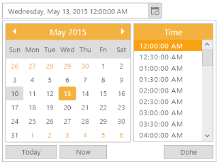
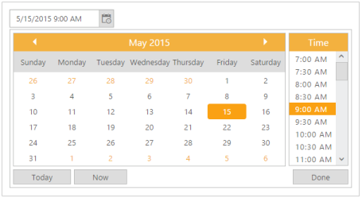

## Display format

DateTime format

DateTimePicker allows you to define the text representation of a date and time value to be displayed in the DateTimePicker control. The format specified is achieved by the DateTimeFormat property. Default value of this property is “M/d/yyyy h: mm tt”. To change the “Time Popup” display format, “TimeDisplayFormat” is used here. The default value of this property is “h:mm t”. 

If your company’s website is going to be used all over the world, following the UTC time is better. Main benefit of UTC Time is that the time is always guaranteed to be _consistent_. In other words, whenever the time zone of customer is changed you don't have to go back or forth in time from the logging time of the customer to your time zone.

_Table_ _1__: DateTime format_

<table>
<tr>
<td>
Format</td><td>
Display in DateTimePicker</td></tr>
<tr>
<td>
Short Date and Time– d/M/yy h:mm tt</td><td>
9/12/2014 2:04 PM</td></tr>
<tr>
<td>
Medium Date-d MMM yy h:mm tt</td><td>
12 Sep 14 2:04: PM</td></tr>
<tr>
<td>
Full Date and short time - dddd, MMMM dd, yyyy HH:mm tt</td><td>
Friday, September 12,2014 2:04 PM</td></tr>
<tr>
<td>
Full Date and Long Time - dddd, MMMM dd, yyyy HH:mm:ss tt</td><td>
Friday, September 12,2014 2:04:00 PM</td></tr>
<tr>
<td>
UTC - yyyy-MM-dThh:mm:ssz</td><td>
2014-09-12T2:04:00+5</td></tr>
</table>

You can also customize the format. Refer the following list to create your custom format for DateTimePicker.

* d - Day of the month.
* ddd - Short name of day of the week.
* dddd - Full name of day of the week.
* M – The month, from 1 through 12.
* MMM- Short name of Month.
* MMMM- Long name of the Month.
* yy - Last two digit if year.
* yyyy - Full Year.
* hh – Hour.
* mm – Minutes.
* ss – Seconds.
* tt - The AM/PM designator.

In the following example, set DateTimeFormat to fulldatetime format.

1. Add the following code in your CSHTML page to render DateTimePicker widget.

[cshtml]

@*Add the following code example to the corresponding CSHTML page to render DateTimePicker widget with customized date time format*@

@Html.EJ().DateTimePicker("DateTime").TimePopupWidth(150).TimeDisplayFormat("hh:mm:ss tt").Width("300px").DateTimeFormat("dddd, MMMM dd, yyyy hh:mm:ss tt")

2. The following screenshot displays the output for the above code.

{  | markdownify }
{:.image }

Day Header Format

You can change the format for the days of the week names using DayHeaderFormat property. By default in our DateTimePicker day of the week format in ShowHeaderMin format. For example, Sun for Sunday. To know the different types of day format refer the following table.

_Table_ _2__: DayHeaderFormat_

<table>
<tr>
<td>
Header Format types</td><td>
Description</td></tr>
<tr>
<td>
ShowHeaderNone</td><td>
Removes the day header</td></tr>
<tr>
<td>
ShowHeaderShort</td><td>
Shows the day header format in min like Su, Mo, Tu …</td></tr>
<tr>
<td>
ShowHeaderMin</td><td>
Shows the day header format in short like Sun, Mon, Tue …</td></tr>
<tr>
<td>
ShowHeaderLong</td><td>
Shows the day header format in long like Sunday, Monday, Tuesday …</td></tr>
</table>

You can also customize the format according to your needs. This is achieved by changing the day names information in the culture script file. This is explained later under the Localization section of this document. In the following sample is displayed, the short name of the day of the week, by setting day header format as ShowHeaderLong.

1. Add the following code in your CSHTML page to render DateTimePicker widget.

[_cshtml]    

@*Add the following code example to the corresponding CSHTML page to render DateTimePicker widget with customized day header format*@

@Html.EJ().DateTimePicker("DateTime").DayHeaderFormat(Header.ShowHeaderLong).Width("175px").Value("5/15/2015 09:00 AM")

2. The following screenshot displays the output for the above code.

{  | markdownify }
{:.image }

