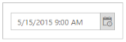
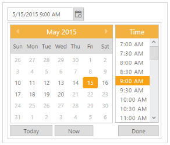

# Getting Started

This section explains briefly about how to create a DateTimePicker in your application with ASP.NET MVC.

## Create your first DateTimePicker in MVC 

The ASP.NET MVC DateTimePicker provides support to display the calendar within your web page and allows you to pick date and time from the calendar. Refer the following guidelines to customize date and time pickers for a real time appointment booking scenario that helps you to book an appointment, within a limited number of days. The following screenshot illustrates the functionality of DatePicker with date range.

{  | markdownify }
{:.image }

In the above screenshot, you can select a date and time, within a week ranging from the current date. This helps you to avoid booking an appointment beyond the current date and mentioned date range.

Create a DateTimePicker 

ASP.NET MVC DateTimePicker widget basically renders built-in features like Month and Time Navigation, with animations and flexible APIs. You can easily create the DateTimePicker widget using simple DateTimePicker element as follows.

1. Create a MVC Project and add necessary assemblies and scripts.
2. Refer [MVC-Getting Started](http://help.syncfusion.com/ug/js/Documents/gettingstartedwithmv.htm).
3. Add the following code to the corresponding view page to render DateTimePicker.

[CSHTML]

@*Add the following code example to the corresponding CSHTML page to render DateTimePicker widget*@

@Html.EJ().DateTimePicker("Datetime").Width("175px").Value("05/15/2015 09:00 AM") 

Execute the above code to render the following output.

{  | markdownify }
{:.image }

Set the Min/Max Date and Time Intervals

In a real-time appointment booking scenario, the booking is open only for a limited number of days. You can select the date from the given range. This is achieved using the properties MinDateTime and MaxDateTime. Only the dates ranging between MinDateTime and MaxDateTime are enabled in the date picker. Using the Interval property, you can set the interval. 

 [cshtml]

@*Add the following code example to the corresponding CSHTML page to render DateTimePicker widget with customized Mintime and Maxtime*@

@Html.EJ().DateTimePicker("DateTime").MinDateTime("5/10/2015 09:00 AM").MaxDateTime("5/20/2015 06:00 PM").Interval(30).Width("175px").Value("5/15/2015 09:00 AM")

{  | markdownify }
{:.image }

