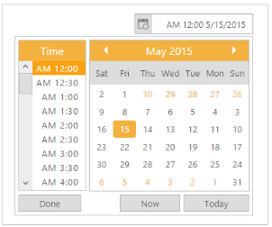

# Right-to-Left

RTL control supports right-to-left functionality and features for languages that work right-to-left for selecting and editing date and time. You can change your popup and textbox display to read right-to-left. Arabic and Hebrew are written from right to left. The customer who has a right to left writing style can use this feature. You can achieve this in your DateTimePicker by using EnableRTL property. Setting this property to “True” allows you to write in the right to left format. Position of the toolbars are also changed to right to left.

1. Add the following code in your CSHTML page to render DateTimePicker widget.

   ~~~ cshtml
   
        @*Add the following code example to the corresponding CSHTML page to render DateTimePicker widget with right to left appearance*@

        @Html.EJ().DateTimePicker("DateTime").EnableRTL(true).Width("175px")

   ~~~
   
  

2. The following screenshot displays the output for the above code.

   

   Showcase of DateTimePicker with Right to Left appearance
   {:.caption}

