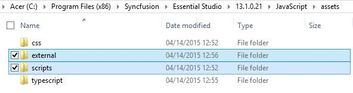
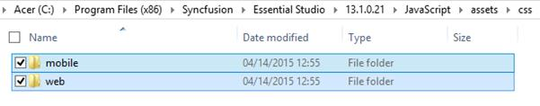

# Dependencies

Other than the above specified assemblies, Scripts and StyleSheets are the two essential requirements to render the Syncfusion components. The components mainly relies on the following 3 common libraries –

* jQuery 1.7.1 and later versions
* JsRender
* jQuery.easing

Currently, we use **jQuery 1.10.2** version, which supports almost all the old and modern browsers.

**jsRender** script file is required to render the templates.

**jQuery.easing** script file is required, so as to support the animation effects in the components.

## Scripts

* All the required scripts for rendering a component is available in a minified format in the below specified location, 

  `(installed location)\Syncfusion\Essential Studio\{{ site.releaseversion }}\ JavaScript\assets`

  _**For example**, If you have installed the Essential Studio package within **C:\Program Files(x86)**, then navigate to the below location,_
  `C:\Program Files (x86)\Syncfusion\Essential Studio\{{ site.releaseversion }}\JavaScript\assets`

* When you navigate to the above location, you can see the folder named **external**, where the common script libraries (like jQuery, jQuery.easing, JsRender and so on) are available and another folder named **scripts** within which the Syncfusion components UI scripts are available in a minified format. You can copy the required scripts from the location depicted below and use it in your application.

  

## StyleSheets

* The stylesheets required for supporting the theming and styling of the Syncfusion components (both mobile and web) is available in a minified format in the below specified location, 

  `(installed location)\Syncfusion\Essential Studio\{{ site.releaseversion }}\ JavaScript\assets\css`

  _**For** **example**, If you have installed the Essential Studio package within **C:\Program Files (x86),** then navigate to the below location,_
  `C:\Program Files (x86)\Syncfusion\Essential Studio\{{ site.releaseversion }}\JavaScript\assets\css`

* When you navigate to the above location, you can see 2 folders namely **mobile** and **web**. The mobile related CSS files are present within the **mobile** folder and all the CSS files related to web components are availed within the **web** folder. You can copy the required CSS files from the location depicted below and use it in your application.

  

## CDN

In case, if the users need to make use of the CDN links instead of the normal above specified scripts and stylesheet references in their application, then have a look at the link [here](http://help.syncfusion.com/js/cdn).