# Connector

Connectors are objects used to create link between two points, nodes or ports to represent the relationships between them.

## Create Connector

Connector can be created by defining the start and end points. The path to be drawn can be defined with a collection of segments.
To explore the properties of a `Connector`, refer to [Connector Properties](http://help.syncfusion.com/cr/cref_files/aspnetmvc/ejmvc/Syncfusion.EJ~Syncfusion.JavaScript.DataVisualization.Models.Diagram.Connector_members.html "Connector Properties").

### Add connectors through connectors collection

The `SourcePoint` and `TargetPoint` properties of connector allow you to define the end points of a `Connector`. The following code example illustrates how to add a connector through connector collection.


public ActionResult Index()
{
    DiagramProperties model = new DiagramProperties();
    Connector connector = new Connector() {
			//Name of the connector
			Name = "Connector",
			//Sets source and target points
			SourcePoint = new DiagramPoint(100f, 100f),
			TargetPoint = new DiagramPoint(200f, 200f),
		};
	model.Connectors.Add(connector);
    ViewData["diagramModel"] = model;
    return View();
}


### Add connector at run time

Connectors can be added at runtime with the client side method, `add`. The following code example illustrates how to add connector at runtime.



// Defines JSON
var connector = {
	name: "connector",
	sourcePoint: {
		x: 100,
		y: 100
	},
	targetPoint: {
		x: 200,
		y: 200
	}
};
var diagram = $("#DiagramContent").ejDiagram("instance");
// Adds to the Diagram
diagram.add(connector);



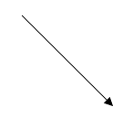

### Connectors from palette

Connectors can be predefined and added to the symbol palette. You can drop those connectors into the Diagram, when required.

For more information about adding connectors from symbol palette, refer to [Symbol Palette](/aspnetmvc/Diagram/Symbol-Palette "Symbol Palette").

### Connectors through data source

Connectors are automatically generated based on the relationships defined through the data source.
The default properties for these connectors are fetched from default settings.

For more information about data source, refer to [Data Binding](/aspnetmvc/Diagram/Data-Binding "Data Binding").

### Draw connectors

Connectors can be interactively drawn by clicking and dragging on the Diagram surface by using **DrawingTool**. For more information about drawing connectors, refer to [Draw Connectors](/aspnetmvc/Diagram/Tools#drawing-tools:connectors "Draw Connectors").

## Update Connector at runtime

The client side method, `updateConnector` is used to update the connectors at run time. The following code example illustrates how to update a connector at runtime.


var diagram = $("#DiagramContent").ejDiagram("instance");
diagram.updateConnector("connectorName", {
	lineColor: "#1BA0E2",
	lineWidth: 5,
	lineDashArray: "5,5"
});


## Connect nodes

The `SourceNode` and `TargetNode` properties allow to define the nodes to be connected. The following code example illustrates how to connect two nodes.


public ActionResult Index()
{
    DiagramProperties model = new DiagramProperties();
    FlowShape task1 = new FlowShape(){
		Name = "task1", OffsetX = 200, OffsetY = 200, Shape = FlowShapes.Process,
		Labels = new Collection() { new Label() { Text = "Task 1" } } 
	};
	FlowShape task1 = new FlowShape(){
		Name = "task2", OffsetX = 400, OffsetY = 200, Shape = FlowShapes.Process,
		Labels = new Collection() { new Label() { Text = "Task 2" } } 
	};
	
	//Sets nodes collection to the Diagram model
	model.Nodes.Add(task1);
	model.Nodes.Add(task2);
    
	Connector connector = new Connector() {
		Name = "flow1",
		//Sets source and target node
		SourceNode = "task1",
		TargetNode = "task2"
	};
	//Sets connectors collection to the Diagram model
	model.Connectors.Add(connector);
	
	//Defines the properties that carry the common values
	model.DefaultSettings.Node = new Node() {
		Width = 100, Height = 50, FillColor = "darkCyan",
		BorderColor = "black", Shape = FlowShapes.Process,
		Labels = new Collection() { new Label() { FontColor = "white" } } 
	};
	
	ViewData["diagramModel"] = model;
    return View();
}


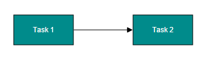

N> By default, connections are created at the intersecting point of segments and node bounds. The connection between any specific point of source and target nodes can be achieved with connection ports.

### Connections with ports

The `SourcePort` and `TargetPort` properties allow to create connections between some specific points of source/target nodes. The following code example illustrates how to create port to port connections.


public ActionResult Index()
{
    DiagramProperties model = new DiagramProperties();
    FlowShape task1 = new FlowShape(){
		Name = "task1", OffsetX = 350, OffsetY = 300, Shape = FlowShapes.Process,
		Labels = new Collection() { new Label() { Text = "Task 1" } } 
	};
	FlowShape task2 = new FlowShape(){
		Name = "task2", OffsetX = 200, OffsetY = 250, Shape = FlowShapes.Process,
		Labels = new Collection() { new Label() { Text = "Task 2" } },
		
		//Defines ports for task2
		Ports = new Collection() {
			new Port(){
				Name="in", Offset= new DiagramPoint(1f, 0.65f), Shape = PortShapes.Circle,
				Visibility = PortVisibility.Visible, FillColor = "black"
			},
			new Port(){
				Name="out", Offset= new DiagramPoint(1f, 0.35f), Shape = PortShapes.Circle,
				Visibility = PortVisibility.Visible, FillColor = "black"
			}
		}
	};
	FlowShape task3 = new FlowShape(){
		Name = "task3", OffsetX = 350, OffsetY = 200, Shape = FlowShapes.Process,
		Labels = new Collection() { new Label() { Text = "Task 1" } } 
	};
	//Sets nodes collection to the Diagram model
	model.Nodes.Add(task1);
	model.Nodes.Add(task2);
	model.Nodes.Add(task3);
	
	Connector connector = new Connector() {
		Name = "flow1",
		//Sets source and target node
		SourceNode = "task1",
		TargetNode = "task2",
		//Name of the target port defined in the target node
		TargetPort = "in"
	};
	Connector connector = new Connector() {
		Name = "flow2",
		//Sets source and target node
		SourceNode = "task2",
		TargetNode = "task3",
		//Name of the target port defined in the target node
		SourcePort = "out"
	};
	//Sets connectors collection to the Diagram model
	model.Connectors.Add(connector);
	
	//Defines the properties that carry the common values
	model.DefaultSettings.Node = new Node() {
		Width = 100, Height = 50, FillColor = "darkCyan",
		BorderColor = "black", Shape = FlowShapes.Process,
		Labels = new Collection() { new Label() { FontColor = "white" } } 
	};
	model.DefaultSettings.Connector = new Connector(){
		Segments = new Collection(){ new Segment(){ Type = Segments.Orthogonal }}
	}
    ViewData["diagramModel"] = model;
    return View();
}


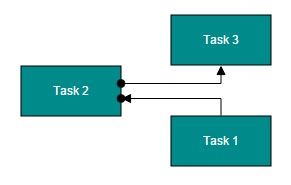

## Segments

The path of the connector is defined with a collection of segments. There are three types of segments.

### Straight

Straight segment allows to create a straight line.
To create a straight line, you should specify the `Type` of the segment as "straight" and add a straight segment to `Segments` collection. The following code example illustrates how to create a default straight segment.


public ActionResult Index()
{
    DiagramProperties model = new DiagramProperties();
    Connector connector = new Connector() {
		Name = "Connector1",
		SourcePoint = new DiagramPoint(100f, 100f),
		TargetPoint = new DiagramPoint(200f, 200f),
		
		//Defines segment collection
		//When there is no previous segment, line starts from source point
		//When the end point is not specified, line ends at target point
		//Defines the type of the segment
		Segments = new Collection() { new Segment() { Type = Segments.Straight }}
	};
    //Sets connectors collection to the Diagram model
    model.Connectors.Add(connector);
    ViewData["diagramModel"] = model;
    return View();
}


The `Point` property of straight segment allows you to define the end point of it. The following code example illustrates how to define the end point of a straight segment.


public ActionResult Index()
{
    DiagramProperties model = new DiagramProperties();
    Connector connector = new Connector() {
		Name = "Connector1",
		SourcePoint = new DiagramPoint(100f, 100f),
		TargetPoint = new DiagramPoint(200f, 300f),
		
		//Defines segment collection
		//When there is no previous segment, line starts from source point
		//When the end point is not specified, line ends at target point
		//Defines the type of the segment
		Segments = new Collection() { new Segment() {
			Type = Segments.Straight,
			// Defines the end point of the segment
			// Additional straight line will be drawn from this end point to the target point
			Point = new DiagramPoint(100f, 200f)
		}}
	}
	
    //Sets connectors collection to the Diagram model
    model.Connectors.Add(connector);
    ViewData["diagramModel"] = model;
    return View();
}


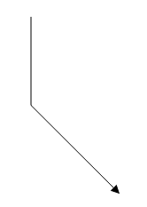

### Orthogonal

Orthogonal segments are used to create segments that are perpendicular to each other.

Set the segment `Type` as "Orthogonal" to create a default orthogonal segment. The following code example illustrates how to create a default orthogonal segment.


public ActionResult Index()
{
    DiagramProperties model = new DiagramProperties();
    Connector connector = new Connector() {
		Name = "Connector1",
		SourcePoint = new DiagramPoint(100f, 100f),
		TargetPoint = new DiagramPoint(200f, 200f),
		
		//Defines segment collection
		//Defines the type of the segment
		Segments = new Collection() { new Segment() { Type = Segments.Orthogonal }}
	}
    //Sets connectors collection to the Diagram model
    model.Connectors.Add(connector);
    ViewData["diagramModel"] = model;
    return View();
}


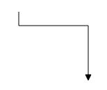

The `Length` and `Direction` properties allow to define the flow and length of segment. The following code example illustrates how to create customized orthogonal segments.


public ActionResult Index()
{
    DiagramProperties model = new DiagramProperties();
    Connector connector = new Connector() {
		Name = "Connector1",
		SourcePoint = new DiagramPoint(100f, 100f),
		TargetPoint = new DiagramPoint(200f, 200f),
		
		//Defines segment collection
		Segments = new Collection() { new Segment() {
			//Defines the type of the segment
			Type = Segments.Orthogonal,
			// Orthogonal segment of 50px length to the bottom
			Length = 50,
			// Additional orthogonal segments will be added from the end of the last segment to the target point
			Direction = "right"
		}}
	}
    //Sets connectors collection to the Diagram model
    model.Connectors.Add(connector);
    ViewData["diagramModel"] = model;
    return View();
}


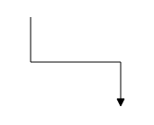

#### Avoid overlapping

Orthogonal segments are automatically re-routed, in order to avoid overlapping with the source and target nodes. The following images illustrate how orthogonal segments are re-routed.

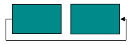

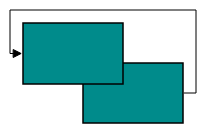

N> Overlapping with source and target nodes are only avoided. Other nodes are not considered as obstacles.

### Bezier

Bezier segments are used to create curve segments and the curves are configurable either with the control points or with vectors.

To create a bezier segment, the `Segment.Type` is set as `Bezier`. The following code example illustrates how to create a default Bezier segment.



public ActionResult Index()
{
    DiagramProperties model = new DiagramProperties();
    Connector connector = new Connector() {
		Name = "Connector1",
		SourcePoint = new DiagramPoint(100f, 100f),
		TargetPoint = new DiagramPoint(200f, 200f),
		
		//Defines segment collection
		Segments = new Collection() { new Segment() {
			//Defines the type of the segment
			Type = Segments.Bezier
		}}
	}
    //Sets connectors collection to the Diagram model
    model.Connectors.Add(connector);
    ViewData["diagramModel"] = model;
    return View();
}


The `Point1` and `Point2` properties of bezier segment enable you to set the control points. The following code example illustrates how to configure the Bezier segments with control points.


public ActionResult Index()
{
    DiagramProperties model = new DiagramProperties();
    Connector connector = new Connector() {
		Name = "Connector1",
		SourcePoint = new DiagramPoint(100f, 200f),
		TargetPoint = new DiagramPoint(250f, 200f),
		
		//Defines segment collection
		Segments = new Collection() { new Segment() {
			//Defines the type of the segment
			Type = Segments.Bezier, 
			//First control point: an absolute position from the page origin
			Point1 = new DiagramPoint(125f, 75f),
			//Second control point: an absolute position from the page origin
			Point2 = new DiagramPoint(225f, 75f)
		}}
	}
    //Sets connectors collection to the Diagram model
    model.Connectors.Add(connector);
    ViewData["diagramModel"] = model;
    return View();
}


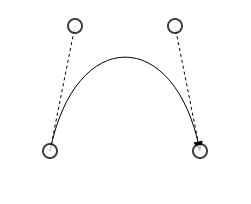

The `Vector1` and `Vector2` properties of bezier segment enable you to define the vectors. The following code illustrates how to configure a bezier curve with vectors.


//Defines JSON
var connector = {
	name: "connector",
	sourcePoint: { x: 100, y: 200 },
	targetPoint: { x: 250, y: 200 },
	//Defines segment collection
	segments: [
	{
		// Defines the type of the segment
		type: "bezier",
		// Length and angle between the source point and the first control point
		vector1: { angle: 270, distance: 75 },
		// Length and angle between the target point and the second control point
		vector2: { angle: 270, distance: 75 }
	}]
};
connectors.push(connector);


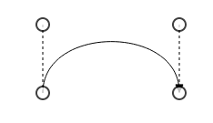

### Complex segments

Multiple segments can be defined one after another. To create a connector with multiple segments, define and add the segments to `Connector.Segments` collection. The Following code example illustrates how to create a connector with multiple segments.


public ActionResult Index()
{
    DiagramProperties model = new DiagramProperties();
    Connector connector = new Connector() {
		Name = "Connector1",
		SourcePoint = new DiagramPoint(100f, 200f), TargetPoint = new DiagramPoint(250f, 300f),
		//Defines segment collection
		Segments = new Collection() {
			// Segment of length 100px to the bottom
			new Segment() { Type = Segments.Orthogonal, Length = 100, Direction = "bottom" },
			
			// Segment of length 150px to the bottom
			//Additional orthogonal segments will be added from the end of the last segment to the target point
			new Segment() { Type = Segments.Orthogonal, Length = 150, Direction = "right" }
		}
	}
 	//Sets connectors collection to the Diagram model
    model.Connectors.Add(connector);
    ViewData["diagramModel"] = model;
    return View();
}


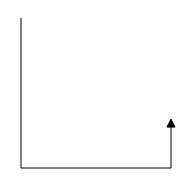

## Decorator

Start and end points of a connector can be decorated with some customizable shapes like arrows, circles, diamond or path. You can decorate the connection end points with the `SourceDecorator` and `TargetDecorator` properties of connector.
To explore the properties of decorators, refer to [Decorator Properties](http://help.syncfusion.com/cr/cref_files/aspnetmvc/ejmvc/Syncfusion.EJ~Syncfusion.JavaScript.DataVisualization.Models.Diagram.Decorator_members.html "Decorator Properties").

The `Shape` property of decorator allows to define the shape of the decorators. The following code example illustrates how to create decorators of various shapes.


public ActionResult Index()
{
    DiagramProperties model = new DiagramProperties();
    Connector connector1 = new Connector() {
		Name = "connector1",SourcePoint = new DiagramPoint(100f, 100f), TargetPoint = new DiagramPoint(200f, 200f),
		//Decorator shape - Circle
		SourceDecorator = new Decorator() { Shape = DecoratorShapes.Circle, Width = 10, Height = 10 },
		//Decorator shape - Arrow
		TargetDecorator = new Decorator() { Shape = DecoratorShapes.Arrow, Width = 10, Height = 10 }
	};
	Connector connector2 = new Connector() {
		Name = "connector2",SourcePoint = new DiagramPoint(300f, 100f), TargetPoint = new DiagramPoint(400f, 200f),
		//Decorator shape - Diamond
		SourceDecorator = new Decorator() { Shape = DecoratorShapes.Diamond, Width = 10, Height = 10 },
		//Decorator shape - Open Arrow
		TargetDecorator = new Decorator() { Shape = DecoratorShapes.OpenArrow, Width = 10, Height = 10 }
	};
	Connector connector3 = new Connector() {
		Name = "connector3",SourcePoint = new DiagramPoint(500f, 100f), TargetPoint = new DiagramPoint(600f, 200f),
		//Decorator shape - Path
		TargetDecorator = new Decorator() { Shape = DecoratorShapes.Path, PathData = "M 376.892,225.284L 371.279,211.95L 376.892,198.617L 350.225,211.95L 376.892,225.284 Z" }
	};
	
	//Sets connectors collection to the Diagram model
    model.Connectors.Add(connector1);
	model.Connectors.Add(connector2);
	model.Connectors.Add(connector3);
    ViewData["diagramModel"] = model;
    return View();
}



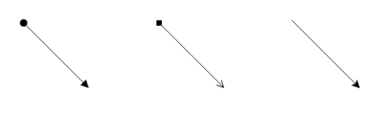

## Padding

Padding is used to leave space between the Connector's end point and the object to where it is connected.

The `SourcePadding` and `TargetPadding` properties of connector define the space to be left between the connection end points and the source and target nodes of connector. The following code example illustrates how to leave space between the connection end points and source, target nodes.


public ActionResult Index()
{
    DiagramProperties model = new DiagramProperties();
	FlowShape task1 = new FlowShape(){
		Name = "task1", OffsetX = 200, OffsetY = 200, Shape = FlowShapes.Process,
		Labels = new Collection() { new Label() { Text = "Task 1" } } 
	};
	FlowShape task2 = new FlowShape(){
		Name = "task2", OffsetX = 400, OffsetY = 200, Shape = FlowShapes.Process,
		Labels = new Collection() { new Label() { Text = "Task 2" } } 
	};
	model.Nodes.Add(task1);
	model.Nodes.Add(task2);
	
	model.Nodes.Add(new Connector() {
		Name = "flow1", SourceNode = "task1", TargetNode = "task2",
		//Space between source point and source object
		SourcePadding = 5,
		//Space between target point and target object
		TargetPadding = 10
	});
	
	//Defines the properties that carry the common values
	model.DefaultSettings.Node = new Node() {
		Width = 100, Height = 50, BorderColor = "black", FillColor = "darkCyan",
		Labels = new Collection() { new Label() { FontColor = "white" } } 
	}
	ViewData["diagramModel"] = model;
    return View();
}


The `ConnectorPadding` property of node defines the space to be left between the node bounds and its edges. The following code example illustrates how to leave the space between a node and its connections.


public ActionResult Index()
{
    DiagramProperties model = new DiagramProperties();
	FlowShape task1 = new FlowShape() {
		Name = "task1", OffsetX = 200, OffsetY = 200, Shape = FlowShapes.Process,
		Labels = new Collection() { new Label() { Text = "Task 1" } },
		//Space between the node and its edges
		ConnectorPadding = 5
	};
	FlowShape task2 = new FlowShape() {
		Name = "task2", OffsetX = 400, OffsetY = 200, Shape = FlowShapes.Process,
		Labels = new Collection() { new Label() { Text = "Task 2" } } 
	};
	model.Nodes.Add(task1);
	model.Nodes.Add(task2);
	
	model.Connectors.Add( new Connector() { Name = "flow1", SourceNode = "task1", TargetNode = "task2" });
	
	//Sets the default properties for nodes
	model.DefaultSettings.Node = new Node() {
		Width = 100, Height = 50, BorderColor = "black", FillColor = "darkCyan",
			Labels = new Collection() { new Label() { FontColor = "white" } } 
	};
	ViewData["diagramModel"] = model;
    return View();
}


The `ConnectorPadding` property of port defines the space between the ports and its in/out edges. The following code example illustrates how to leave the space between ports and its connections.


public ActionResult Index()
{
    DiagramProperties model = new DiagramProperties();
	FlowShape task1 = new FlowShape() {
		Name = "task1", OffsetX = 200, OffsetY = 200, Shape = FlowShapes.Process,
		Labels = new Collection() { new Label() { Text = "Task 1" } } 
	};
	FlowShape task2 = new FlowShape() {
		Name = "task2", OffsetX = 400, OffsetY = 200, Shape = FlowShapes.Process,
		Labels = new Collection() { new Label() { Text = "Task 2" } },
		//Defines ports for task2
		Ports = new Collection() {
			new Port(){
				Name = "port", Offset = new DiagramPoint(0f, 0.5f), Shape = PortShapes.Circle,
				Visibility = PortVisibility.Visible, FillColor = "black",
				//Space between port and its edges
				ConnectorPadding = 5
			}
		}
	};
	model.Nodes.Add(task1);
	model.Nodes.Add(task2);
	
	model.Connectors.Add(new Connector() { Name = "flow1", SourceNode = "task1", TargetNode = "task2", TargetPort = "port"});
	
	//Sets the default properties for nodes
	model.DefaultSettings.Node = new Node() {
		Width = 100, Height = 50, BorderColor = "black", FillColor = "darkCyan",
		Labels = new Collection() { new Label() { FontColor = "white" } }
	}
	ViewData["diagramModel"] = model;
    return View();
}		


## Bridging

Line Bridging creates a bridge for lines to smartly cross over other lines, at points of intersection. When two line connectors meet each other, the line with the higher z-order (upper one) draws an arc over the underlying connector.
Bridging can be enabled/disabled either with the `Connector.Constraints` or `Diagram.Constraints`. The following code example illustrates how to enable line bridging.


public ActionResult Index()
{
    DiagramProperties model = new DiagramProperties();
    Connector connector = new Connector() {
		Name = "Connector1", SourcePoint = new DiagramPoint(100f, 100f), TargetPoint = new DiagramPoint(200f, 200f),
		//Removes inherit bridging or else bridging is enabled/disabled based on the Diagram constraints
		//And includes bridging
		Constraints = ConnectorConstraints.Default & ~ConnectorConstraints.InheritBridging | ConnectorConstraints.Bridging
	};
	model.Connectors.Add(connector);
    ViewData["diagramModel"] = model;
    return View();
}


The direction of the bridge can be customized with the property `BridgeDirection`. BridgeDirection defines the intersecting segment where the bridge has to be inserted. By default, the bridge direction points to the top.

To explore the bridge directions, refer to [Bridge Directions](http://help.syncfusion.com/cr/cref_files/aspnetmvc/ejmvc/Syncfusion.EJ~Syncfusion.JavaScript.DataVisualization.Models.DiagramProperties~BridgeDirection.html "Bridge Directions").

The following code example illustrates how to draw the bridge at the bottom direction.



@using Syncfusion.JavaScript.DataVisualization.DiagramEnums 
@using Syncfusion.JavaScript.DataVisualization.Models.Diagram

@(Html.EJ().Diagram("Diagram").Width("100%").Height("600px")
	@*Sets the bridge direction*@
	.BridgeDirection(BridgeDirection.Bottom)
	@*Enables bridging for every connector added in the model*@
	.Constraints(DiagramConstraints.Default | DiagramConstraints.Bridging)
)



**Limitation**: Bezier segments do not support bridging.

## Corner radius

Corner radius allows to create connectors with rounded corners. The radius of the rounded corner is set with `CornerRadius` property.


public ActionResult Index()
{
    DiagramProperties model = new DiagramProperties();
	FlowShape task1 = new FlowShape() {
		Name = "task1", OffsetX = 200, OffsetY = 200, Shape = FlowShapes.Process,
		Labels = new Collection() { new Label() { Text = "Task 1" } } 
	};
	FlowShape task1 = new FlowShape() {
		Name = "task2", OffsetX = 350, OffsetY = 300, Shape = FlowShapes.Process,
		Labels = new Collection() { new Label() { Text = "Task 2" } },
	};
	Connector connector = new Connector() {
		Name = "flow1",
		SourceNode = "task1",
		TargetNode = "task2",
		//Sets the radius for the rounded corner
		CornerRadius = 10
	};
	//Sets connectors collection to the Diagram model
    model.Connectors.Add(connector);
	
    //Sets the default properties for nodes
	model.DefaultSettings.Node = new Node() {
		Width = 100, Height = 50, BorderColor = "black", FillColor = "darkCyan",
		Labels = new Collection() { new Label() { FontColor = "white" } } 
	};
	model.DefaultSettings.Connector = new Connector(){
		Segments = new Collection(){ new Segment(){ Type = Segments.Orthogonal }}
	}
	ViewData["diagramModel"] = model;
    return View();
}


## Appearance

Stroke width, stroke color, and style of the lines and decorators can be customized with a set of defined properties.

### Segment Appearance

The following code example illustrates how to customize the segment appearance.


public ActionResult Index()
{
    DiagramProperties model = new DiagramProperties();
    Connector connector = new Connector() {
		Name = "connector", SourcePoint = new DiagramPoint(100f, 100f), TargetPoint = new DiagramPoint(200f, 200f),
		//Stroke width of the line
		LineWidth = 2,
		//Stroke color
		LineColor = "green",
		//Line style
		LineDashArray = "2,2",
		//Opacity of the line
		Opacity = 0.8,
	};
	//Sets connectors collection to the Diagram model
    model.Connectors.Add(connector);
    ViewData["diagramModel"] = model;
    return View();
}


### Decorator Appearance

The following code example illustrates how to customize the appearance of the decorator.


public ActionResult Index()
{
    DiagramProperties model = new DiagramProperties();
    Connector connector = new Connector() {
		//Customizes the appearance of decorator
		TargetDecorator = = new Decorator(){
			//Defines the shape
			Shape = DecoratorShapes.Arrow,
			//Fills color of the decorator
			FillColor = "red",
			//Stroke color
			BorderColor = "green",
			//Stroke width
			BorderWidth = 2,
			Width = 10,
			Height = 10
		}
	};
	//Sets connectors collection to the Diagram model
    model.Connectors.Add(connector);
    ViewData["diagramModel"] = model;
    return View();
}


## Interaction
Diagram allows to edit the connectors at runtime. To edit the connector segments at runtime, refer to [Connection Editing](/js/Diagram/Interaction#connection-editing "Connection Editing").

## Constraints
The `Constraints` property of connector allows to enable/disable certain features of connectors. For more information about constraints, refer to [Connector Constraints](/aspnetmvc/Diagram/Constraints#connectorconstraints "Connector Constraints").