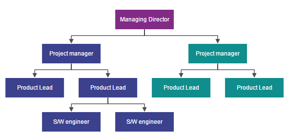

# Data Binding

* Diagram can be populated with the nodes and connectors based on the information provided from an external data source.
* Diagram exposes its specific data-related properties allowing you to specify the data source fields from where the node information has to be retrieved from.

To explore those properties, see [Data source settings](http://help.syncfusion.com/cr/cref_files/aspnetmvc/ejmvc/Syncfusion.EJ~Syncfusion.JavaScript.DataVisualization.Models.Diagram.DataSourceSettings_members.html "Data source settings")

* Diagram supports three different kinds of Data binding.
	* Local Data
	* Remote Data
	* HTML Table Data

## Local Data

Diagram can be populated based on the user defined JSON data (**Local Data**) by mapping the relevant data source fields.

To map the user defined JSON data with Diagram, you have to configure the fields of `DataSourceSettings`. The following code example illustrates how to bind local data with the Diagram.



@Html.EJ().Diagram("Diagram", ViewData["diagramModel"] as Syncfusion.JavaScript.DataVisualization.Models.DiagramProperties)




public ActionResult Index()
{
    DiagramProperties model = new DiagramProperties();
    //Uses layout to auto-arrange nodes on the Diagram page
    model.Layout.Type = LayoutTypes.HierarchicalTree;
    model.Layout.HorizontalSpacing=30;
    model.Layout.VerticalSpacing=30;
    
    //Sets the default properties for nodes and connectors
    Label label = new Label() { Name = "label1", FontColor = "white", Bold = true };
    model.DefaultSettings.Node = new Node() { Width = 100, Height = 40, FillColor = "darkcyan" };
    model.DefaultSettings.Node.Labels.Add(label);
    model.DefaultSettings.Connector = new Connector()
    {
        Segments = new Collection() { new Segment(Segments.Orthogonal) },
        TargetDecorator = new Decorator() { Shape = DecoratorShapes.None },
    };  
    
    //Configures data source for Diagram
    //Defines the unique field of each JSON data
    model.DataSourceSettings.Id = "Name";
    //Defines the parent field which builds the relationship
    model.DataSourceSettings.Parent = "ReportingPerson";
    //Sets the local data source to the diagram.
    model.DataSourceSettings.DataSource = GetDataSource(); 
    //Initializes the node template.
    model.NodeTemplate = "nodeTemplate";
    
    ViewData["diagramModel"] = model;
    return View();
}
public Array GetDataSource()
{
    String allText = System.IO.File.ReadAllText(Server.MapPath("~/App_Data/data.json"));
    Dictionary<string, object> requestArgs = (Dictionary<string, object>)new JavaScriptSerializer().DeserializeObject(allText);
    requestArgs = (Dictionary<string, object>)requestArgs["root"];
    return (Array)requestArgs.Values.ElementAt(0);
}



{root: {data: [ 
    { "Name": "Director" },
    { "Name": "Manager", "ReportingPerson": "Director" },
    { "Name": "TeamLead", "ReportingPerson": "Director" },
    { "Name": "Software Developer", "ReportingPerson": "TeamLead" },
    { "Name": "Testing engineer", "ReportingPerson": "TeamLead" },
    { "Name": "Software Developer", "ReportingPerson": "Manager" },
    { "Name": "Testing engineer", "ReportingPerson": "Manager" }
]}}



## Remote Data

You can bind the Diagram with Remote Data by using dataManager.

* DataManager supports the following types of data-binding: JSON, Web Services, oData.
* It uses two different classes: ej.DataManager for processing and ej.Query for serving data. ej.DataManager communicates with data source and ej.Query generates data queries that are read by the dataManager.
* To learn more, refer to [Data Manager](/aspnetmvc/DataManager/Getting-Started "Data Manager").

To bind remote data to the Diagram, you have to configure the fields of `DataSourceSettings`. The following code illustrates how to bind remote data to the Diagram.



@Html.EJ().Diagram("Diagram", ViewData["diagramModel"] as Syncfusion.JavaScript.DataVisualization.Models.DiagramProperties)




public ActionResult Index()
{
    DiagramProperties model = new DiagramProperties();
    
    //Uses layout to auto-arrange nodes on the Diagram page
    model.Layout.Type = LayoutTypes.HierarchicalTree;
    model.Layout.HorizontalSpacing = 30;
    model.Layout.VerticalSpacing = 30;

    //Sets the default properties for nodes and connectors
    Label label = new Label() { Name = "label1", FontColor = "white", Bold = true };
    model.DefaultSettings.Node = new Node() { Width = 100, Height = 40, FillColor = "darkcyan" };
    model.DefaultSettings.Node.Labels.Add(label);
    model.DefaultSettings.Connector = new Connector()
    {
        Segments = new Collection() { new Segment(Segments.Orthogonal) },
        TargetDecorator = new Decorator() { Shape = DecoratorShapes.None },
    };

    //Initializes the node template.
    model.NodeTemplate = "nodeTemplate";

    model.DataSourceSettings.DataSource = "http://mvc.syncfusion.com/Services/Northwnd.svc/";
    model.DataSourceSettings.Query = "ej.Query().from('Employees').select('EmployeeID,ReportsTo,FirstName')";
    model.DataSourceSettings.Id = "EmployeeID";
    model.DataSourceSettings.Parent = "ReportsTo";
    model.DataSourceSettings.TableName = "Employees";   
}



## HTML Table Data

The Diagram provides support to populate the Diagram from the **HTML table**. It is flexible to convert HTML table to Diagram by using **Data Manager**.

The following code illustrates how to convert HTML table to the Diagram.




                DiagramProperties Model = new DiagramProperties();
                Model.Height = "600px";
                Model.Width = "600px";
                //Initializes the node template.
                Model.NodeTemplate = "nodeTemplate";
                Model.Layout.Type = LayoutTypes.HierarchicalTree;
                Model.Layout.VerticalSpacing = 30;
                Model.Layout.HorizontalSpacing = 30;
                Model.DefaultSettings.Node = new Node()
                {
                    Width = 120,
                    Height = 40,
                    BorderColor = "transparent",
                    Labels = new Collection() { new Label() { Name = "label1", FontColor = "#ffffff" } }
                };
                Model.DefaultSettings.Connector = new Connector()
                {
                    Segments = new Collection() { new Segment(Segments.Orthogonal) },
                    TargetDecorator = new Decorator() { FillColor = "#4F4F4F", BorderColor = "#4F4F4F" }
                };
                ViewData["Diagram"] = Model;
                



@Html.EJ().Diagram("Diagram", ViewData["diagramModel"] as Syncfusion.JavaScript.DataVisualization.Models.DiagramProperties)
@using Syncfusion.JavaScript.DataVisualization.DiagramEnums 
@using Syncfusion.JavaScript.DataVisualization.Models.Diagram
@using Syncfusion.JavaScript.DataVisualization.Models.Collections

@(Html.EJ().Diagram("Diagram").Width("100%").Height("600px")
@*Configures data source for Diagram*@
.DataSourceSettings(e => 
{ 
    e.DataSource(ds => ds.Table("#htmlbinding"))
    .Id("Id")
    .Parent("ReportingPerson");
}))

<!-- HTML Table -->




