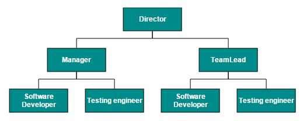
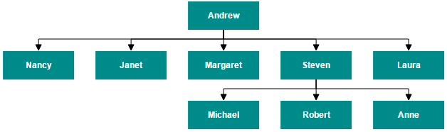
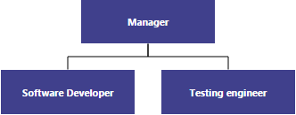

# Data Binding

Diagram can be populated with the node and connector based on information from an external data source by using data binding. Diagram supports binding data sources containing hierarchical data and also supports both local data and remote data for retrieving data from a specified data source. Diagram exposes its specific data-related properties allowing you to specify the data source fields from where the node information has to be retrieved.

You can populate Diagram elements by using data binding support such as JSON and OData services.

## DataSource Settings

The DataSourceSettings property of Diagram includes the required data source fields and it can be set with appropriate values as follows.

_Feld properties_

<table>
<tr>
<th>
Name</th><th>
Type</th><th>
Default</th><th>
Description</th></tr>
<tr>
<td>
DataSource</td><td>
Object</td><td>
Null</td><td>
Datasource receives Essential DataManager object and JSON object.</td></tr>
<tr>
<td>
Query</td><td>
Object</td><td>
Null</td><td>
It receives query to retrieve data from the table (query is same as SQL).Example:  ej.Query().from("Categories").select("CategoryID,CategoryName").take(3);take(3);</td></tr>
<tr>
<td>
TableName</td><td>
String</td><td>
Null</td><td>
It receives table name to execute query on the corresponding table.</td></tr>
<tr>
<td>
Id</td><td>
String</td><td>
Null</td><td>
Specifies the ID to Diagram node items list.</td></tr>
<tr>
<td>
Parent</td><td>
String</td><td>
Null</td><td>
Specifies the parent id of the table.</td></tr>
</table>

## Local Data

To bind the Local Data to the Diagram control, map the user-defined JSON data names with its appropriate data source field. You can bind data to the Diagram by mapping fields such as DataSource, ID, and Parent.

The following code example illustrates how to bind local data to the Diagram.



// Node template.

function nodeTemplate(diagram, node) {

            node.labels[0].text = node.Name;

        }

//Initializes the node template.

$(window).load(function () {

           $("#Diagram").ejDiagram({ nodeTemplate: nodeTemplate });

        });

DiagramProperties model = new DiagramProperties();

model.Layout.Type  = LayoutTypes.HierarchicalTree;

//Configures data source for diagram

model.DataSourceSettings.DataSource = GetData();

model.DataSourceSettings.Parent = "ReportingPerson";

model.DataSourceSettings.Id = "Id";

//Sets the default properties of the nodes.

model.DefaultSettings.Node = new Node() { 

            Width = 140,

            Height = 50,

            Labels = new Collection() { 

                new Label() { Name = "label", Bold = true }

         }

};

//Sets the default properties of the connectors.

model.DefaultSettings.Connector = new Connector() {

  Segments = new Collection() { new Segment(Segments.Orthogonal)},

  TargetDecorator = new Decorator() { Shape = DecoratorShapes.None }  

};

public Array GetData(){

//Returns datasource

}



## Remote Data

You can bind the Diagram to Remote Data by using DataManager and the query in fields is used to retrieve the data. DataManager supports the following types of data-binding: JSON, Web Services, oData. It uses two different classes; ej.DataManager for processing, and ej.Query for serving data. ej.DataManager communicates with data source and ej.Query generates data queries that are read by the dataManager. The following link explains in detail the way to create dataManager.

[http://help.syncfusion.com/ug/js/default.htm#!Documents/createyourdatamanage.htm](http://help.syncfusion.com/ug/js/default.htm)

The following code illustrates how to bind remote data to the Diagram.



        @Html.EJ().Diagram("OrgChart").DataSourceSettings(s => s.DataSource("http://mvc.syncfusion.com/Services/Northwnd.svc/").Query(" ej.Query().from('Employees').select('EmployeeID,ReportsTo,FirstName')").Id("EmployeeID").Parent("ReportsTo").TableName("Employees")).Layout(s => s.Type(Syncfusion.JavaScript.DataVisualization.DiagramEnums.LayoutTypes.HierarchicalTree)).DefaultSettings(s => s.Node(new Syncfusion.JavaScript.DataVisualization.Models.Diagram.Node() { Width = 50, Height = 50, FillColor = "blue", Labels = new Syncfusion.JavaScript.DataVisualization.Models.Collections.Collection() { new Syncfusion.JavaScript.DataVisualization.Models.Diagram.Label() { Name = "label1"} } }));

 
    



## Root

During automatic layout, node without parent is treated as root of the layout. You can specify this root by using the data source settings.

The following code example illustrates how to specify the root object for the Diagram.



 

//Configures data source for Diagram

model.DataSourceSettings.Parent = "ReportingPerson";

model.DataSourceSettings.Id = "Id";

//Specifies the root

 model.DataSourceSettings.Root = "Manager";



## HTML Binding

The Diagram provides support to form diagram from the HTML table. It is easy to convert HTML table to Diagram by using Data Manager.

The following code example illustrates how to convert HTML table to diagram.



{@Html.EJ().Diagram("HtmlDatabinding")

//configure data source for diagram

.DataSourceSettings(s => s.DataSource(ds => ds.Table("#htmlbinding")).Id("Id").Parent("ReportingPerson"))}



