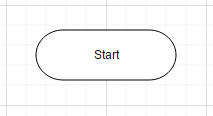
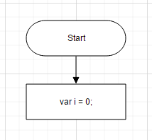

# Getting Started

This section explains briefly how to create the Diagram in your application with ASP.NET MVC.

## Control Structure

The following screenshot illustrates the structure of the Diagram control.

## Create your first Diagram in MVC

### Initialize Diagram

1. Create a CSHTML file and add the necessary script and CSS files in the Head tag as shown in the following code example.


 <html xmlns="http://www.w3.org/1999/xhtml">

    <head>

        <title>

            Getting Started with the Diagram control for MVC

        </title>

        <!-- jQuery Script -->

        

        <!--script to create Diagram-->

        

    </head>
    <body>
    </body>
</html>



2. Add the @Html.EJ().Diagram() element in the <body> tag to render the Diagram.


<html>

    <body>

        @Html.EJ().Diagram("DiagramContent", ViewData["diagramModel"] as Syncfusion.JavaScript.DataVisualization.Models.DiagramProperties)     

    </body>

</html>



3. Initialize the Diagram widget as follows.


  public ActionResult RenderDiagram()

  {

        DiagramProperties model = new DiagramProperties();

         model.Height = "600px";

         model.Width = "600px"; 

         ViewData["diagramModel"] = model;

         return View();

  }



4. This creates an empty Diagram. In the following section, you can learn how to add employee details in the Diagram.

Initialize Data

Initially, you can create hierarchical employee information, JSONData, and assign it to a variable data.



<head>

    <!-- ... -->

    

</head>





//Customizes node before rendering

function nodeTemplate(diagram, node) {

            node.labels[0].text = node.Name; 

        } 

 $(window).load(function () {

            $("#OrgChart").ejDiagram({ nodeTemplate: nodeTemplate });

        });

//Configures data source for diagram.

  DiagramProperties model = new DiagramProperties();

  model.Width = "100%";

  model.Height = "490px";

  model.Layout.Type = LayoutTypes. HierarchicalTree;

  model.Layout.MarginY = 50;

  model.Layout.HorizontalSpacing = 50;

  model.Layout.VerticalSpacing = 50;

  model.DataSourceSettings.DataSource = GetOrgChartData();

  model.DataSourceSettings.Parent = "ReportingPerson";

  model.DataSourceSettings.Id = "name";

//Sets the default properties of nodes.

  model.DefaultSettings.Node = new Node() {

        Width = 70, 

        Height = 30, 

        shape: { type: "rectangle","cornerRadius": 5 },

  };

  Label label = new Label() {

      Name = "label1", 

      FontSize = 11,

      Bold = true, 

      FontFamily = "Segoe UI", 

  };

  model.DefaultSettings.Node.Labels.Add(label);

//Sets the default properties of connectors.

  model.DefaultSettings.Connector = new Connector()

  {

     Segments = new Collection() { new Segment(Segments.Orthogonal) },

     TargetDecorator = new Decorator() { Shape=DecoratorShapes.Arrow }

  };

  ViewData["diagramModel"] = model;

  return View();

  public Array GetOrgChartData(){

  //Returns datasource

  }



The employee data is displayed in the following Diagram .

_Organization Chart_

