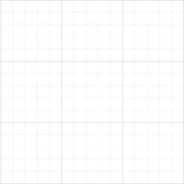

# Gridlines

**Gridlines** are the pattern of lines drawn behind the Diagram elements. It provides a visual guidance while dragging or arranging the objects on the Diagram surface.

## Customize the gridlines visibility

The `SnapSettings.SnapConstraints` enables you to show/hide the gridlines. The following code example illustrates how to show or hide gridlines.



@Html.EJ().Diagram("Diagram", ViewData["diagramModel"] as Syncfusion.JavaScript.DataVisualization.Models.DiagramProperties)



public ActionResult Index()
{
    DiagramProperties model = new DiagramProperties();
	model.SnapSettings = new SnapSettings()
	{
		//Shows both horizontal and vertical gridlines
		SnapConstraints = SnapConstraints.ShowLines
	}
	ViewData["diagramModel"] = model;
    return View();
}



To show only horizontal/vertical gridlines or to hide gridlines, refer to [Constraints](http://help.syncfusion.com/cr/cref_files/aspnetmvc/ejmvc/Syncfusion.EJ~Syncfusion.JavaScript.DataVisualization.Models.Diagram.SnapSettings~SnapConstraints.html "Constraints")

## Appearance

You can customize the appearance of the gridlines by using a set of predefined properties. To explore those properties, refer to [Gridlines](http://help.syncfusion.com/cr/cref_files/aspnetmvc/ejmvc/Syncfusion.EJ~Syncfusion.JavaScript.DataVisualization.Models.Diagram.GridLines_members.html "Gridlines")
The `HorizontalGridLines` and `VerticalGridLines` properties allow to customize the appearance of the gridlines. The following code example illustrates how to customize the appearance of gridlines.


public ActionResult Index()
{
    DiagramProperties model = new DiagramProperties();
	model.SnapSettings = new SnapSettings()
	{
		//Shows both horizontal and vertical gridlines
		SnapConstraints = SnapConstraints.ShowLines,
		// Customizes the line color and line style to the gridlines.
		HorizontalGridlines = new GridLines() { LineColor = "blue", LineDashArray = "2 2" },
		VerticalGridlines = new GridLines() { LineColor = "blue", LineDashArray = "2 2" } 
	};
	ViewData["diagramModel"] = model;
    return View();
}


### Line Intervals

Thickness and the space between gridlines can be customized by using `LinesInterval` property. In the linesInterval collections, values at the odd places are referred as the thickness of lines and the values at the even places are refered as the space between gridlines.

The following code example illustrates how to customize the thickness of lines and the line intervals.


public ActionResult Index()
{
    DiagramProperties model = new DiagramProperties();
	model.SnapSettings = new SnapSettings()
	{
		//Shows both horizontal and vertical gridlines
		SnapConstraints = SnapConstraints.ShowLines,
		// Customizes the line color and line style to the gridlines.
		// Defines the thickness and intervals for a pattern of lines
		HorizontalGridlines = new GridLines() {
			LinesInterval = new List<decimal>(){1.25m, 14, 0.25m, 15, 0.25m, 15, 0.25m, 15, 0.25m, 15},
			LineColor = "blue",
			LineDashArray = "2 2"
		},
		VerticalGridlines = new GridLines() {
			LinesInterval = new List<decimal>(){1.25m, 14, 0.25m, 15, 0.25m, 15, 0.25m, 15, 0.25m, 15},
			LineColor = "blue",
			LineDashArray = "2 2"
		}
	};
    ViewData["diagramModel"] = model;
    return View();
}


# Snapping

## Snap To Lines

This feature allows the Diagram objects to snap to the nearest intersection of gridlines while being dragged or resized. This feature enables easier alignment during layout or design.

Snapping to gridlines can be enabled/disabled with the `SnapSettings.SnapConstraints`. The following code example illustrates how to enable/disable the snapping to gridlines.


public ActionResult Index()
{
    DiagramProperties model = new DiagramProperties();
	model.SnapSettings = new SnapSettings()
	{
		//Enables snapping to both the horizontal and vertical lines.
		SnapConstraints = SnapConstraints.SnapToLines, 
	};
	ViewData["diagramModel"] = model;
    return View();
}


To enable/disable snapping to horizontal/vertical lines, refer to [Constraints](http://help.syncfusion.com/cr/cref_files/aspnetmvc/ejmvc/Syncfusion.EJ~Syncfusion.JavaScript.DataVisualization.Models.Diagram.SnapSettings~SnapConstraints.html "Constraints")

## Customization of Snap Intervals

By default, the objects are snapped towards the nearest gridline. The gridline or position towards where the diagram object snaps can be customized with the property, `snapInterval`. The following code example illustrates how to customize the snap intervals.


public ActionResult Index()
{
    DiagramProperties model = new DiagramProperties();
	model.SnapSettings = new SnapSettings()
	{
		HorizontalGridlines = new GridLines() { LinesInterval = new List<decimal>(){10} },
		VerticalGridlines = new GridLines() { LinesInterval = new List<decimal>(){10} },
		SnapConstraints = SnapConstraints.All	
	};
	ViewData["diagramModel"] = model;
    return View();
}


## Snap To Objects

The snap-to-object provides visual cues to assist with aligning and spacing Diagram elements. A node can be snapped with its neighboring objects based on certain alignments. Such alignments are visually represented as smart guides.

The `EnableSnapToObject` property allows you to enable/disable smart guides. The following code example illustrates how to enable/disable the smart guides.


public ActionResult Index()
{
    DiagramProperties model = new DiagramProperties();
	model.EnableSnapToObject = true;
    ViewData["diagramModel"] = model;
    return View();
}


