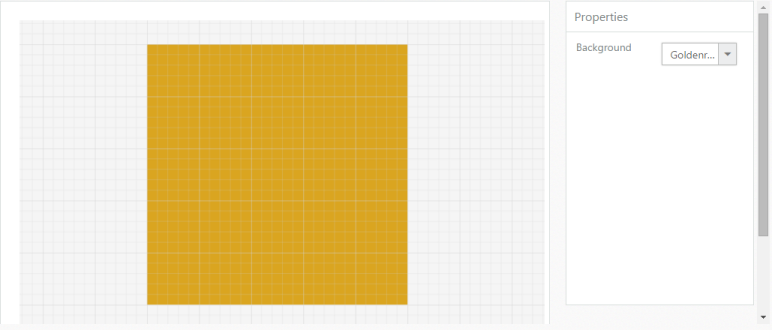

# KnockoutJS Binding

KnockoutJS binding allows you to bind HTML elements against any data model. It uses a Model-View-ViewModel (MVVM) design pattern, where the Model is your stored data, View is the visual representation of that data (UI), and ViewModel acts as the intermediary between the Model and the View. For more information about the KnockoutJS binding, refer to the online documentation: <http://help.syncfusion.com/aspnetmvc/diagram/knockout-binding>

When using KO, the view page is simply a HTML document with declarative bindings that you can link to the ViewModel. ViewModel is nothing but an object, holding a list of items for creating the TreeView control by using KnockoutJS binding. When you call ko.applyBindings with a specific element, it binds everything under that element.

The following code example illustrates how to bind data to the Diagram through KnockoutJS Support.



//References to be added for KnockoutJS support. 

< script src ="@Url.Content("~/Scripts/ej/ej.unobstrusive.min.js")"></script>

//Initializes Diagram.

<input id="Text1" data-bind="ejDropDownList:{ dataSource: pageColor, value: pageBackgroundColor, width: '100px'}">

//Initializes source for page background color.

var pageColor = [{ text: "Black" },

                 { text: "White" }];

window.viewModel = {

            pageBackgroundColor: ko.observable("White")

                   };

//Applies KnockoutJS binding.

$(function () {

            ko.applyBindings(viewModel);

        });



Page Background through KnockoutJS
{:.caption}
