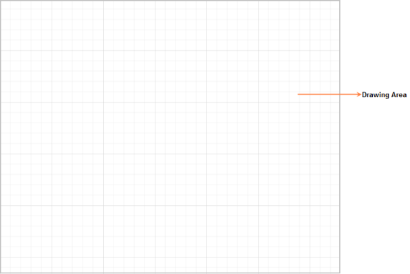

# Model

The Diagram model represents data for rendering the Diagram and manipulating the Diagram elements.

The following code illustrates how to create a Diagram with some model properties.



@*Creates Diagram*@

@Html.EJ().Diagram("Diagram", ViewData["DiagramModel"] as Syncfusion.JavaScript.DataVisualization.Models.DiagramProperties).Render()

using Syncfusion.JavaScript.DataVisualization.DiagramEnums;

using Syncfusion.JavaScript.DataVisualization.Models.Controls;

using Syncfusion.JavaScript.DataVisualization.Models;

public ActionResult Diagram()

{

    DiagramProperties model = new DiagramProperties();

    //Sets diagram model properties

    model.Height = "100%";

    model.Width = "100%";

    model.PageSettings.PageWidth = 2000;

    model.PageSettings.PageHeight = 2000;

    ViewData["DiagramModel"] = model;

    return View();

}



Model
{:.caption}
