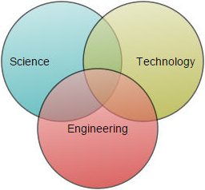
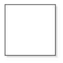

# Node

Nodes are graphical object that represent visual data to be placed on the page.

## Create Node

A node can be created and added to the Diagram, either programmatically or interactively. Nodes are stacked on the Diagram area from bottom to top in the order they are added.

### Add node through nodes collection

To create a node, You have to create the node object and add that to `Nodes` collection of the Diagram Model. The following code example illustrates how to add a node to the Diagram.



            //Initializes Diagram
            DiagramProperties Model = new DiagramProperties();
            Model.Height = "600px";
            Model.Width = "900px";

            BasicShape Node = new BasicShape();
            //Name of the node
            Node.Name = "node1";

            //Sets the size
            Node.Width = 100;
            Node.Height = 100;

            //Sets the position
            Node.OffsetX = 250;
            Node.OffsetY = 250;

            //Customizes the appearance
            Node.FillColor = "darkcyan";
            Node.BorderWidth = 2;

            //Adds node to nodes collection
            Model.Nodes.Add(Node);
    


### Add node at runtime

Nodes can be added at runtime by using public method, `add`. The following code illustrates how to add a node.



    // Defines JSON to create a node
    var node = {
        name: "node1",
        width: 100,
        height: 100,

        //Sets position
        offsetX: 250,
        offsetY: 250,
        fillColor: "darkcyan",
        borderWidth: 2
    };

    var diagram = $("#diagram").ejDiagram("instance");

    // Adds node to the Diagram
    diagram.add(node);



### Add node from palette

Nodes can be predefined and added to palette and can be dropped into the Diagram when needed. For more information about adding nodes from symbol palette, refer to [Symbol Palette](/aspnetmvc/Diagram/Symbol-Palette "Symbol Palette").

### Create node through data source

Nodes can be generated automatically with the information provided through data source. The default properties for these nodes are fetched from default settings. For more information about data source, refer to [Data Binding](/aspnetmvc/Diagram/Data-Binding "Data Binding").

### Draw nodes

Nodes can be interactively drawn by clicking and dragging the Diagram surface by using **DrawingTool**. For more information about drawing nodes, refer to [Draw Nodes](/aspnetmvc/Diagram/Tools#drawing-tools:shapes "Draw Nodes").

## Update Node at runtime

The client side method `updateNode` is used to update the nodes at run time. The following code example illustrates how to update a node at runtime.



    var diagram = $("#DiagramContent").ejDiagram("instance");
    diagram.updateNode("nodeName", {
        fillColor: "#1BA0E2",
        borderWidth: 5,
        borderColor: "#000000"
    })


## Position

Position of a node is controlled by using its `OffsetX` and `OffsetY` properties. By default, these offset properties represent the distance between origin of the Diagram's page and node's center point. You may expect this Offset values to represent the distance between page origin and node's top left corner instead of center. `Pivot` property helps solve this problem. Default value of node's Pivot point is (0.5, 0.5), that means center of Node.

The following table illustrates how pivot relates offset values with node boundaries.

| Pivot | Offset |
|---|---|
| (0.5,0.5) | OffsetX and OffsetY values are considered as the node's center point. |
| (0,0) | OffsetX and OffsetY values are considered as the top left corner of node |
| (1,1) | OffsetX and OffsetY values are considered as the bottom right corner of the node. |

The following code illustrates how to change the `Pivot` value.



            //Initializes Diagram
            DiagramProperties Model = new DiagramProperties();
            Model.Height = "600px";
            Model.Width = "900px";

            BasicShape Node = new BasicShape();
            //Name of the node
            Node.Name = "node1";

            //Sets the size
            Node.Width = 100;
            Node.Height = 50;

            //Sets the position
            Node.OffsetX = 100;
            Node.OffsetY = 100;

            //Sets pivot point 
            Node.Pivot = new DiagramPoint(0, 0);

            //Adds node to nodes collection
            Model.Nodes.Add(Node);



## Types

Diagram allows to add different kind of nodes. To explore the types of nodes, refer to [Types of Nodes](/aspnetmvc/Diagram/Shapes "Types of Nodes").

## Appearance

You can customize the appearance of a node by changing its font, fill colors, patterns, line weight and style, or shadow. The following code illustrates how to customize the appearance of the shape.



            //Initializes Diagram
            DiagramProperties Model = new DiagramProperties();
            Model.Height = "600px";
            Model.Width = "900px";

            BasicShape Node = new BasicShape();
            Node.Name = "node1";
            Node.Width = 100;
            Node.Height = 100;
            Node.OffsetX = 100;
            Node.OffsetY = 100;

            //Sets styles to a node to customize the appearance
            Node.FillColor = "darkcyan";
            Node.BorderWidth = 2;
            Node.BorderColor = "black";
            Node.BorderDashArray = "5 5";
            //Adds node to nodes collection
            Model.Nodes.Add(Node);



### Gradient

There are two types of gradients.

* **Linear gradient -** Defines a smooth transition between a set of colors (so-called "stops") on a line. 
* **Radial gradient -** Defines a smooth transition between stops on a circle.

The `Gradient` property of Node allows you to define and applies the gradient effect to that node.



            BasicShape Node = new BasicShape();
            Node.Name = "node1";
            Node.Width = 100;
            Node.Height = 100;
            Node.OffsetX = 100;
            Node.OffsetY = 100;
            //Initialize the radial gradient
            RadialGradient Radial = new RadialGradient();
            Radial.CX = 50;
            Radial.CY = 50;
            Radial.FX = 50;
            Radial.FY = 50;
            //Initialize the stops
            Collection Stops = new Collection();
            Stop Stop = new Stop();
            Stop.Color = "white";
            Stop.Offset = 0;
            Stops.Add(Stop);
            Stop = new Stop();
            Stop.Color = "darkCyan";
            Stop.Offset = 100;
            Stops.Add(Stop);
            Radial.Stops = Stops;
            
            //Initialize the linear gradient
            LinearGradient Linear = new LinearGradient();
            Linear.X1 = 0;
            Linear.X2 = 50;
            Linear.Y1 = 0;
            Linear.Y2 = 50;
            //Initialize the stops
            Stops = new Collection();
            Stop = new Stop();
            Stop.Color = "white";
            Stop.Offset = 0;
            Stops.Add(Stop);
            Stop = new Stop();
            Stop.Color = "darkCyan";
            Stop.Offset = 100;
            Stops.Add(Stop);
            Linear.Stops = Stops;
            
            //Sets the node gradient as linear gradient
            Node.Gradient = Linear;
            Model.Nodes.Add(Node);
     
     
     


## Shadow

**Diagram** provides support to add **shadow** effect to a node that is disabled by default. It can be enabled with the `Constraints` property of node. The following code illustrates how to drop shadow.



            // Defines the node 
            BasicShape Node = new BasicShape();
            Node.Name = "node1";
            Node.Width = 100;
            Node.Height = 100;
            Node.OffsetX = 100;
            Node.OffsetY = 100;
            //Enables Shadow effect for a node.
            Node.Constraints = NodeConstraints.Default | NodeConstraints.Shadow;



The following code illustrates how to disable shadow effect at runtime.



    var diagram = $("#diagram").ejDiagram("instance");
    var node = diagram.findNode("node");
    var nodeConstraints = ej.datavisualization.Diagram.NodeConstraints;

    //Disables Shadow effect for a node.
    constraints = node.constraints & ~nodeConstraints.Shadow;
    diagram.updateNode("node", { constraints: constraints });



### Customizing Shadow

The angle, translation, and opacity of the Shadow can be customized with the `Shadow` property of node. The following code example illustrates how to customize shadow.



            // Defines the node 
            BasicShape Node = new BasicShape();
            Node.Name = "node1";
            Node.Width = 100;
            Node.Height = 100;
            Node.OffsetX = 100;
            Node.OffsetY = 100;
            //Enables Shadow effect for a node.
            Node.Constraints = NodeConstraints.Default | NodeConstraints.Shadow;
            //Customize the Node's Shadow effect
            Node.Shadow.Opacity = .8f;
            Node.Shadow.Angle = 50;
            Node.Shadow.Distance = 9;
            


## Interaction

Diagram provides support to drag, resize, or rotate the node interactively. For more information about editing a node at runtime, refer to [Edit Nodes](/aspnetmvc/Diagram/Interaction "Interaction").

## Constraints

The `constraints` property of node allows you to enable/disable certain features. For more information about node constraints, refer to [Node Constraints](/aspnetmvc/Diagram/Constraints#nodeconstraints "Node Constraints").
