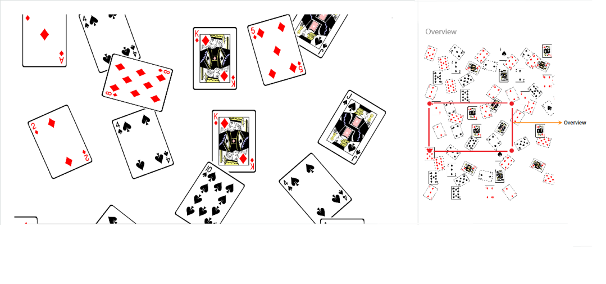

# Overview Control

Overview control allows you to see a preview or an overall view of the entire content of a Diagram. This helps you to look at the overall picture of the large Diagram and also to navigate, pan, or zoom, on a particular position of the page.

When you work on a very large Diagram, you may not know the part you are actually working on or navigation from one part to another might be difficult. One solution for navigation is to zoom out of the entire Diagram and find where you are. Then you can zoom in to a particular area you want to be. This solution is not suitable when you need frequent navigations.

Overview control solves these problems by showing you a preview, an overall view of the entire diagram. A rectangle indicates viewport of the diagram. Navigation becomes easy by dragging this rectangle.

The following code illustrates how to create Overview control.





//Initializes overview

 

@Html.EJ().Overview("Overview", ViewData["overview"] as Syncfusion.JavaScript.DataVisualization.Models.OverviewProperties)

    

//Initializes Diagram

 @Html.EJ().Diagram("Diagram1", ViewData["diagramModel"] as Syncfusion.JavaScript.DataVisualization.Models.DiagramProperties)

 


 
OverviewProperties overview = new OverviewProperties();

overview.Height = "300px";

overview.Width = "233px";

overview.SourceID = "Diagram1";   

ViewData["overview"] = overview;   



 

Overview
{:.caption}

