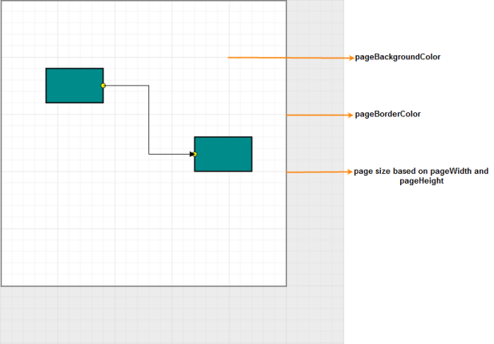
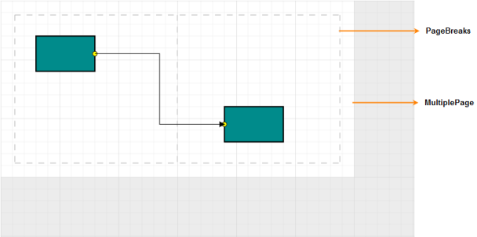
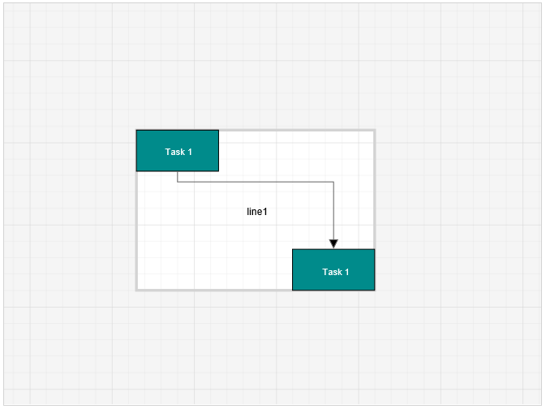
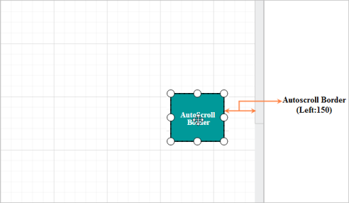

# Page Settings 

Page settings enable to customize the appearance, width, and height of the Diagram page.

## Page size and appearance

The size and appearance of the Diagram pages can be customized with the `PageSettings` property. 

The `PageWidth` and `PageHeight` properties of page settings define the size of the page. In addition to that, you can customize the appearance of the page with a set of appearance specific properties.
To explore those properties, refer [Page Settings](http://help.syncfusion.com/cr/cref_files/aspnetmvc/Syncfusion.EJ~Syncfusion.JavaScript.DataVisualization.Models.Diagram.PageSettings_members.html  "Page Settings").

You can also customize the appearance of off-page regions with the property `BackgroundColor`.

The following code illustrates how to customize the page size and the appearance of page and off-page.



            //Initializes Diagram
            DiagramProperties Model = new DiagramProperties();
            Model.Height = "600px";
            Model.Width = "900px"; 
            //Sets page size
            Model.PageSettings.PageHeight = 500;
            Model.PageSettings.PageWidth = 500;
            //Customizes the appearance of page
            Model.PageSettings.PageBorderWidth = 4;
            Model.PageSettings.PageBackgroundColor = "white";
            Model.PageSettings.PageBorderColor = "lightgray";
            Model.PageSettings.PageMargin = 25;
            Model.PageSettings.ShowPageBreak = true;
            Model.PageSettings.MultiplePage = true;
            Model.PageSettings.PageOrientation = PageOrientation.Portrait;


N> When the PageWidth and PageHeight are not specified, the rectangular region that completely fits all nodes and connectors are considered as page size.

## MultiplePage and PageBreaks

When MultiplePage is enabled, size of the page dynamically increases or decreases in multiples of page width and height and completely fits diagram within the page boundaries. Page Breaks is used as a visual guide to see how pages are split into multiple pages.

`MultiplePage` and `ShowPageBreak` properties of page settings allow you to enable/disable multiple pages and page breaks respectively.
The following code illustrates how to enable multiple page and page break lines.



             //Initializes Diagram
            DiagramProperties Model = new DiagramProperties();
            Model.Height = "600px";
            Model.Width = "900px"; 
            //Enables the multiple page
            Model.PageSettings.MultiplePage = true; 
            //Enables the page break lines
            Model.PageSettings.ShowPageBreak = true;



## Boundary Constraints

 Diagram provides support to restrict/customize the interactive region, out of which the elements cannot be dragged, resized or rotated. 
 `BoundaryConstraints` property of page settings allows you to customize the interactive region. To explore the boundary constraints, refer refer [Boundary Constraints](http://help.syncfusion.com/cr/cref_files/aspnetmvc/Syncfusion.EJ~Syncfusion.JavaScript.DataVisualization.Models.Diagram.PageSettings~BoundaryConstraints.html  "Boundary Constraints").

The following code example illustrates how to define boundaryConstraints.



            //Initializes Diagram
            DiagramProperties Model = new DiagramProperties();
            Model.Height = "600px";
            Model.Width = "900px";
            //Allows to drag within the diagram content
            Model.PageSettings.BoundaryConstraints = BoundaryConstraints.Diagram;
    
