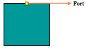
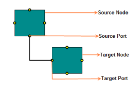

## Port

Port is a specific connection point on node to make a static connection with node. You can define any number of ports on a node. 

### Create Port

The following code illustrates how to create a port and add it to nodes port array.



[EJMVC]

[Controller]

//Creates a port and it to node’s ports collection.

Port port = new Port();

port.Name = "port1";

port.Visibility = PortVisibility.Visible;

port.FillColor = "yellow";

port.Offset = new DiagramPoint(0, 0.5f);

node.Ports.Add(port);



{{ '' | markdownify }}
{:.image }

### Connecting Ports

The connection between specific ports on the node is established by assigning the name of the node’s port to connector’s target port/source port.

The following code illustrates how to establish a port connection:



[EJMVC]

[Controller]

//Creates nodes with ports

Node node1 = CreateNodes("node1", 300, 300);

Node node2 = CreateNodes("node2", 450, 500);

Connector connector = new Connector();

//for creating connector refer to the link Connector Creation

connector.SourcePort = node1.Ports[2] as Port;

connector.TargetPort = node2.Ports[0] as Port;

private Node CreateNodes(string name ,float offsetx, float offsety){

    Node node = new Node(); //for creating node refer the link Node Creation

    node.Ports.Add(GetPort(0, 0.5f, "port1"));

    node.Ports.Add(GetPort(0.5f, 0, "port2"));

    node.Ports.Add(GetPort(1, 0.5f, "port2"));

    node.Ports.Add(GetPort(0.5f, 1, "port2"));

    return node;

}

private Port GetPort(float offsetX, float offsetY, string name){

    Port port = new Port();

    port.Name = name;

    port.Visibility = PortVisibility.Visible;

    port.FillColor = "yellow";

    port.Shape = PortShapes.Square;

    port.Offset = new DiagramPoint(offsetX, offsetY);

    return port;

}



{{ '' | markdownify }}
{:.image }

### Appearance

You can customize the Port appearance by setting the desired values to the appropriate appearance property.

_Properties_

<table>
<tr>
<td>
Properties</td><td>
Data Type</td><td>
Description </td></tr>
<tr>
<td>
 Visibility</td><td>
PortVisibility</td><td>
Gets or sets the visibility of port</td></tr>
<tr>
<td>
 Size</td><td>
Int</td><td>
Gets or sets the size of the port</td></tr>
<tr>
<td>
 Offset</td><td>
DiagramPoint</td><td>
Gets or sets the offset of the port</td></tr>
<tr>
<td>
 BorderColor</td><td>
String</td><td>
Gets or sets the border color of the port</td></tr>
<tr>
<td>
 BorderWidth</td><td>
Int</td><td>
Gets or sets the border width of the port</td></tr>
<tr>
<td>
 FillColor</td><td>
String</td><td>
Gets or sets the fill color of the port</td></tr>
<tr>
<td>
 PathData</td><td>
String</td><td>
Gets or sets the path data of the port</td></tr>
</table>

The following code illustrates how to customize the port.



[EJMVC]

[Controller]

//Sets various appearance properties to port

Port port = new Port();

port.Visibility = PortVisibility.Visible;

port.FillColor = "yellow";

port.Shape = PortShapes.Square;

port.Size = 12;

port.BorderColor = "black";

port.BorderWidth = 2;



### Constraints

You can enable or disable certain behaviors of Port by using Port’s constraints property. 

_Constraints_

<table>
<tr>
<td>
Constraints</td><td>
Description</td></tr>
<tr>
<td>
None</td><td>
Disable all constraints</td></tr>
<tr>
<td>
Connect</td><td>
Enables connections with connector</td></tr>
</table>

The following code illustrates how to set port constraints.



[EJMVC]

[Controller]

//Sets port’s “Connect” constraint

Port port = new Port();

port.Constraints = PortConstraints.Connect;



> {{ '' | markdownify }}
{:.image }
_Note: Port’s constraints property is manipulated by using bitwise operations. For more information about bitwise operations, see_ Bitwise Operations.

