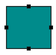
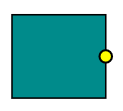

# Port

Essential Diagram for JS provides support to define custom ports for making connections.

When a connector is connected between two nodes, its end points are automatically docked to node's nearest boundary as shown in the following image. 

Ports act as the connection points of node and allows to create connections with only those specific points as shown in the following image.

## Create Port

### Add ports when initializing nodes

To add a connection port, you need to define the port object and add it to node's `Ports` collection. The `Offset` property of port accepts an object of fractions and used to determine the position of ports. The following code illustrates how to add ports when initializing the node.



            BasicShape Node = new BasicShape();
            Node.Name = "node1";
            Node.Width = 100;
            Node.Height = 100; 
            Collection Ports = new Collection();
            Port port = new Port();
            port.Name = "port1";
            port.Offset = new DiagramPoint(0, 0.5f);
            Node.Ports = Ports;
            Model.Nodes.Add(Node);

 

### Add ports at runtime

You can add ports at runtime by using the client side method `addPorts`. The following code illustrates how to add ports to node at runtime.



    // Defines a collection of ports that have to be added at runtime
    var ports = [
        {
            name: "port1",
            // Specifies the port offset – fraction value relative
            to node bounds – determines the position of port on node
            offset: {	
                x: 0,	
                y: 0.5
            }
        },
        { name: "port2",offset: {x: 1,y: 0.5 }},
        { name: "port3",offset: {x: 0.5,y: 0 }},
        { name: "port4",offset: {x: 0.5,y: 1 }}
    ];

    // Gets the instance for the Diagram
    var diagram = $("#diagram").ejDiagram("instance");
    // Adds the ports to the node of name "node"
    diagram.addPorts("node", ports)



To explore the set of properties for defining a port, refer to [Port Properties](http://help.syncfusion.com/cr/aspnetmvc/Syncfusion.JavaScript.DataVisualization.Models.Diagram.Port.html  "Port Properties")

### Update Port at runtime

The client side API `updatePort` is used to update the ports at run time. The following code example illustrates how to change the port properties.



    var diagram = $("#diagram").ejDiagram("instance");
    var selectedObject = diagram.model.selectedItems.children[0];
    var visibility = ej.datavisualization.Diagram.PortVisibility.Visible;
    diagram.updatePort(selectedObject.name, selectedObject.ports[0], { fillColor: "red", visibility: visibility });



## Connect with ports

Connector’s `SourcePort` and `TargetPort` properties allow to create connections between some specific points of source/target nodes. 
For more information about creating connections with port, refer to [Connections with ports](/aspnetmvc/Diagram/Connector#connections-with-ports "Connections with ports")

## Appearance 

You can change the shape of port by using its `Shape` property. To explore the different types of port shapes, refer to [Port Shapes](https://help.syncfusion.com/cr/aspnetmvc/Syncfusion.JavaScript.DataVisualization.Models.Diagram.Port.html#Syncfusion_JavaScript_DataVisualization_Models_Diagram_Port_Shape "Port Shapes").
The appearance of ports can be customized with a set of style specific properties. 

The following code illustrates how to change the appearance of port.



            BasicShape Node = new BasicShape();
            Collection Ports = new Collection();
            Port Port = new Port(); 

            //Defines the shape of port
            Port.Shape = PortShapes.Circle;
            //Specifies the port visibility
            Port.Visibility = PortVisibility.Visible;
            //Customizes the appearance
            Port.FillColor = "yellow";
            Port.Size = 12;
            Port.BorderColor = "black";
            Port.BorderWidth = 2;
            // Specifies the port position
            Port.Name = "port1";
            Port.Offset = new DiagramPoint(1, 0.5f);
            Node.Ports = Ports;
            Model.Nodes.Add(Node);



## Constraints

The `Constraints` property allows to enable/disable certain behaviors of ports. For more information about port constraints, refer to [Port Constraints](/aspnetmvc/Diagram/Constraints#portconstraints)