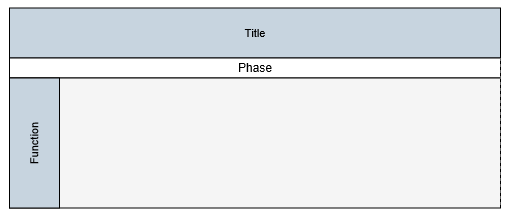
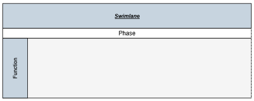

# Swim lane

Swim-lane Diagrams are typically used to visualize the relationship between a business process and the department responsible for it by focusing on the logical relationships between activities. Swimlanes may be arranged either horizontally or vertically.

##Initialize the Diagram model 
Create a Object for diagram properties model element that can be used to initialize the diagram widget as shown below.



            //Initialize the Diagram Model
            DiagramProperties Model = new DiagramProperties();



## Create a swimlane

To create a swimlane, you need to use the `Swimlane` class. By default, the swimlanes are arranged vertically. You can change that with the `Orientation` property of swimlane.

The following code example illustrates how to define a swimlane object.



            //Disables tooltip for any node/connector
            DiagramProperties Model = new DiagramProperties();

            SwimLane Swimlane = new SwimLane();
            Swimlane.Name = "swimlaneNode";
            //Changes the orientation
            Swimlane.Orientation = "horizontal";
            //Sets the position and size
            Swimlane.OffsetX = 400;
            Swimlane.OffsetY = 200;
            Swimlane.Height = 100;
            Swimlane.Width = 700;
            //Sets the type of object as swimlane
            Swimlane.IsSwimlane = true;



## Add swimlane into diagram

Adding a swimlane to the Diagram is same as adding a node. You can add either through the `Nodes` collection or through the client side method `add`. You can also drag and drop a swimlane from symbol palette.
For more information about adding a node/swimlane to the Diagram, refer to [Add Nodes](/aspnetmvc/Diagram/Node#create-node "Add Nodes").

The following code example illustrates how to add a swimlane to the Diagram through `Nodes` collection.



            //Add the swimlane in to the Nodes collection
            Model.Nodes.Add(Swimlane);



## Headers

Swimlane allows to define a header to textually describe it. The `Header` property of swimlane allows you to define its textual description(`Text`) and to customize its appearance. The following code example illustrates how to define swimlane header.



            //Defines the header and format its text
            Header Header = new Header();
            Header.Text = "Swimlane";
            Header.Height = 50;
            Header.FillColor = "#C7D4DF";
            Header.FontColor = "black";
            Header.FontSize = 11;
            Header.FontFamily = "Arial";
            Header.Italic = true;
            Header.Bold = true;
            Header.TextDecoration = "underline";

            SwimLane Swimlane = new SwimLane();
            Swimlane.Name = "swimlaneNode";
            //Changes the orientation
            Swimlane.Orientation = "horizontal";
            //Sets the position and size
            Swimlane.OffsetX = 400;
            Swimlane.OffsetY = 200;
            Swimlane.Height = 100;
            Swimlane.Width = 700;
            //Sets the type of object as swimlane
            Swimlane.IsSwimlane = true; 
            
            //Sets the swimlane header
            Swimlane.Header = Header;
            //Add the swimlane in to the Nodes collection
            Model.Nodes.Add(Swimlane);




    //Updates the swimlane header at runtime
    var diagram = $("#diagram").ejDiagram("instance");
    diagram.updateNode("swimlaneName", { header: {fontColor:"white"} })



### Update Header

Swimlane headers can be updated at runtime with the client side method `updateNode`. The following code example illustrates how to update a lane's header at runtime.



    var diagram = $("#diagram").ejDiagram("instance");

    //Defines the header and format its text
    var header = {
        text: "swimlane",
        bold: true,
        italic: true
    };

    diagram.updateNode("swimlane", { header: header });



### Disable headers

You can hide the swimlane headers. The following code example illustrates how to hide headers.


 
           //Defines the header 
            Header Header = new Header(); 
            //Sets "0" to hide header
            Header.Height = 0;



## Lane

Lane is a functional unit or a responsible department of a business process that helps to map a process within the functional unit or in between other functional units.
You can add any number of lanes to a swimlane and the lanes are automatically stacked inside a swimlane based in the order they are added.

### Create an empty lane

To create an empty lane, you need to define an object with `IsLane` property that helps identify the object as a lane. The following example illustrates how to define a swimlane with a lane.



            SwimLane Swimlane = new SwimLane();
            Swimlane.Name = "swimlaneNode";
            //Changes the orientation
            Swimlane.Orientation = "horizontal";
            //Sets the position and size
            Swimlane.OffsetX = 400;
            Swimlane.OffsetY = 200;
            Swimlane.Height = 100;
            Swimlane.Width = 700;
            Swimlane.Header = Header;
            //Sets the type of object as swimlane
            Swimlane.Type = "swimlane";

            //Defines an empty lanes Collection
            Collection Lanes = new Collection();
            Lane Lane = new Lane();
            Lane.Name = "lane1";
            Lane.FillColor = "#f5f5f5";
            Lane.Height = 120;
            //Sets the object as Lane
            Lane.IsLane = true;
            Lanes.Add(Lane);
            Swimlane.Lanes = Lanes;

            //Add the swimlane in to the Nodes collection
            Model.Nodes.Add(Swimlane);



### Create a lane with header

The `Header` property of the lane allows you to textually describe the lane(`text`) and to customize the appearance of the description. The following code example illustrates how to define a lane header.
You can limit the size of a lane with its `MinWidth`, `MinHeight`, `MaxWidth`, and `MaxHeight` properties.



            //Defines the header and format its text
            Header Header = new Header();
            Header.Text = "Swimlane";
            Header.Height = 50;
            Header.FillColor = "#C7D4DF";
            Header.FontColor = "black";
            Header.FontSize = 11;
            Header.FontFamily = "Arial";

            Header LaneHeader = new Header();
            LaneHeader.Text = "Lane";
            LaneHeader.Width = 50;
            LaneHeader.FillColor = "#C7D4DF";
            LaneHeader.FontColor = "black";
            LaneHeader.FontSize = 11;
            LaneHeader.FontFamily = "Arial";

            //Defines an empty lanes Collection
            Collection Lanes = new Collection();
            Lane Lane = new Lane();
            Lane.Name = "lane1";
            Lane.FillColor = "#f5f5f5";
            Lane.Height = 120;
            //Sets the object as Lane
            Lane.IsLane = true;
            //Sets the object as Lane
            Lane.Header = LaneHeader;
            //Specifies the minimum and maximum size of the lane
            Lane.MinWidth = 500;
            Lane.MaxWidth = 700;
            Lane.MinHeight = 120;
            Lane.MaxHeight = 200;
            Lanes.Add(Lane);

            SwimLane Swimlane = new SwimLane();
            Swimlane.Name = "swimlaneNode";
            //Changes the orientation
            Swimlane.Orientation = "horizontal";
            //Sets the position and size
            Swimlane.OffsetX = 400;
            Swimlane.OffsetY = 200;
            Swimlane.Height = 100;
            Swimlane.Width = 700;
            Swimlane.Header = Header;
            //Sets the type of object as swimlane
            Swimlane.Type = "swimlane"; 
            Swimlane.Lanes = Lanes;

            //Add the swimlane in to the Nodes collection
            Model.Nodes.Add(Swimlane);



#### Disable/Update header

You can disable/update the lane header at runtime with the client side method, `updateNode`. The following code example illustrates how to disable the lane header at run time.



        var diagram = $("#diagram").ejDiagram("instance");

        //Sets "0" to hide header
        diagram.updateNode("laneName", { header: {height: 0} })



### Add nodes to a lane

To add nodes to a lane, You need to add them to the `Children` collection of lane. The following code example illustrates how to add nodes to a lane.



            Label Label = new Label() { Text = "Node" };
            Node Child = new Node()
            {
                Name = "node",
                Width = 70,
                Height = 30,
                MarginLeft = 70,
                MarginTop = 1
            };

            //Defines an empty lanes Collection
            Collection Lanes = new Collection();
            //Defines an empty Children Collection
            Collection Children = new Collection();
            Lane Lane = new Lane();
            Lane.Name = "lane1";
            Lane.FillColor = "#f5f5f5";
            Lane.Height = 120;
            //Sets the object as Lane
            Lane.IsLane = true;
            //Sets the object as Lane
            Lane.Header = LaneHeader;

            //Add the Child to the children of the lane
            Children.Add(Child);
            Lane.Children = Children;
            Lanes.Add(Lane);

            SwimLane Swimlane = new SwimLane();
            Swimlane.Name = "swimlaneNode";
            //Changes the orientation
            Swimlane.Orientation = "horizontal";
            //Sets the position and size
            Swimlane.OffsetX = 400;
            Swimlane.OffsetY = 200;
            Swimlane.Height = 100;
            Swimlane.Width = 700;
            Swimlane.Header = Header; 
            Swimlane.Lanes = Lanes;

            //Add the swimlane in to the Nodes collection
            Model.Nodes.Add(Swimlane);



## Phase

Phases are the sub-processes that are used to break the swimlane into multiple smaller regions.

### Add phase

To define a phase, you have to set the length of the region to the `Offset` property of phase. Every region can be textually described with the `Label` property of phase.

The following code example illustrates how to add a phase on initializing swimlane.



            Label PhaseLabel = new Label() { Text = "Phase1" };
            //Defines an empty Children Collection
            Collection Phases = new Collection();
            //Creates a phase
            Phase Phase1 = new Phase()
            {
                Name = "Phase1",
                //Length of the first region
                Offset = 300,
                //Initializes labels for phases
                Label = PhaseLabel,
                //Specifies the appearance of separator
                LineWidth = 1,
                LineDashArray = "3,3",
                LineColor = "#606060"
            };
            PhaseLabel = new Label() { Text = "Phase2" };
            Phase Phase2 = new Phase()
            {
                Name = "Phase2",
                Label = PhaseLabel,
            };
            Phases.Add(Phase1);
            Phases.Add(Phase2);

            SwimLane Swimlane = new SwimLane();
            Swimlane.Name = "swimlaneNode";
            //Changes the orientation
            Swimlane.Orientation = "horizontal";
            //Sets the position and size
            Swimlane.OffsetX = 400;
            Swimlane.OffsetY = 200;
            Swimlane.Height = 100;
            Swimlane.Width = 700;
            Swimlane.Header = Header;
            //Sets the type of object as swimlane
            Swimlane.Type = "swimlane";

            //Sets the Lanes Collection
            Swimlane.Lanes = Lanes;

            //Sets the Phase Collection
            Swimlane.Phases = Phases;
            //Add the swimlane in to the Nodes collection
            Model.Nodes.Add(Swimlane);



### Add phase at runtime

You can add a region at runtime with the client side method, `addPhase`. The following code example illustrates how to add a phase at runtime.



    var phase = {
        name: "Phase3",
        label: { text: "Phase3" }
    };

    var diagram = $("#diagram").ejDiagram("instance");
    diagram.addPhase("swimlaneName", phase);



A phase can be updated at runtime with the client side API `updateNode`. The following code example illustrates how to a update phase at runtime.



    var diagram = $("#diagram").ejDiagram("instance");
    var options = {
        //Specifies the style of the phase to be updated
        lineDashArray: "3,3",
        lineColor: "#C7D4DF",
        lineWidth: 2
    }
    diagram.updateNode("phaseName", options);



N> A default phase is added, when the phase collection of the swimlane is empty. When the phase collection is initialized, a default phase is appended at the end of swimlane.

## Limitations

* You cannot add connectors as the children of lanes.