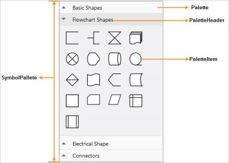
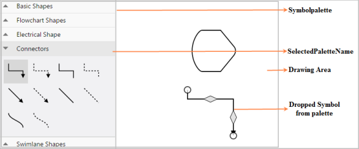

# Symbol Palette

The SymbolPalette displays a collection of palettes. The Palette shows nodes and connectors. It allows you to drag and drop the nodes and connectors on the Diagram. The Palette has a header that displays the name and also has an option that allows you to expand or collapse its items. Each node or connector in the palette is called a Palette Item.

## Create and Add Symbols in the Palette

Nodes and Connectors are added to the Palette as Palette Items.

The following code example illustrates how to create and add symbols in Palette.



//Creates palette nodes and add it in symbolpalette

public void GenerateBasicShapes(SymbolPaletteProperties symbolPalettes)

{ 

    Palette basicShapes = new Palette("Basic Shapes");

    //note: for creating node refer to the link Node creation

    basicShapes.AppendChild(node);

    //Adds palette in palette collection

    symbolPalettes.Palettes.Add(basicShapes);

}

//Creates palette connectors and add it in symbolpalette

public void GenerateConnectors(SymbolPaletteProperties symbolPalettes)

{

   Palette connectors = new Palette("Connectors");

   //note: for creating connector refer to the link Connector creation

   connectors.AppendChild(connector);

   //Adds palette in palette collection

   symbolPalettes.Palettes.Add(connectors);

}



## Add Nodes and Connectors

The Diagram provides support for adding nodes and connectors through the Symbol Palette. To add a node to the Diagram, drag the desired symbol from the SymbolPalette to the drawing area and release the pointer. The desired palette item that is clicked, is added to the Diagram when you set the desired Diagram ID to the Symbol Palette’s DiagramId.

## Appearance

The following properties are used to customize the appearance of the Symbol Palette.

_Appearance_

<table>
<tr>
<th>
Properties</th><th>
Data Type</th><th>
Description</th></tr>
<tr>
<td>
 Width</td><td>
String</td><td>
Gets or sets the width of the palette.</td></tr>
<tr>
<td>
 Height</td><td>
String</td><td>
Gets or sets the height of the palette.</td></tr>
<tr>
<td>
 PaletteItemWidth</td><td>
Int</td><td>
Gets or sets the palette item width.</td></tr>
<tr>
<td>
 PaletteItemHeight</td><td>
Int</td><td>
Gets or sets the palette item height.</td></tr>
<tr>
<td>
 ShowPaletteItemText</td><td>
Boolean</td><td>
Shows or hides the palette item text.</td></tr>
<tr>
<td>
 AllowDrag</td><td>
Boolean</td><td>
Allows or prevents you from dragging node or connector from symbol palette.</td></tr>
<tr>
<td>
 HeaderHeight</td><td>
Int</td><td>
Gets or sets the palette header height.</td></tr>
<tr>
<td>
 CssClass</td><td>
String</td><td>
Gets or sets the class of the palette.</td></tr>
<tr>
<td>
 Palettes</td><td>
Array</td><td>
Gets or sets the palette items.</td></tr>
<tr>
<td>
SelectedPaletteName</td><td>
String</td><td>
Gets or sets the name of the selected item in the palette</td></tr>
</table>

The following code illustrates how to customize the Appearance ofthe Palette.



 public void Palette(SymbolPaletteProperties symbolpalettes)

  {

 // properties to symbol palette

    symbolpalettes.DiagramId = "DiagramContent";

    symbolpalettes.Height = "100%";

    symbolpalettes.Width = "100%";           

    symbolpalettes.PaletteItemHeight = 45;

    symbolpalettes.PaletteItemWidth = 45;

    symbolpalettes.HeaderHeight = 30;

    symbolpalettes.SelectedPaletteName = "Basic Shapes";

    symbolpalettes.ShowPaletteItemText = true; 

    symbolpalettes.AllowDrag = true;  }



## Preview for Drag and Drop

Diagram provides preview support for Paletteitem during drag and drop. When you drag an item from the palette to Diagram, a preview of the dragged item is displayed.

### Preview Appearance

You can customize the preview size and position by using the following properties.

_Preview Appearance_

<table>
<tr>
<th>
Properties</th><th>
Data Type</th><th>
Description</th></tr>
<tr>
<td>
PreviewWidth</td><td>
 Int</td><td>
Gets or sets the preview width of palette item.</td></tr>
<tr>
<td>
PreviewHeight</td><td>
 Int</td><td>
Gets or sets the preview height of palette item.</td></tr>
<tr>
<td>
PreviewOffset</td><td>
 Object</td><td>
Gets or sets the preview x and y value of palette item.</td></tr>
</table>

The following code example illustrates how to customize Preview Content.



//Sets properties to symbol palette preview

symbolpalette.Model.PreviewHeight=100

symbolpalette.Model.PreviewWidth=100

symbolpalette.Model.PreviewOffset= new DiagramPoint(102,102)



