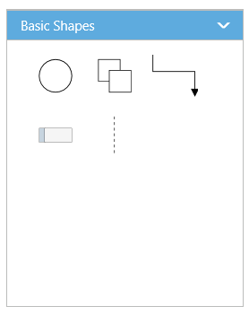

# Symbol Palette

The **SymbolPalette** displays a collection of palettes. The Palette shows a set of nodes and connectors. It allows you to drag and drop the nodes and connectors into the Diagram.

## Create symbol palette

The `DiagramId` property of symbolpalette should be set with the corresponding Diagram ID to drag and drop the nodes and connectors into the Diagram. The following code illustrates how to create symbolpalette.  

 

    //Initializes overview
    
    

    
        @Html.EJ().SymbolPalette("SymbolPalette", ViewData["SymbolPaletteModel"] as Syncfusion.JavaScript.DataVisualization.Models.SymbolPaletteProperties)
        
         @Html.EJ().Diagram("Diagram", ViewData["DiagramModel"] as Syncfusion.JavaScript.DataVisualization.Models.DiagramProperties)
    

    




    //Initializes the symbol palette
    SymbolPaletteProperties symbolPalette = new SymbolPaletteProperties();
    //Defines the palette collection
    symbolPalette.Palettes = new Collection()
    {
        palette
    };
    //Specifies the symbol palette size
    symbolPalette.Width = "100%";
    symbolPalette.Height = "100%";
    ViewData["SymbolPaletteModel"] = symbolpalette;

    DiagramProperties model = new DiagramProperties();
    model.Height = "550px";
    model.Width = "800px";
    ViewData["DiagramModel"] = model;



## Add palettes to SymbolPalette

A palette allows to display a group of related symbols and it textually annotates the group with its header.
To initialize a palette, define a JSON object with the property `Name` that is displayed as the header text of palette. The `Expanded` property of palette allows to expand/collapse its palette items.
The following code example illustrates how to define a palette and how its added to symbol palette.



    //Creates a node
    BasicShape ellipse = new BasicShape()
    {
        //Specifies node size
        Width = 50,
        Height = 50,
        //Specifies node offset  
        OffsetX = 50,
        OffsetY = 50,
        //Specifies node shape
        Shape = BasicShapes.Ellipse
    };
    Palette palette = new Palette("Basic Shapes");
    palette.Expanded = true;
    //Adds the palette items to palette
    palette.Items.Add(ellipse);



You can add any number of palettes to the `Palettes` collection of the symbol palette. The following example illustrates how to define symbol palette with a palette object that is defined in the previous step.



    //Initializes the symbol palette 
    SymbolPaletteProperties symbolpalette = new SymbolPaletteProperties();
    symbolpalette.Palettes = new Collection()
        {
            palette
        };
    ViewData["SymbolPaletteModel"] = symbolpalette;

    DiagramProperties model = new DiagramProperties();
    model.Height = "550px";
    model.Width = "800px";
    ViewData["DiagramModel"] = model;



The following image shows the symbol palette with multiple palette Items.

### Customize the Palette Header

Palettes can be annotated with its header texts and you can change the height of palette header by using `HeaderHeight` property of symbol palette.

Also, you can embed any HTML element into a palette header by defining the ScriptTemplate id to palette's templateId property. Following code example illustrates how to customize palette headers.



    <!--dependency scripts-->
        											





    //Initializes the symbol palette 
    SymbolPaletteProperties symbolpalette = new SymbolPaletteProperties();
    symbolpalette.Height = "550px";
    symbolpalette.Width = "300px";
     
    Palette palette = new Palette("Basic Shapes");
    //Sets the id of the script template
    palette.TemplateId = "svgTemplate";
    palette.Expanded = true; 
    symbolpalette.HeaderHeight = 50;

    symbolpalette.Palettes = new Collection() { palette };
    ViewData["SymbolPaletteModel"] = symbolpalette;



The following image shows the customized palette header

## Add symbols to palette

The symbol need to be defined and added to the `Items` collection of the palette. You can create a symbol as a node, group, connector, lane, or phase except swimlane. 
 
The following code example illustrates how to define a palette with symbols that are defined in the previous section. 



    //Initializes the symbol palette 
    SymbolPaletteProperties symbolpalette = new SymbolPaletteProperties();
    symbolpalette.Height = "550px";
    symbolpalette.Width = "300px";
    //Creates a node
    BasicShape ellipse = new BasicShape()
    {
        //Specifies node size
        Width = 50,
        Height = 50,
        //Specifies node offset  
        OffsetX = 50,
        OffsetY = 50,
        //Specifies node shape
        Shape = BasicShapes.Ellipse
    };
    Palette palette = new Palette("Basic Shapes");
    //Sets the id of the script template
    palette.TemplateId = "svgTemplate";
    palette.Expanded = true;
    //Adds the palette items to palette
    palette.Items.Add(ellipse);
    symbolpalette.HeaderHeight = 50;

    symbolpalette.Palettes = new Collection() { palette };
    ViewData["SymbolPaletteModel"] = symbolpalette;



### Customize the size of symbols

You can customize the size of the individual symbol. The `PaletteItem` property of node enables you to define the size of the symbols. The following code example illustrates how to change the size of a symbol.



    //Initializes the symbol palette 
    SymbolPaletteProperties symbolpalette = new SymbolPaletteProperties();
    symbolpalette.Height = "550px";
    symbolpalette.Width = "300px";
    //Creates a node
    BasicShape ellipse = new BasicShape()
    {
        //Specifies node size
        Width = 50,
        Height = 50, 
        //Specifies node shape
        Shape = BasicShapes.Ellipse,
        PaletteItem = new PaletteItem() { Width = 50, Height = 50, Margin = new Margin() { Left = 20, Top = 20, Right = 20, Bottom = 20 } }
    };
    Palette palette = new Palette("Basic Shapes");
    palette.Expanded = true;
    //Adds the palette items to palette
    palette.Items.Add(ellipse);
    //Specifies the default size to render symbols
    symbolpalette.PaletteItemWidth = 50;
    symbolpalette.PaletteItemHeight = 50;
    symbolpalette.Palettes = new Collection() { palette };
    ViewData["SymbolPaletteModel"] = symbolpalette;



Symbol size will be set based on the following precedence.

**Precedence**

| Palette Item | Rendering Size |  
|---|---|---|
| Width | PaletteItem.Width > model.PaletteItemWidth > Node.Width |  
| Height | PaletteItem.height > model.PaletteItem.Height > Node.Height | 

* Symbol size will be rendered in the palette based on Node.PaletteItem's `Width` and `Height` property. 
* If PaletteItem's Width and Height property is not specified, symbol size will be rendered in the palette based on model's `PaletteItemWidth` and `PaletteItemHeight` property. 
* If you don't specify above two, then symbol size will be rendered in the palette based on node's `Width` and `Height` property.
 

### Stretch the symbols into the palette

The `EnableScale` property of the paletteItem enables you to customize the size of the symbol regardless of the precedence. The following code example illustrates how to customize the symbol size.



    //Initializes the symbol palette 
    SymbolPaletteProperties symbolpalette = new SymbolPaletteProperties();
    symbolpalette.Height = "550px";
    symbolpalette.Width = "300px";
    //Creates a node
    BasicShape rectangle = new BasicShape()
    {
        //Specifies node size
        Width = 80,
        Height = 40,
        // Enables to fit the content into the specified palette item size
        // When it is set as false, the element is rendered with actual node size
        PaletteItem = new PaletteItem() { EnableScale = true }
    };
    Palette palette = new Palette("Basic Shapes");
    palette.Expanded = true;
    //Adds the palette items to palette
    palette.Items.Add(rectangle);
    //Specifies the default size to render symbols
    symbolpalette.PaletteItemWidth = 50;
    symbolpalette.PaletteItemHeight = 50;
    symbolpalette.Palettes = new Collection() { palette };
    ViewData["SymbolPaletteModel"] = symbolpalette;



## Symbol Previews

Image, simple snippet to customize the preview size

You can customize the preview size of the individual palette items. The `PaletteItem` property of node enables you to define the preview size of the symbol items. The following code example illustrates how to change the preview size of a palette item.



    //Initializes the symbol palette 
    SymbolPaletteProperties symbolpalette = new SymbolPaletteProperties();
    symbolpalette.Height = "550px";
    symbolpalette.Width = "300px";
    //Creates a node
    BasicShape rectangle = new BasicShape()
    {
        //Specifies node size
        Width = 50,
        Height = 50,
        //Specifies the individual palette item preview size   
        PaletteItem = new PaletteItem() { PreviewHeight = 50, PreviewWidth = 50 }
    };
    BasicShape ellipse = new BasicShape()
    {
        //Specifies node size
        Width = 50,
        Height = 50,
        Shape = BasicShapes.Ellipse, 
    };
    Palette palette = new Palette("Basic Shapes");
    palette.Expanded = true;
    //Adds the palette items to palette
    palette.Items.Add(rectangle);
    palette.Items.Add(ellipse);
    symbolpalette.Palettes = new Collection() { palette };
    ViewData["SymbolPaletteModel"] = symbolpalette;



You can also customize the preview size of the all palette items. The `PreviewWidth` and `PreviewHeight` property of SymbolPalette enables you to define the preview size to all the symbol palette items. The following code example illustrates how to change the preview size of a symbol palette items.



    //Initializes the symbol palette 
    SymbolPaletteProperties symbolpalette = new SymbolPaletteProperties();
    symbolpalette.Height = "550px";
    symbolpalette.Width = "300px";
    //Creates a node
    BasicShape rectangle = new BasicShape()
    {
        //Specifies node size
        Width = 50,
        Height = 50,
    }; 
    Palette palette = new Palette("Basic Shapes");
    palette.Expanded = true;
    //Adds the palette items to palette
    palette.Items.Add(rectangle); 
    symbolpalette.PreviewHeight = 100;
    symbolpalette.PreviewWidth = 100;
    symbolpalette.Palettes = new Collection() { palette };
    ViewData["SymbolPaletteModel"] = symbolpalette;



Symbol palette allows to sets the offset of the dragging helper relative to the mouse cursor.



    //Initializes the symbol palette 
    SymbolPaletteProperties symbolpalette = new SymbolPaletteProperties();
    symbolpalette.Height = "550px";
    symbolpalette.Width = "300px";
    //Creates a node
    BasicShape rectangle = new BasicShape()
    {
        //Specifies node size
        Width = 50,
        Height = 50,
    };

    Palette palette = new Palette("Basic Shapes");
    palette.Expanded = true;
    //Adds the palette items to palette
    palette.Items.Add(rectangle);
    symbolpalette.PreviewOffset = new DiagramPoint() { X = 50, Y = 50 };
    symbolpalette.Palettes = new Collection() { palette };
    ViewData["SymbolPaletteModel"] = symbolpalette;



Symbol preview size will be set based on the following precedence.

**Precedence**

| Palette Item |   Preview Size |
|---|---|---|
| Width |  PaletteItem.PreviewWidth > Model.PreviewWidth > Node.Width |
| Height | PaletteItem.PreviewHeight > Model.PreviewHeight > Node.Height |

* Symbol preview size will be set based on node.paletteItem's `PreviewWidth` and `PreviewHeight` property. 
* If paletteItem's width and height property is not specified, symbol size will be set based on model's `PreviewWidth` and `PreviewHeight` property. 
* If you don't specify above two, then symbol size will be rendered in the palette based on node's `Width` and `Height` property. 

## Show/hide the symbol Text 

You can show/hide the symbol text by using the `ShowPaletteItemText` property of symbol palette.



    //Initializes the symbol palette 
    SymbolPaletteProperties symbolpalette = new SymbolPaletteProperties();
    symbolpalette.Height = "550px";
    symbolpalette.Width = "300px";
    //Specifies whether palette item text should be visible or not
    symbolpalette.ShowPaletteItemText = true;
    ViewData["SymbolPaletteModel"] = symbolpalette;


To explore the properties of symbol palette, refer to [Symbol Palette Properties](/api/aspnetmvc/ejsymbolpalette#members "Symbol Palette Properties").