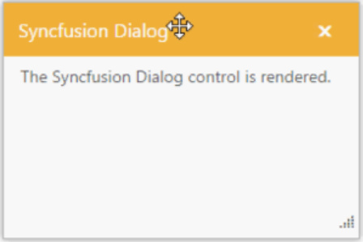
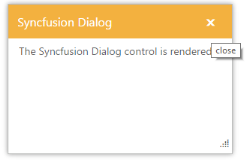
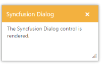
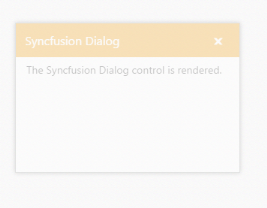
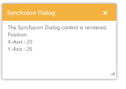
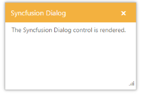
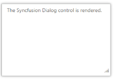
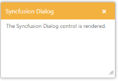

## Behavior Settings 

Resize Support

The Dialog control can be resized using this feature. You can resize the Dialog by dragging the bottom right corner area.

Enable Resize Option

The following steps explains you the implementation of resize option in the Dialog control. 

1. In a VIEW page set a helper element with dialog content for rendering the Dialog control. 

[CSHTML]

// In the CSHTML page, add the Dialog widget using helpers and set EnableResize to ‘true’. 

@{Html.EJ().Dialog("dialog").Title("Syncfusion Dialog").ContentTemplate(@
The Syncfusion Dialog control is rendered.&lt;/div&gt;).Width(300).Height("200").

EnableResize(true).Render();}

2. The output for Dialog control when “EnableResize” is “true” is as follows.

{  | markdownify }
{:.image }

_Figure_ _6__: Dialog with “EnableResize”_                                                                                 

Drag Support

The Dialog control supports the drag functionality. You can click the Dialog header and drag the control anywhere in the web page.

Allow Drag Option

The following steps explains you the implementation of drag option in the Dialog control. 

1. In the VIEW page set a helper element with the dialog content for rendering the Dialog control. 

[CSHTML]

// In the CSHTML page add the Dialog widget using helpers and set AllowDraggable to ‘true’.

@{Html.EJ().Dialog("dialog").Title("Syncfusion Dialog").ContentTemplate(@
The Syncfusion Dialog control is rendered.&lt;/div&gt;).Width(300).Height("200").

AllowDraggable(true).Render();}

2. The output for Dialog control when “AllowDraggable” is “true” is as follows.

{  | markdownify }
{:.image }

_Figure_ _7__: Dialog with "AllowDraggable"_                                                                  

Close Icon ToolTip Support

1. You can change the close icon tooltip in the Dialog control by using CloseIconTooltipproperty. The default value for CloseIconTooltip is close in the Dialog control.

Define Close Icon ToolTip

The following steps explains you the implementation of close icon tooltip option in the Dialog control. 

1. In the VIEW page set a helper element with the dialog content for rendering the Dialog control. 

[CSHTML]

// In the CSHTML page add the Dialog widget using helpers and assign the CloseIconTooltip property as close.

@{Html.EJ().Dialog("dialog").Title("Syncfusion Dialog").ContentTemplate(@
The Syncfusion Dialog control is rendered.&lt;/div&gt;)

   .Width(300).Height("200").CloseIconTooltip("close").Render();}

2. The output for Dialog control when “CloseIconTooltip” is “close” is as follows.

{  | markdownify }
{:.image }

_Figure_ _8__: Dialog with "CloseIconTooltip_     

Persistence Support

The Dialog control supports the state maintenance where you can maintain the state of the Dialog control in the web page. The default value for EnablePersistence is false in the Dialog control.

Enable Persistence Option

The following steps explains the implementation of persistence support in the Dialog control. 

1. In the VIEW page set a helper element with the dialog content for rendering the Dialog control. 

[CSHTML]

// In the CSHTML page add the Dialog widget using helpers and set EnablePersistence to ‘true’.

    @{Html.EJ().Dialog("dialog").Title("Syncfusion Dialog").ContentTemplate(@
The Syncfusion Dialog control is rendered.&lt;/div&gt;)

      .Width(300).Height("200").EnablePersistence(true).Render();}

Make resize and reload the web page. The state is maintained in the Dialog control. The output for Dialog control when “EnablePersistence” is “true” is as follows. 

{  | markdownify }
{:.image }

_Figure_ _9__: Dialog with “EnablePersistence"_

Enabled or Disabled

The Dialog control supports the Enabled or Disabled option that allows you to enable or disable the Dialog control in the web page.

Disable Dialog Control

The following steps explains you the implementation of disable option in the Dialog control. 

1. In the VIEW page set a helper element with the dialog content for rendering the Dialog control. 

[CSHTML]

// In the CSHTML page add the Dialog widget using helpers and set Enabled to ‘false’.

    @{Html.EJ().Dialog("dialog").Title("Syncfusion Dialog").ContentTemplate(@
The Syncfusion Dialog control is rendered.&lt;/div&gt;)

      .Width(300).Height("200").Enabled(false).Render();}

2. The output for Dialog control when Enabled is “false” is as follows.

{  | markdownify }
{:.image }

_Figure_ _11__: Dialog with “Enabled" as “false”_                                                                  

 Positioning Dialog

The Dialog provides the option to place the control based upon its X-axis and Y-axis position in the web page. The following steps explains you the implementation of dialog position option.

1. In the VIEW page set a helper element with the dialog content for rendering the Dialog control. 

[CSHTML]

// In the CSHTML page add the Dialog widget using helpers and set the Position values.

@{Html.EJ().Dialog("dialog").Title("Syncfusion Dialog").ContentTemplate(@&lt;div&gt;

            The Syncfusion Dialog control is rendered.&lt;br /&gt;

            Position

            &lt;br /&gt;

            X-Axis : 20

            &lt;br /&gt;

            Y-Axis : 26

        &lt;/div&gt;).Width(300).Height("200").Position(p => p.XValue("20").YValue("26")).

Render();}

2. The output for Dialog control after setting X-axis and Y-axis value.

{  | markdownify }
{:.image }

_Figure_ _12__: Dialog with “Position"_

Header Option

You can show or hide the Dialog header by setting ShowHeader property. The following steps explains you the implementation of Dialog header option.

Show Header

1. In the VIEW page set a helper element with the dialog content for rendering the Dialog control. 

[CSHTML]

// In the CSHTML page add the Dialog widget using helpers and set the ShowHeader as true. 

@{Html.EJ().Dialog("dialog").Title("Syncfusion Dialog").ContentTemplate(@
The Syncfusion Dialog control is rendered.&lt;/div&gt;).Width(300).Height("200").

ShowHeader(true).Render();}

2. The output for Dialog control when ShowHeader is “true” is as follows.

{  | markdownify }
{:.image }

_Figure_ _13__: Dialog with “ShowHeader" as “true”_                                           

Hide Header

1. In the VIEW page set a helper element with the dialog content for rendering the Dialog control. 

[CSHTML]

// In the CSHTML page add the Dialog widget using helpers and set the ShowHeader to ‘false’. 

@{Html.EJ().Dialog("dialog").Title("Syncfusion Dialog").ContentTemplate(@
The Syncfusion Dialog control is rendered.&lt;/div&gt;).Width(300).Height("200").

ShowHeader(false).Render();}

2. The output for Dialog control when ShowHeader is “false” is as follows.

{  | markdownify }
{:.image }

_Figure_ _14__: Dialog with “ShowHeader" as “false”_                                     

Show at Initial

The Dialog control contains an option to be opened state or closed state at initial.

 The default value for ShowOnInit is true. Setting false to the ShowOnInit hides the Dialog control at initialization.

1. In the VIEW page set a helper element with the dialog content for rendering the Dialog control. 

[CSHTML]

// In the CSHTML page add the Dialog widget using helpers and set the ShowOnInit to ‘true’.

@{Html.EJ().Dialog("dialog").Title("Syncfusion Dialog").ContentTemplate(@
The Syncfusion Dialog control is rendered.&lt;/div&gt;).Width(300).Height("200").

ShowOnInit(true).Render();}

2. The output for Dialog control when ShowOnInit is “true” is as follows.

{  | markdownify }
{:.image }

_Figure_ _15__: Dialog with “ShowOnInit"_                               

Rounded Corner Support

The Dialog can support with rounded corner appearance, the default value for ShowRoundedCorner is false. 

1. In the VIEW page set a helper element with the dialog content for rendering the Dialog control. 

[CSHTML]

// In the CSHTML page add the Dialog widget using helpers and set ShowRoundedCorner to ‘true’.

@{Html.EJ().Dialog("dialog").Title("Syncfusion Dialog").ContentTemplate(@
The Syncfusion Dialog control is rendered.&lt;/div&gt;).Width(300).Height("200").

ShowRoundedCorner(true).Render();}

2. The output for Dialog control when ShowRoundedCorner is “true” is as follows.

{  | markdownify }
{:.image }

_Figure_ _16__: Dialog with “ShowRoundedCorner"_

