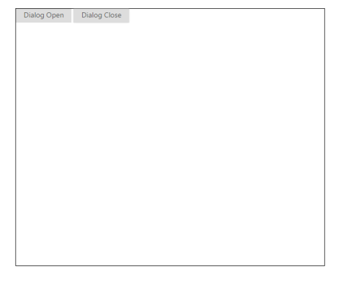
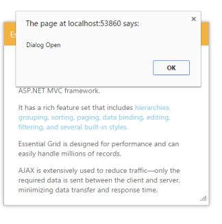
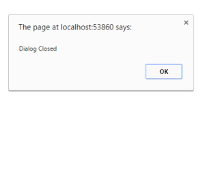

## Client-Side-API’s

The Dialog Widget provides some Client side Methods to process the control from script side.

_Table_ _1__: Client side API for Dialog Table_

<table>
<tr>
<td>
Methods</td><td>
Description</td></tr>
<tr>
<td>
Open</td><td>
This method allows you to open the Dialog widget</td></tr>
<tr>
<td>
Close</td><td>
This method allows you to close the Dialog widget</td></tr>
<tr>
<td>
IsOpened</td><td>
This method will check whether the Dialog widget is in open state or not and return the Boolean value</td></tr>
<tr>
<td>
Destroy</td><td>
This method destroy the Dialog widget</td></tr>
</table>
Open and Close

To open or close the Dialog widget by using client side API:

1. In the VIEW page set a helper element with dialog content for rendering the Dialog control. 

Render input button controls for performing open and close actions.

[CHTML]

@{Html.EJ().Dialog("dialogAPI").Title("Syncfusion Dialog").ContentTemplate(@

        

            Essential Grid for ASP.NET MVC is a lightweight, AJAX-enabled, high-performance grid component built especially to suit the programming model of the ASP.NET MVC framework.

        

        
It has a rich feature set that includes hierarchies, grouping, sorting, paging, data binding, editing, filtering, and several built-in styles. 

        
Essential Grid is designed for performance and can easily handle millions of records. 

        
AJAX is extensively used to reduce traffic—only the required data is sent between the client and server, minimizing data transfer and response time.

    
).Render();}

    <input type="button" id="btnDialogOpen" class="e-btn" value="Dialog Open" />

    <input type="button" id="btnDialogClose" class="e-btn" value="Dialog Close" />

[Javascript]

The output of Dialog open is as follows.

{{ '' | markdownify }}
{:.image }

_Figure_ _21__: Dialog is opened_

3.The output of Dialog close is as follows.     

            If we click the dialog close button, in the click event  dialog close method calls to close the dialog.

{{ '' | markdownify }}
{:.image }

_Figure_ _22__: Dialog is closed_                                                                     

IsOpened

This API is used to check whether the dialog is opened state or closed state through alert message.

To check the Dialog widget state by using client side API:

1. In the VIEW page set a helper element with dialog content for rendering the Dialog control. 

Render input button controls for performing open and close actions.

[CHTML]

// In the CSHTML page add the Dialog widget using helpers and set IsOpened to ‘true’. 

@Html.EJ().Button("btnOpen").Text("Click to open dialog").ClientSideEvents(evt => evt.Click("onclick"))

    @{Html.EJ().Dialog("dialogAPI").Title("Essential Grid").ContentTemplate(@

            

                Essential Grid for ASP.NET MVC is a lightweight, AJAX-enabled, high-performance grid component built especially to suit the programming model of the ASP.NET MVC framework.

            

            
It has a rich feature set that includes hierarchies, grouping, sorting, paging, data binding, editing, filtering, and several built-in styles. 

            
Essential Grid is designed for performance and can easily handle millions of records. 

            
AJAX is extensively used to reduce traffic—only the required data is sent between the client and server, minimizing data transfer and response time.

        
).Content(".control").ClientSideEvents(evt => evt.Close("onDialogClose")).Render();}

    

        Dialog Open

    

    

        @Html.EJ().Button("btnDialogOpen").Width("107px").Text("Dialog Open").ClientSideEvents(evt => evt.Click("onOpen"))

    

    

        Dialog Close

    

    

        @Html.EJ().Button("btnDialogClose").Width("107px").Text("Dialog Close").ClientSideEvents(evt => evt.Click("onClose"))

    

    

        Dialog IsOpened

    

    

        @Html.EJ().Button("btnDialogIsOpen").Width("107px").Text("Dialog IsOpen").ClientSideEvents(evt => evt.Click("onIsOpen"))

    

At initially set the width and height to the dialog then create object for that dialog component, using this object to accessing the methods whether the dialog is open or not.

[JavaScript]

    

2. The output of Dialog Open is as follows.    

{{ '' | markdownify }}
{:.image }

_Figure_ _23__: Dialog is in open state_            

3. The output of Dialog Close is as follows.

{{ '' | markdownify }}
{:.image }

_Figure_ _24__: Dialog is in Closed state_

