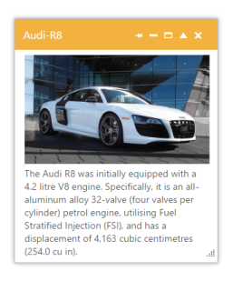

# Custom Action Support

The Dialog provides custom action buttons such as close, collapsible, maximize, minimize and pin. You can set the action buttons as per your requirement in the Dialog.

## Configure Custom Action

The following steps explains you the implementation of custom action. 

1. In the VIEW page set a helper element with dialog content for rendering the Dialog control. 

   ~~~ js

		// In the CSHTML page add the Dialog widget using helpers and assign the ActionButtons value. 

		@{List<string> icon = new List<string>() { "close", "collapsible", "maximize", "minimize", "pin" };}

		@{Html.EJ().Dialog("customaction").Title("Audi-R8").ContentTemplate(@

		   

			   The Audi R8 was initially equipped with a 4.2 litre V8 engine. Specifically, it is an all-aluminum alloy 32-valve (four valves per cylinder) petrol engine, utilising Fuel Stratified Injection (FSI), and has a displacement of 4,163 cubic centimetres (254.0 cu in).
).Width(300).ActionButtons(icon).Render();}

   ~~~
   {:.prettyprint }

2. The output of ActionButtons in Dialog widget is as follows.

   

   _Figure19: Dialog with “ActionButtons_                                                   

