# Events

 The Dialog widget provides the following events,

_Table2: Events of Dialog_

<table>
<tr>
<th>
Event</th><th>
Description</th></tr>
<tr>
<td>
BeforeClose</td><td>
Triggered when the control before close</td></tr>
<tr>
<td>
Close</td><td>
Triggered when the control is close</td></tr>
<tr>
<td>
BeforeOpen</td><td>
Triggered when the control before open</td></tr>
<tr>
<td>
Open</td><td>
Triggered when the control is open</td></tr>
<tr>
<td>
Drag</td><td>
Triggered when the control is drag</td></tr>
<tr>
<td>
DragStart</td><td>
Triggered when the control drag start </td></tr>
<tr>
<td>
DragStop</td><td>
Triggered when the control drag stop</td></tr>
<tr>
<td>
Resize</td><td>
Triggered when the control is resize</td></tr>
<tr>
<td>
ResizeStart</td><td>
Triggered when the control resize start</td></tr>
<tr>
<td>
ResizeStop</td><td>
Triggered when the control resize stop</td></tr>
</table>

## Configure Events

The following steps describes you on how the events are added to the Dialog control.

1. In the VIEW page set a helper element with dialog content for rendering the Dialog control.

   ~~~ js

		@{Html.EJ().Dialog("dialog").Title("WinRT").ContentTemplate(@
The Syncfusion Dialog control is rendered.
).Width(300).Height("200").ClientSideEvents(evt => evt.Create("onCreate").BeforeClose("onBeforeClose")

			.Close("onDialogClose").BeforeOpen("onBeforeOpen").Open("onOpen").Drag("onDrag").DragStart("onDragStart").DragStop("onDragStop").Resize("onResize")

			.ResizeStart("onResizeStart").ResizeStop("onResizeStop")).Render();}
			
   ~~~
   {:.prettyprint }

2. Define the script for handling Dialog events.

   ~~~ js

			

   ~~~
   {:.prettyprint }

3. Output of Dialog widget when the events trigger is as follows.

<table>
<tr>
<td>
 
{{'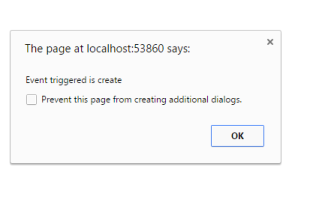'| markdownify}}

</td><td>
{{ ' 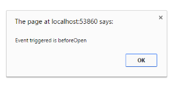'| markdownify }}

</td></tr>
</table>

_Figure 25: Dialog triggered Create and BeforeOpen event_               

<table>
<tr>
<td>
{{ '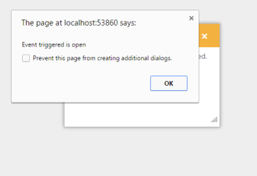' | markdownify }}

</td><td>
</td><td>
{{ ' 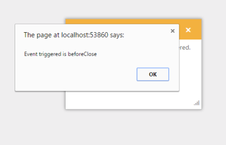' | markdownify }}

</td></tr>
</table>
_Figure 26: Dialog triggered Open and BeforeClose event_  

<table>
<tr>
<td>
{{'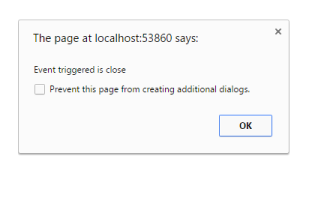'|markdownify }}

</td><td>
{{'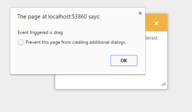'|markdownify }}

</td></tr>
</table>

_Figure 27: Dialog triggered Close and Drag event_

<table>
<tr>
<td>
{{'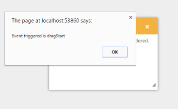'|markdownify }}

</td><td>
{{'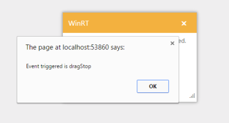'| markdownify }}

</td></tr>
</table>

_Figure 28: Dialog triggered DragStart and DragStop event_

<table>
<tr>
<td>
{{'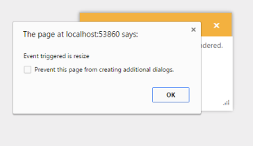'| markdownify }}
</td><td>
{{'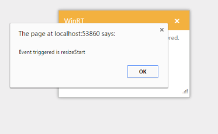'| markdownify }}

</td></tr>
</table>

_Figure 29: Dialog triggered Resize and ResizeStart event_

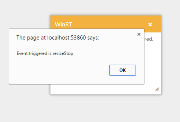

_Figure 30: Dialog triggered ResizeStop event_

