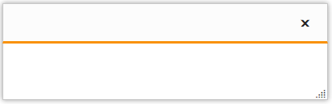
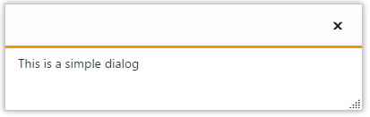
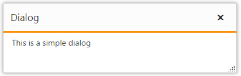
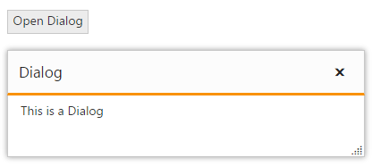
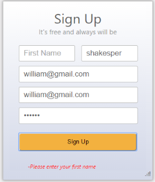

# Getting Started

This section explains briefly about how to create a Dialog in your application with ASP.NET MVC.

## Create your first Dialog in MVC

The ASP.NET MVCDialog displays Dialog window within your web page. The Dialog control enables you to display a message in a supplementary content (such as images, text) and interactive content such as forms. The Dialog control displays the content in modal Dialog, in which you cannot interact with the other items on the page. You can drag and resize the Dialog. In this section, you will learn how to customize a Dialog in a real-time login form scenario. The following screen shot displays a Dialog window.

Here, flat-saffron theme is used. Similarly you can change the themes.

_Figure 1:Sign Up Form Appearance_

### Create a Dialog

ASP.NET MVCDialog is an interface for hosting a page inside a window. Dialog content can be text, graphics or HTML. It shows the model popup window such as model form. You can easily create a Dialog control by using simple HTML helper as follows.

1. Create a MVC Project and add necessary Dll’s and Scripts. Refer below link

   <http://docs.syncfusion.com/aspnetmvc/dialog/getting-started>

2. You can add the following code example to the corresponding view page to render Dialog.

   ~~~ js

		@Html.EJ().Dialog("loginForm").Title("Sign Up")

   ~~~
   {:.prettyprint }

3. The following screenshot displays a Dialog control without any content.

   
   
   _Figure 2: Dialog Control Appearance without Dialog content_

By default, the Dialog control shows the header element. You can use the title text from Dialog element.

### Set content 

To display the content in Dialog control using content template.

ContentTemplate API is used to specifying the HTML content within helper elements, here we set the content to the dialog using various html tags in that case we are using ContentTemplate.

The following code example illustrates how to set the content in Dialog control.



@{Html.EJ().Dialog("loginForm").Title("Sign Up").ClientSideEvents(events => events.BeforeClose("onValidation")).ContentTemplate(@

        <!-- Sign up form elements -->

    <form method="get" name="signup" id="signup_form">

        <!-- Sign up form elements -->

        

            
Sign Up

            
It's free and always will be

        

        

            

                

                    <!-- input element for First name field -->

                    <input type="text" id="firstname" name="first name" class="input ejinputtext name" placeholder="First Name" />

                

                

                    <!-- input element for last name field -->

                    <input type="text" id="lastname" name="last name" class="input ejinputtext name" placeholder="Last Name" />

                

            

            

                <!-- input element for email field -->

                <input type="text" id="email" name="email" class="input ejinputtext email" placeholder="Your Email" />

            

            

                <!-- input element for Re-enter email field -->

                <input type="text" id="reptemail" name="re-enter email" class="input ejinputtext email" placeholder="Re-enter Email" />

            

            

                <!-- input element for Password field -->

                <input type="password" maxlength="8" name="password" id="password" class="input ejinputtext" placeholder="Password" />

            

        

        

            <!--Sign Up button -->

            <input type="button" class="btn btn-lg btn-primary" onclick="onSignUp()" name="Submit" value="Sign Up" />

        

        <!-- Sign up form elements are ended here-->

        <!-- element for error message -->

        

    </form>

    

).Width(330).Render();}



      You can use the following styles to customize the styles of sign up form. You can use Bootstrap for aligning the login page header in center and styling the sign up button. You can also include bootstrap.min.css file from CDN location. 





Execute the above code example to render following output.

_Figure 3: Dialog Control Appearance with Sign up form elements_

The above screenshot displays the Dialog control with header and resizable option. These options are enabled in Dialog control by default

### Configure a Dialog 

To remove the header and resizable options from Dialog, you can use EnableResize and ShowHeader properties. By default the width of the Dialog control is based on the content inside it. You can also set the width of the Dialog control using width property. To render the appearance of signup control, you can set the width of Dialog control.

Initialize the Dialog control using following code example.



@{Html.EJ().Dialog("loginForm").Title("SignUp").ContentTemplate(@

            <!—Initialize using above Form elements-->

        
).ShowHeader(false).EnableAutoResize(false).Width(330).Render();}

<!—use above styles -->


Execute this code example to render the following output.

_Figure 4: Dialog Control with Sign up form elements_

You can also add additional functionalities to Dialog control such as Ajax content, list of header icon actions such as close, minimize, maximize actions and model Dialog.

### Add Validation

This section explains you to set the validation to each form elements inside the Dialog control. Here we are doing manual validation. To validate each form element, click sign up button. The Dialog closes when the signup button is clicked raising the BeforeClose event. The BeforeClose event validates each and every form elements manually. Once the validation is succeeds, the Dialog closes.

When the validation fails, set args.cancel value to “True”. This prevents the Dialog from closing.

Initialize the Dialog control with the following code example.



@{Html.EJ().Dialog("loginForm").Title("SignUp").ClientSideEvents(events => events.BeforeClose("onValidation")).ContentTemplate(@

            <!—Initialize using above Form elements-->

).ShowHeader(false).EnableAutoResize(false).Width(330).Render();}



You can add an HTML element in the form to display the error message in Dialog.

<!-- element for error message -->

                  

  

<!-- inserts the element at the end of the Sign up form -->

You can add the following code example in 



You can add the following styles to customize the styles of error message.



<!—add this with above styles -->

       .errormsg li {

            list-style: none outside none;

        }

        .errormsg span {

            color: #FF0000;

            font-size: 12px;

            font-style: italic;

            margin: 2px 0;

            font-weight: normal;

        }



1. Name the control by using the Name attribute.

   ~~~ html
   
		<Syncfusion:CalendarEdit Name=”calendar”>
		</Syncfusion:CalendarEdit> 

   ~~~
   {:.prettyprint }
	
2. Name the control by using the Name attribute.

   ~~~ html
   
		<Syncfusion:CalendarEdit Name=”calendar”>
		</Syncfusion:CalendarEdit> 

   ~~~
   {:.prettyprint }

 
To check the validation process if we click the submit button without specifying any values.

Execute the code example to render the following output.

_Figure 5: Sign up form with validation_

The above screenshot displays an error message when an invalid input is given to form elements. The dialog is closed when the value is in a valid format Otherwise dialog will not close.	 

