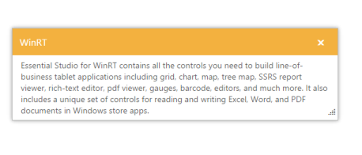

## Keyboard Interaction	

The Dialog provides you to interact with the keyboard actions instead of mouse actions. All the Dialog actions can be achieved by using Keyboard shortcuts.

_Table_ _3__: Key shortcuts for Dialog_

<table>
<tr>
<td>
Shortcut Key</td><td>
Description</td></tr>
<tr>
<td>
Alt{{ '[http://en.wikipedia.org/wiki/Access_key](http://en.wikipedia.org/wiki/Access_key)' | markdownify }} + j	</td><td>
Focus the Dialog control</td></tr>
<tr>
<td>
Up</td><td>
Dialog moves up direction</td></tr>
<tr>
<td>
Down</td><td>
Dialog moves down direction</td></tr>
<tr>
<td>
Right</td><td>
Dialog moves right direction</td></tr>
<tr>
<td>
Left</td><td>
Dialog moves left direction</td></tr>
<tr>
<td>
Esc</td><td>
Dialog window close</td></tr>
</table>
Configure Keyboard Interaction

The following steps explains you to enable keyboard interaction for Dialog control.

1. In the VIEW page set a helper element with dialog content for rendering the Dialog control. 

<table>
<tr>
<td>
[CSHTML]// In the CSHTML page add the Dialog widget using helpers. @{Html.EJ().Dialog("keyboardDialog").Title("WinRT").ContentTemplate(@
Essential Studio for WinRT contains all the controls you need to build line-of-business tablet applications including grid, chart, map, tree map, SSRS report viewer, rich-text editor, pdf viewer, gauges, barcode, editors, and much more. It also includes a unique set of controls for reading and writing Excel, Word, and PDF documents in Windows store apps. 
).Width(550).Render();}</td></tr>
<tr>
<td>
[JavaScript]    </td></tr>
</table>

2. Run the sample and press Alt + j key to focus the Dialog control. You can perform the specified option using keyboard shortcuts.

{{ '' | markdownify }}
{:.image }

_Figure 32: Dialog with keyboard interaction._

