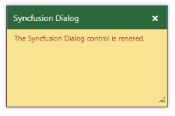

## Look and Feel

You can customize the appearance of Dialog widget using various themes that are available in Essential JavaScript. Applying themes customizes the entire control and its appearances. Refer the following link.
[http://help.syncfusion.com/ug/js/Documents/theming.htm](http://help.syncfusion.com/ug/js/Documents/theming.htm)

CSS Class

The CSS properties can be customized by using CSS Class in the Dialog control. The following steps explains the implementation of CSS Class option in the Dialog widget.

1. In the VIEW page set a helper element with the dialog content for rendering the Dialog control. 

[CSHTML]

// In the CSHTML page add the Dialog widget using helpers and assign the CssClass value from the custom class name.

@{Html.EJ().Dialog("dialog").Title("Syncfusion Dialog").ContentTemplate(@

The Syncfusion Dialog control is rendered.
).Width(300).Height("200").

CssClass("customCss").Render();}

2. Customize the CSS class by setting CSS Properties. 

[CSS]

    

3. The output for Dialog control after customizing the “CssClass” is as follows.

{{ '' | markdownify }}
{:.image }

_Figure_ _33__: Dialog with “CssClass"_

