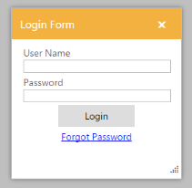

# Modal Dialog Support

The modal dialog is used like an alert window that disables the main window and explore its content for the purpose of interacting with others. 

## Configure Modal Dialog

The following steps explains you the implementation of modal dialog. 

1. In the VIEW page set a helper element with dialog content for rendering the Dialog control. 



// In the CSHTML page add the Dialog widget using helpers and set EnableModal to ‘true’. 

@{Html.EJ().Dialog("dialogLoginForm").Title("Login Form").ContentTemplate(@

            <table>

                <tr>

                    <td>

                        User Name

                        <input type="text" id="txtName" class="ejinputtext" style="width: 100%" />

                    </td>

                </tr>

                <tr>

                    <td>

                        Password

                        <input type="text" id="Text1" class="ejinputtext" style="width: 100%" />

                    </td>

                </tr>

                <tr>

                    <td align="center">

                        <input type="button" id="downloadBtn" value="Login" class="e-btn" style="width: 100px; height: 30px" />

                    </td>

                </tr>

                <tr>

                    <td align="center">

                        <a href="#">Forgot Password</a>

                    </td>

                </tr>

            </table>

        
).Width(250).Height("250").EnableModal(true).Render();}



2. The output of modal dialog control. 

_Figure20: Modal Dialog_

