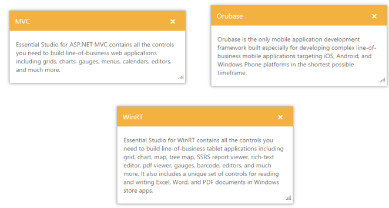

# Multiple Dialog Support

The Dialog supports multiple controls in the same web page. You can use more number of Dialog control with different content and different functionalities in the same web page.

## Configure Multiple Dialog

The following steps explains the implementation of multiple Dialog in the same web page. 

1. In the VIEW page set a helper element with dialog content for rendering the Dialog control. 



// In the CSHTML page add the Dialog widgets using helpers and set the Position values. 

@{Html.EJ().Dialog("mvcdialog").Title("MVC").ContentTemplate(@

            

                Essential Studio for ASP.NET MVC contains all the controls you need to build line-of-business web applications including grids, charts, gauges, menus, calendars, editors, and much more.

            

       
).Position(p => p.XValue("296").YValue("207")).Render();}

@{Html.EJ().Dialog("orubasedialog").Title("Orubase").ContentTemplate(@

            

                Orubase is the only mobile application development framework built especially for developing complex line-of-business mobile applications targeting iOS, Android, and Windows Phone platforms in the shortest possible timeframe.

            

        
).Position(p => p.XValue("721").YValue("207")).Render();}

@{Html.EJ().Dialog("winrtdialog").Title("WinRT").ContentTemplate(@

            

                Essential Studio for WinRT contains all the controls you need to build line-of-business tablet applications including grid, chart, map, tree map, SSRS report viewer, rich-text editor, pdf viewer, gauges, barcode, editors, and much more.

                It also includes a unique set of controls for reading and writing Excel, Word, and PDF documents in Windows store apps.

            

        
).Position(p => p.XValue("500").YValue("407")).Render();}



2. The output of multiple Dialog control is as follows.

_Figure_ _18__: Multiple Dialog_                                                                                            

