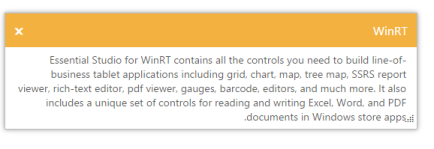

# RTL Support

The Dialog supports Right-To-Left feature. The alignment of Dialog content can be changed from Left-To-Right into Right-To-Left.

## Enable RTL Support

The following steps explain enabling the right-to-left property for Dialog control.

1. In the VIEW page set a helper element with dialog content for rendering the Dialog control. 



// In the CSHTML page add the Dialog widget using helpers and set EnableRTL to ‘true’. 

@{Html.EJ().Dialog("rtldialog").Title("WinRT").ContentTemplate(@

Essential Studio for WinRT contains all the controls you need to build line-of-business tablet applications including grid, chart, map, tree map, SSRS report viewer, rich-text editor, pdf viewer, gauges, barcode, editors, and much more.

It also includes a unique set of controls for reading and writing Excel, Word, and PDF documents in Windows store apps.
).Width(550).EnableRTL(true).Render();}


2. The output for Dialog when EnabelRTL is “True” is as follows.

_Figure 31: Dialog with “EnableRTL"_

