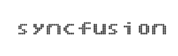
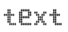
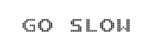

# Basic Settings

## Height and Width Customization

The basic customization for any control is to set the dimension. Here dimension refers to two major attributes such as height and width. The height and width assigned in the control will render the canvas element in the given size. The code example to set height and width is as follow. 



@(Html.EJ().DigitalGauge("DigitalGauge1")

@*For setting height of the canvas element. *@

.Height(200)

// For setting width of the canvas element.

.Width(500)

// For setting text

.Value("syncfusion"))



Execute the above code examples to render the DigitalGauge as follows. 

## Responsive Layout

* For any display devices, the control will be rendered based on the space available in that device. For this purpose, resizing property is given to the Digital Gauge control. The Digital Gauge renders with a given value. 
* When the browser resize the canvas element checks the dimension with its parent element. If there are any changes in parent dimension, Gauge control will changes the dimension based on its parent element change. This feature is enabled by using the property canResize.



@* For Digital Gauge rendering *@

@(Html.EJ().DigitalGauge("DigitalGauge1")

// For enabling resize.

.EnableResize(true))



Execute the above code examples to render the DigitalGauge as follows. 

## Themes

Themes give the good appearance to the control. There are two types of Themes available for DigitalGauge as folllows

* flatlight
* flatdark



@* For Digital Gauge rendering *@

@(Html.EJ().DigitalGauge("DigitalGauge1")

// For setting theme for digital gauge.

.Themes(Themes.FlatDark)

// For setting text

.Value("LOS ANGELS 40 KM"))



Execute the above code examples to render the DigitalGauge as follows. 

## Setting Text for Digital Gauge

Digital Gauge is mainly used to display the text in the digital format. We can define the value for the text with the help of value property. It is string data type. The Code example for setting the text is as follows.



@* For Digital Gauge rendering  *@

@(Html.EJ().DigitalGauge("DigitalGauge1")

// For setting text

.Value("GO SLOW"))



Execute the above code examples to render the DigitalGauge as follows.

'

