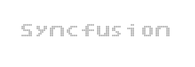
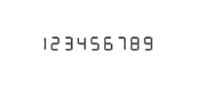

# Character Settings

## Appearance

The opacityof the character is adjustable with the help of opacity property. The space between two characters are adjusted with spacing property as like in the segment settings.



@* For Digital Gauge rendering *@

@(Html.EJ().DigitalGauge("DigitalGauge1")

.Width(800)

.Value("Syncfusion")

.Items(it=>

{ it.CharacterSettings(cs => cs

// For setting character opacity

.Opacity(0.3)

// For setting character spacing

.Spacing(3)).Add();

}))



Execute the above code examples to render the DigitalGauge as follows.

_Figure 32: Digital Gauge control with character setting_

## Count and Type

* The number of text to be displayed can be limited by the attribute called count. In Digital Gauge five different types of characters are supported. They are as follows, 
1. EightCrossEightDotMatrix
2. SevenSegment
3. FourteenSegment
4. SixteenSegment 
5. EightCrossEightSquareMatrix.



@(Html.EJ().DigitalGauge("DigitalGauge1")

.Width(800)

.Value("123456789")

.Items(it=>

{ it.CharacterSettings(cs => cs

// For setting character count

.Count(10)

// For setting character spacing

.Spacing(10)

// For setting character type

.Type(CharacterType.SevenSegment))

.SegmentSettings(ss=>

// For setting segment length

ss.Length(8)

// For setting segment width

.Width(1)).Add();

}))



Execute the above code examples to render the DigitalGauge as follows.

_Figure 33: Digital Gauge control with character type as seven segment_

## Text Positioning

The text in the DigitalGauge is positioned with position object. This object contains two attributes such as x and y. The x variable positions the text in the horizontal axis and the y variable positions the text in the vertical axis.



@* For Digital Gauge rendering *@

@(Html.EJ().DigitalGauge("DigitalGauge1")

// For setting Width and Height

.Width(800).Height(300)

.Frame(fr=>fr

// For setting frame background image

.BackgroundImageUrl("../Content/images/gauge/Board1.jpg"))

.Items(it=> { it.Value("YELLOW")

// For setting segment color

.SegmentSettings(cs=>cs.Color("Yellow"))

.Position(Pos=>Pos

// For setting horizontal position

.X(80)

// For setting Vertical position

.Y(10)).Add();}))



Execute the above code examples to render the DigitalGauge as follows.

_Figure 34: Digital Gauge control with position text based on the background image_

## Shadow Effects

The text in the Digital Gauge is positioned with position object. This object contains two attributes such as x and y. The x variable positions the text in the horizontal axis and y variable positions the text in the vertical axis.



@* For Digital Gauge rendering*@

@(Html.EJ().DigitalGauge("DigitalGauge1")

// For setting Width and Height

.Width(800)

.Items(it=> { it.Value("WELCOME")

// For setting Shadow blur

.ShadowBlur(20)

// For setting Shadow color  .ShadowColor("Yellow")

// For setting Shadow horizontal offset     .ShadowOffsetX(15)

// For setting Shadow vertical offset .ShadowOffsetY(15)

// For setting segment length and width

.SegmentSettings(cs=>

cs.Length(3) .Width(3)).Add();}))



Execute the above code examples to render the DigitalGauge as follows.

_Figure 35: Digital Gauge control with shadow option_

