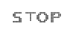

# Digital Elements

## Text Customization

* The attribute value refers the text displayed in the Digital Gauge. This text is applicable only for that item instead of all items. Text color is changed by using the property textColor.
* It is possible to align the text inside the Digital Gauge control by using the property textAlign. Two possible values for text align are as follows
	1. left
	2. right



@* For Digital Gauge rendering *@

@(Html.EJ().DigitalGauge("DigitalGauge1").Items(it=>{it

// For Setting the text value

.Value("STOP")

// For aligning the text

.TextAlign(TextAlign.Right).Add();

}))



Execute the above code examples to render the DigitalGauge as follows.

Digital Gauge control with text customization
{:.caption}

