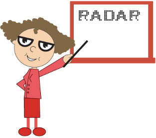

# Frames

## Inner and Outer Customization

**Frames** are space that enclose the **Digital Gauge**. The inner width of the Frame is the distance between the canvas element and the frame. The outer width is the distance from the frame. The code example to set frame’s `innerWidth` and `outerWidth` is as follow.



@*For Digital Gauge rendering *@

@(Html.EJ().DigitalGauge("DigitalGauge1")

// For setting text

.Value("WELCOME").Frame(fr=>fr

// For setting frame inner width

.InnerWidth(6)

// For setting outer width

.OuterWidth(10)))



Execute the above code examples to render the **DigitalGauge** as follows.

Digital Gauge control with frame inner and outer width
{:.caption}

## Setting Background Image

For a better appearance, you can set the `background image` for the **Digital Gauge** using the property `backgroundImageUrl`. 



@*For Digital Gauge rendering *@

@(Html.EJ().DigitalGauge("DigitalGauge1")

// For setting text

.Frame(fr=>fr

// For setting frame background image

.BackgroundImageUrl("../Content/images/gauge/board3.jpg"))

.Items(it=> { it.Value("RADAR")

// For setting segment color

.SegmentSettings(cs=> cs.Color("Black"))

.Position(position=>position.X(80).Y(10)).Add();}))



Execute the above code examples to render the **DigitalGauge** as follows.

Digital Gauge control with frame background image
{:.caption}