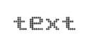
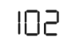

# Getting Started

* The ASP.NET MVC Digital Gauge provides support to display the DigitalGauge within your web page and allows you to customize it. This section encompasses the details on how to configure DigitalGauge. Here you will learn how to provide data for a DigitalGauge and display the data in the required way. 
* In addition, you will learn how to customize the default DigitalGauge appearance according to your requirements. As a result, you will get a DigitalGauge that shows it as Digital thermometer.
* You can use this DigitalGauge in advertisements, decorative purposes, displaying share details in share market, game score boards, token systems, etc.

Digital Thermometer
{:.caption}

## Create a Digital Gauge

ASP.NET MVC Digital Gauge widget basically renders with flexible APIs. You can easily create the Digital Gauge widget by using the following steps.

1. First create an MVC Project and add necessary Dlls and scripts with the help of the given [MVC-Getting Started](http://help.syncfusion.com/aspnetmvc/digitalgauge/getting-started) Documentation.
2. Add the following code example to the corresponding view page to render Digital Gauge.

   ~~~ cshtml
   
	@(Html.EJ().DigitalGauge("digitalGauge"))
		
   ~~~
   {:.prettyprint }

3. Add the following code example in the controller page.

   ~~~ csharp   
   
	public ActionResult Default()		
        
	{
            
		return View();
    
	}		

   ~~~
   {:.prettyprint }

   
Run the above code example and you will get a default Digital Gauge as follows.

Digital Gauge
{:.caption}

## Set Height and Width values

Basic attributes of each canvas elements are height and width. You can set the height and width of the gauge.



@(Html.EJ().DigitalGauge("digitalGauge")

.Height(145)

.Width(260)

)



Run the above code example and you will see a default gauge with the specified height and width values.

Digital Gauge with Height and Width
{:.caption}

## Set Items Property

Items have different properties to customize the Digital Gauge.

### Add Segment and Character Properties

* In the Welcome Board, the text color must be attentive in nature. You can give some segment properties such as segment spacing, segment width, segment color, segment length and segment opacity.
* Character type is to define the Digital representation of the character. The five types of character representation available are,
	1. EightCrossEightDotMatrix
	2. SevenSegment
	3. FourteenSegment
	4. SixteenSegment 
	5. EightCrossEightSquareMatrix.



@(Html.EJ().DigitalGauge("digitalGauge")

.Height(145)

.Width(260)

.Items(item=>

{

item.SegmentSettings(seg=>seg.Length(20).Width(2))            
.Value("102")
. CharacterSettings(cha=>{cha.Spacing(12)
.Type(CharacterType.SevenSegment);}).Add();

}))



Run the above code example and you will see the following output.

Digital Gauge Segment Properties
{:.caption}

## Add Background Image

* Add a 
 element to set the background for the Digital Gauge. 
* Add a style tag in the View page to add the background image for the Digital Gauge.
* Add the required properties to show the background image such as position, margin, display, etc.,



@(Html.EJ().DigitalGauge("digitalGauge")

.Height(145)

.Width(260)

.Items(item=>

{

item.SegmentSettings(seg=>seg.Length(20).Width(2))            .Value("102")

. CharacterSettings(cha=>{cha.Spacing(12)

.Type(CharacterType.SevenSegment);}).Add();

}))



Run the above code example and you will see the following output.                    

Digital Gauge Background Image
{:.caption}

## Add Location

The Location property is used to position the digital letters inside the canvas element.



@(Html.EJ().DigitalGauge("DigitalGauge1").Height(145).Width(260).Items(item=>

{

item.SegmentSettings(seg=>seg.Length(20).Width(2))

.Value("102").CharacterSettings(cha=>{cha.Spacing(12).Type(CharacterType.SevenSegment);})

.Position(loc=>loc.X(15).Y(40)).Add();

}))



Run the above code example and you will see the following output. 

Digital Gauge with Segment Location
{:.caption}

## Add Items Collection 

You can further add the Items Collection to display the temperature value like Digital Thermometer.



@(Html.EJ().DigitalGauge("digitalGauge").Height(145).Width(260).Items(item=>

{

item.SegmentSettings(seg=>seg.Length(20).Width(2))            
.Value("102").CharacterSettings(cha=>{cha.Spacing(12).Type(CharacterType.SevenSegment);})
.Position(loc=>loc.X(15).Y(40)).Add();

item.SegmentSettings(seg=>seg.Length(5).Width(2))
.Value("0").CharacterSettings(cha=>{cha.Spacing(12).Type(CharacterType.SevenSegment);})
.Position(loc => loc.X(85).Y(28)).Add();

item.SegmentSettings(seg=>seg.Length(20).Width(2))  
.Value("F").CharacterSettings(cha=>{cha.Spacing(12).Type(CharacterType.SevenSegment);})
.Position(loc => loc.X(170).Y(40)).Add();

item.SegmentSettings(seg=>seg.Length(9).Width(1).Color("#F5b43f"))
.Value("38").CharacterSettings(cha=>{cha.Spacing(12).Type(CharacterType.SevenSegment);})
.Position(loc => loc.X(70).Y(90)).Add();

item.SegmentSettings(seg=>seg.Length(3).Width(1).Color("#F5b43f"))
.Value("0").CharacterSettings(cha=>{cha.Spacing(12).Type(CharacterType.SevenSegment);})
.Position(loc => loc.X(90).Y(80)).Add();

item.SegmentSettings(seg=>seg.Length(9).Width(1).Color("#F5b43f"))
.Value("c").CharacterSettings(cha=>{cha.Spacing(12).Type(CharacterType.SevenSegment);})
.Position(loc => loc.X(120).Y(90)).Add();

}))



Run the above code example and you will see the following output.                    

Digital Gauge with Item Collection
{:.caption}