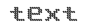
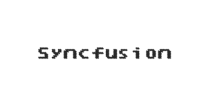
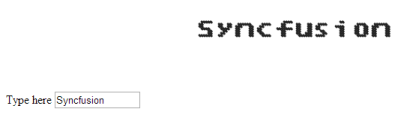

## MVVM

Angular JS

Digital Gauge contains angular support. It is possible to add object as well as array object in the Digital Gauge. The two way binding support is given to the value for displaying the text.

### Rendering the Digital Gauge

ej-DigitalGauge is the control tag, where ej is tag prefix and DigitalGauge is the control name.Digital Gauge is rendered with the following code example.

&lt;div ng-app="syncApp"&gt;

&lt;div ng-controller="DigitalGauge"&gt;

&lt;ej-DigitalGauge id="digitalCore" e-height="500" e-load="loadGaugeTheme"&gt;

&lt;/ej-DigitalGauge&gt;

&lt;/div&gt;

&lt;/div&gt;

&lt;script type="text/javascript"&gt;

&lt;!—binding the value to the scope variables in application controller--&gt;

angular.module('syncApp', ['ejangular'])

.controller('DigitalGauge', function ($scope) {

$scope.nvalue = “text”;

});

&lt;/script&gt;

Execute the above code to render the following output.

{  | markdownify }
{:.image }

### Adding the Digital Gauge Items

Digital Gauge is rendered with the following code example. You can extend the Object in the array collection such as, position, characterSetting, segmentSetting, etc. with hyphen in the same tag.

Example: e-position-x. 

&lt;!--To Render the Digital gauge--&gt;

&lt;ej-DigitalGauge id="digitalCore"&gt;

&lt;!--Adding Item collection to the digital gauge--&gt;

&lt;e-items&gt;

<e-item e-segmentSettings-width="1" e-segmentSettings-spacing="0"

e-value="Syncfusion" e-characterSetting-opacity="0.8"

e-position-x="52" e-position-y="52">

&lt;/e-item&gt;

&lt;/e-items&gt;

&lt;/ej-DigitalGauge&gt;

Finally while running the above codes, the following output will be rendered.

{  | markdownify }
{:.image }

### Two Way Binding

Digital Gauge supports the two way biding for the property value as mentioned earlier. Following code example explains how to achieve the two way binding to the Digital Gauge.

&lt;div ng-app="syncApp"&gt;

&lt;div ng-controller="DigitalGauge"&gt;

&lt;ej-DigitalGauge id="digitalCore" e-height="200" e-load="loadGaugeTheme"&gt;

&lt;e-items&gt;

<e-item e-segmentSettings-width="1" e-segmentSettings-spacing="0"

e-characterSetting-opacity="0.8" e-position-x="52"

e-value="nvalue" e-position-y="52">

&lt;/e-item&gt;

&lt;/e-items&gt;

&lt;/ej-DigitalGauge&gt;

Type here &lt;input type="text" id="txtValue" ng-model="nvalue" Style="width:110px"/&gt;

&lt;/div&gt;

&lt;/div&gt;

&lt;script type="text/javascript"&gt;

&lt;!—binding the value to the scope variables in application controller--&gt;

angular.module('syncApp', ['ejangular'])

.controller('DigitalGauge', function ($scope) {

$scope.nvalue = "Syncfusion";

});

&lt;/script&gt;

Execute the above code to render the following output.

{  | markdownify }
{:.image }

### Knockout Binding

* Knockout support allows you to bind the html elements against any of the available data models.Two types of knockout binding is supported as of angular,
1. one-way binding
2. two-way binding
* One way binding refers to the process of applying observable values to all the available properties of the Digital Gauge control, but the changes made in it does not reflect and trigger in turn to the observable collection. This kind of binding applies to all the properties of the Digital Gauge control.
* Two-way binding supports both the processes – it applies the observable values to the Digital Gauge properties as well as the changes made in it is also reflected back and triggered within the observable collections. Only Value of the schedule properties support two-way binding.

[MVC]

 [CSHTML]

    

    &lt;/div&gt;

    &lt;script type="text/javascript"&gt;

        $(function () {

            window.viewModel = {

             samplevalue: ko.observable(“syncfusion”),

            };

            $(function () {

                ko.applyBindings(viewModel);

            });

        });

    &lt;/script&gt;

Execute the above code to render the following output.

{  | markdownify }
{:.image }

_Figure_ _4__1: Digital Gauge with Knockout binding_

