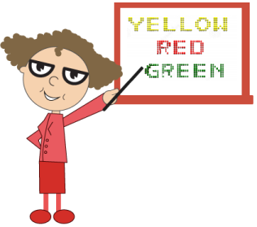

## Multiple Items 

The text in the Digital Gauge is positioned with position object. This object contains two attributes such as x and y. The x variable positions the text in the horizontal axis and y variable positions the text in the vertical axis.

[MVC]

@(Html.EJ().DigitalGauge("DigitalGauge1")

// For setting Width and Height

.Width(1300).Height(300)

.Frame(fr=>fr.BackgroundImageUrl("../Content/images/gauge/Board1.jpg"))

.Items(it =>

{

// For setting Item1

it.Value("YELLOW").SegmentSettings(cs =>

cs.Color("Yellow")).Position(pos=>pos.X(80).Y(0)).Add();

// For setting Item2

it.Value("RED").SegmentSettings(cs =>

cs.Color("Red")).Position(pos => pos.X(80).Y(20)).Add();

// For setting Item3

it.Value("GREEN").SegmentSettings(cs =>

cs.Color("Green")).Position(pos => pos.X(80).Y(40)).Add();

}))

Execute the above code example to render the DigitalGauge as follows.

{  | markdownify }
{:.image }

