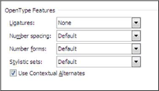
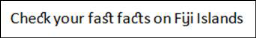
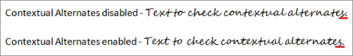
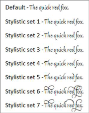

---
layout: post
title: How to set OpenType Features | DocIo | ASP.NET MVC | Syncfusion
description: how to set opentype features?
platform: DocIo
control: ejmvc
documentation: ug
---

# How to set OpenType Features?

The OpenTypeFeatures provide special effects for text in order to make them more refined and easier to read. This support is provided specifically for Word 2010 documents. Microsoft Word 2010 has new OpenTypeFeatures fonts that support these features to make your documents look professional when printed. When font designers create fonts, they often add designs for special features.

## The OpenType Features include:

* Ligatures
* Use Contextual Alternates
* Number spacing
* Number forms
* Stylistic sets

OpenType Features
{:.caption}

## Ligatures

A ligature is a combination of characters that is written as a glyph, as though it is a single character. Usually ligatures are made up of pairs of letters. This enhances readability and is attractive, providing the best ligature choice for the surrounding text. The OpenType standard specifies four categories of ligatures namely:

* Standard: The standard set of ligatures varies by language, but it contains the ligatures that most typographers and font designers agree, is appropriate for that language.
* Contextual: Contextual ligatures are ligatures that are appropriate for use with that font, but they are not standard.
* Historical and discretionary: Historical forms are ligatures that were once standard, but are no longer commonly used in the language. They can be used for a “period” effect. Discretionary ligatures are those that the font designer included for specific purposes. In general, you are more likely to apply historical or discretionary ligatures to just a portion of your text.
* All: All ligature combinations that are available for a font are applied to the text.

Ligatures
{:.caption}

## Contextual Alternates

Contextual alternates provide fine-tuning of letters or combinations of letters based on the surrounding characters. This feature can be used to make scripts look more natural and smooth. You can also use contextual alternates to provide specific letter forms at the start or at the end of a word, next to punctuations or even at the end of a paragraph.

Contextual Alternates
{:.caption}

### Number Spacing

* Default - The default number spacing is specified by the font designer of each font.
* Proportional - Numbers are spaced more like letters with varying widths. For example, an 8 is wider than a 1. This spacing is easier to read in text.
* Tabular - Each number has the same width. This means that in a table column, for example, all three-digit numbers will align vertically. Tabular spacing is useful in Mathematics, which enhances readability for financial information.

## Number Forms

* Default - The default number form is specified by the font designer of each font.
* Lining - Lining numbers will apply the same height for all numbers and they do not extend below the baseline of the text. Lining numbers are easier to read in tables, boxes, or forms.
* Old-style - In Old-style numbering, the lines of the characters flow above or below the line of the text (it makes the numbers easier to read). For example, some numbers such as 3 and 5 extend below the baseline or they are centered higher on the line.

## Stylistic Sets

Stylistic sets help you to change the look of the text by applying a different stylistic set. A font designer may include up to 20 stylistic sets for a font, and each stylistic set may include any subset of the characters of the font.

For example, the OpenType font “Gabriola” supports seven stylistic sets, though each changes the formatting of text.

Stylistic Sets
{:.caption}

The following code example illustrate how to set OpenType Features.



//Sets the contextual alternates.text = paragraph.AppendText("Text to check contextual alternates.");
text.CharacterFormat.FontName = "Segoe Script";text.CharacterFormat.UseContextualAlternates = true;

//Sets the historical discretional ligatures.
text = paragraph.AppendText("Check your fast facts on Fiji Islands");
text.CharacterFormat.FontName = "Calibri";
text.CharacterFormat.Ligatures = LigatureType.HistoricalDiscretional;
//Sets the old style number format.
text = paragraph.AppendText("3457645");
text.CharacterFormat.FontName = "Calibri";
text.CharacterFormat.NumberForm = NumberFormType.OldStyle;
//Sets the tabular type number spacing.
text = paragraph.AppendText("53127");
text.CharacterFormat.FontName = "Calibri";
text.CharacterFormat.NumberSpacing = NumberSpacingType.Tabular;
//Sets the stylistic set option.
text = paragraph.AppendText("The quick red fox.");
text.CharacterFormat.FontName = "Gabriola";
text.CharacterFormat.StylisticSet = StylisticSetType.StylisticSet06;



‘Sets the contextual alternates.
text = paragraph.AppendText("Text to check contextual alternates.")
text.CharacterFormat.FontName = "Segoe Script"
text.CharacterFormat.UseContextualAlternates = True

‘Sets the historical discretional ligatures.
text = paragraph.AppendText("Check your fast facts on Fiji Islands")
text.CharacterFormat.FontName = "Calibri"text.CharacterFormat.Ligatures = LigatureType.HistoricalDiscretional
‘Sets the old style number format.
text = paragraph.AppendText("3457645")
text.CharacterFormat.FontName = "Calibri"text.CharacterFormat.NumberForm = NumberFormType.OldStyle
‘Sets the tabular type number spacing.
text = paragraph.AppendText("53127")
text.CharacterFormat.FontName = "Calibri"text.CharacterFormat.NumberSpacing = NumberSpacingType.Tabular
‘Sets the stylistic set option.
text = paragraph.AppendText("The quick red fox.")
text.CharacterFormat.FontName = "Gabriola"
text.CharacterFormat.StylisticSet = StylisticSetType.StylisticSet06


 

