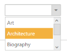
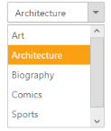
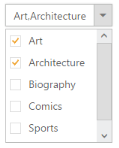
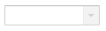

## Behaviour Settings

The following are some miscellaneous properties that helps you to change the behaviour of DropdownList control 

Target ID

You can append a list with dropdown textbox by using TargetId property. You need to define a &lt;ul&gt;, &lt; li&gt; tag that you want to show on Dropdown List and then set the id of parent &lt;ul&gt; tag to TargetId property. Its data type is string. 

The following steps explains you the configuration of TargetID property in Dropdownlist

1. Add the below code in view page to render the dropdown list with UL LI element as dropdown target.

[CSHTML]

// Add a DropDownList element using the helper class in CSHTML

@Html.EJ().DropDownList("dropdownlist").TargetID("list") 

        &lt;div id="list"&gt;

            &lt;ul&gt;

                <li>Art</li>

                <li>Architecture</li>

                <li>Biography</li>

                <li>Comics</li>

                <li>Sports</li>

                <li>Science</li>

            &lt;/ul&gt;

        &lt;/div&gt;

Number of items in the list

Dropdown widget provides you support to customize the items visible on popup visible. The ItemsCount property defines the number of items that is displayed on Dropdown List. Its data type is number.

The following steps explains you the configuration of ItemsCount property in Dropdownlist

1. Add the below code in view page to render the dropdown list with 3 items in popup panel.

[CSHTML]

// Add a DropDownList element using the helper class in CSHTML

@Html.EJ().DropDownList("dropdownlist").TargetID("list").ItemsCount(3)

        &lt;div id="list"&gt;

            &lt;ul&gt;

                <li>Art</li>

                <li>Architecture</li>

                <li>Biography</li>

                <li>Comics</li>

                <li>Sports</li>

                <li>Science</li>

            &lt;/ul&gt;

        &lt;/div&gt;

Output of the above steps

{  | markdownify }
{:.image }

_Figure 12: Dropdown with itemsCount property_  

Select the value by index 

Dropdown widget provides you support to select an item by mentioning the index of the item. The SelectedItemIndex property helps you to select the particular item from the list. Its date type is number. 

The following steps explains you the configuration of SelectedItemIndex property in Dropdownlist

1. Add the below code in your page with to render the dropdown list with index 1 item as selected item.

1. add the below code in your page to render the dropdown list with index 2 items is selected[CSHTML]

// Add a DropDownList element using the helper class in CSHTML

@Html.EJ().DropDownList("dropdownlist").TargetID("list").SelectedItemIndex(1)

        &lt;div id="list"&gt;

            &lt;ul&gt;

                <li>Art</li>

                <li>Architecture</li>

                <li>Biography</li>

                <li>Comics</li>

                <li>Sports</li>

                <li>Science</li>

            &lt;/ul&gt;

        &lt;/div&gt;

Output of the above steps

{  | markdownify }
{:.image }

_Figure 13: Dropdown with selecteditemindex property_  

Show Popup on load

You can display the popup panel when page load itself using ShowPopupOnLoad property. Its data type is Boolean. 

The following steps explains you the configuration of ShowPopupOnLoad property in Dropdownlist

1. Add the below code in your view page to show the popup on load.

[CSHTML]

// Add a DropDownList element using the helper class in CSHTML

@Html.EJ().DropDownList("dropdownlist").TargetID("list").ShowPopupOnLoad(true)

        &lt;div id="list"&gt;

            &lt;ul&gt;

                <li>Art</li>

                <li>Architecture</li>

                <li>Biography</li>

                <li>Comics</li>

                <li>Sports</li>

                <li>Science</li>

            &lt;/ul&gt;

        &lt;/div&gt;

Multiple selection through index 

You can select the list of items from the Dropdownlist using SelectedItems property. Its data type is array. To achieve this, you need to set true to checkbox property in Dropdownlist. 

The following steps explains you the configuration of selectedItems property in Dropdownlist

1. Add the below code snippet to select multiple items in dropdown list.

[CSHTML]

// Add a DropDownList element using the helper class in CSHTML

@{List<int> indexList = new List<int>();

  indexList.Add(0);

  indexList.Add(1);

}

@Html.EJ().DropDownList("dropdownlist").TargetID("list").ShowCheckbox(true).SelectedItems(indexList)

&lt;div id="list"&gt;

    &lt;ul&gt;

        <li>Art</li>

        <li>Architecture</li>

        <li>Biography</li>

        <li>Comics</li>

        <li>Sports</li>

        <li>Science</li>

    &lt;/ul&gt;

&lt;/div&gt;

Output of the above steps

{  | markdownify }
{:.image }

_Figure 14: Dropdown with selecteditems property_  

Read-only

This feature supports to make the dropdown as readable. That is, you can make the dropdown as editable or non-editable by setting Boolean type value to ReadOnly property.

The following steps explains you the configuration of ReadOnly property in Dropdownlist.

1. Add the below code snippet to your view page to render the dropdown list with read-only enabled.

[CSHTML]

// Add a DropDownList element using the helper class in CSHTML

@Html.EJ().DropDownList("dropdownlist").TargetID("list").ReadOnly(true)

        &lt;div id="list"&gt;

            &lt;ul&gt;

                <li>Art</li>

                <li>Architecture</li>

                <li>Biography</li>

                <li>Comics</li>

                <li>Sports</li>

                <li>Science</li>

            &lt;/ul&gt;

        &lt;/div&gt;

Enable or Disable the Dropdown Widget

This features enables you to set the enable or disable options for dropdown by setting Boolean type value to Enabled property. 

The following steps explains you the configuration of Enabled property in Dropdownlist.

1. Add the below code snippet to render the disabled dropdown list

[CSHTML]

// Add a DropDownList element using the helper class in CSHTML

@Html.EJ().DropDownList("dropdownlist").TargetID("list").Enabled(false)

        &lt;div id="list"&gt;

            &lt;ul&gt;

                <li>Art</li>

                <li>Architecture</li>

                <li>Biography</li>

                <li>Comics</li>

                <li>Sports</li>

                <li>Science</li>

            &lt;/ul&gt;

        &lt;/div&gt;

Output of the above steps 

{  | markdownify }
{:.image }

_Figure 15: Dropdown with enable property_  

Persistence support 

This features enables you to save current model value to browser cookies for state maintains. When you refresh the DropDownList control page, it retains the model value apply from browser cookies. The date type of EnablePersistence is Boolean type. 

The following steps explains you the configuration of EnablePersistence property in Dropdownlist

1. Add the below code snippet to render the dropdown list with enable persistence enabled.

[CSHTML]

// Add a DropDownList element using the helper class in CSHTML

@Html.EJ().DropDownList("dropdownlist").TargetID("list").EnablePersistence(true)

        &lt;div id="list"&gt;

            &lt;ul&gt;

                <li>Art</li>

                <li>Architecture</li>

                <li>Biography</li>

                <li>Comics</li>

                <li>Sports</li>

                <li>Science</li>

            &lt;/ul&gt;

        &lt;/div&gt;

