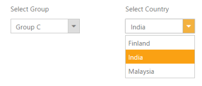
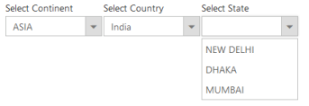

# Cascading Support 

Using Cascade option, you can create a behaviour of cascade between dropdown list controls. For this, you need to create database with single field as common between two dropdown data fields and then mention that column id in field. With this, you need to set second dropdown id in CascadeTo property in first one. 

N> In case the second dropdown is to disabled, until the first one is selected, you need to set enable property as false in second dropdown, which enables automatically once the value is selected in first one.

The following steps explains you the behaviour of cascade dropdown. 

1. Add the below code in your view page to render the dropdown list.


 
 // Add a DropDownList element using the helper class in CSHTML
 

 Select Group
 @Html.EJ().DropDownList("dropdownlist").Datasource((IEnumerable< Groups >) 
	ViewData["groups"]).DropDownListFields(f=>f.Value("parentId")).CascadeTo("dropdownlist1")
 

 

 Select Country
 @Html.EJ().DropDownList("dropdownlist1").Datasource((IEnumerable<Countries>)ViewData["countries"]).Enabled(false)
 



 
 // Initialize the control in controller
 public ActionResult Property()
 {                
    List<Groups> dataOne = new List<Groups>();
    dataOne.Add(new Groups() { Id = "a", Text = "Group A" });
    dataOne.Add(new Groups() { Id = "b", Text = "Group B" });
    dataOne.Add(new Groups() { Id = "c", Text = "Group C" });
    dataOne.Add(new Groups() { Id = "d", Text = "Group D" });
    ViewData["groups"] = dataOne;    
	List<Countries> dataTwo = new List<Countries>();
    dataTwo.Add(new Countries() { Value = 12, Id = "a", Text = "Armenia" });
    dataTwo.Add(new Countries() { Value = 13, Id = "a", Text = "Bangladesh" });
    dataTwo.Add(new Countries() { Value = 14, Id = "a", Text = "Cuba" });
    dataTwo.Add(new Countries() { Value = 15, Id = "b", Text = "Denmark" });
    dataTwo.Add(new Countries() { Value = 16, Id = "b", Text = "Egypt" });
    dataTwo.Add(new Countries() { Value = 17, Id = "c", Text = "Finland" });
    dataTwo.Add(new Countries() { Value = 18, Id = "c", Text = "India" });
    dataTwo.Add(new Countries() { Value = 19, Id = "c", Text = "Malaysia" });
    dataTwo.Add(new Countries() { Value = 20, Id = "d", Text = "New Zealand" });
    dataTwo.Add(new Countries() { Value = 21, Id = "d", Text = "Norway" });
    dataTwo.Add(new Countries() { Value = 22, Id = "d", Text = "Poland" });
    dataTwo.Add(new Countries() { Value = 23, Id = "d", Text = "Romania" });
    dataTwo.Add(new Countries() { Value = 24, Id = "d", Text = "Singapore" });
    dataTwo.Add(new Countries() { Value = 25, Id = "d", Text = "Thailand" });
    dataTwo.Add(new Countries() { Value = 26, Id = "d", Text = "Ukraine" });
    ViewData["countries"] = dataTwo;
 } 
 public class Groups
 {
    public string Id;
	public string Text;
 }
 public class Countries
 {        
    public int Value;
	public string Id;
	public string Text;
 } } 
 

Output of the above steps

_Figure 25: Dropdown with cascade property_  

### Multiple Cascading support

Using multi cascade option, you can create a behavior of cascade between dropdown list controls. To achieve this, map the common field from table to “Fields” property of all the dropdown lists. Also, specify the ID of cascading DropDownList in “CascadeTo” property of parent DropDownList. 

N> In case, when you want to show the cascading dropdowns in disabled state initially, then set the value of enable property as “false” in each cascading dropdowns. It is then enabled automatically once a value is selected in parent (first) dropdown list.

The following steps explains you the behavior of multiple cascade dropdown.

1. Add the below code in your view page to render the  DropDownList widget.



    Select Continent

    @Html.EJ().DropDownList("groupsList").Datasource((IEnumerable<groups>)ViewBag.datasource).DropDownListFields(f => f.Value("parentId")).CascadeTo("countryList,capitalList")

    Select Country

    @Html.EJ().DropDownList("countryList").Datasource((IEnumerable<Countries>)ViewBag.datasource1).Enabled(false)

    Select Capital

    @Html.EJ().DropDownList("capitalList").Datasource((IEnumerable<Countries>)ViewBag.datasource2).Enabled(false)



       

public ActionResult Index()

{

    List<groups> group = new List<groups>();

    group.Add(new groups { parentId = "a", text = "Africa" });

    group.Add(new groups { parentId = "b", text = "Asia" });

    group.Add(new groups { parentId = "c", text = "Europe" });

    group.Add(new groups { parentId = "d", text = "North America" });

    group.Add(new groups { parentId = "e", text = "South America" });

    group.Add(new groups { parentId = "f", text = "Oceania" });

    group.Add(new groups { parentId = "g", text = "Antarctica" });

    ViewBag.datasource = group;

    List<Countries> country = new List<Countries>();

    country.Add(new Countries { value = 11, parentId = "a", text = "Algeria" });

    country.Add(new Countries { value = 12, parentId = "a", text = "Egypt" });

    country.Add(new Countries { value = 13, parentId = "b", text = "Armenia" });

    country.Add(new Countries { value = 14, parentId = "b", text = "Bangladesh" });

    country.Add(new Countries { value = 15, parentId = "b", text = "India" });

    country.Add(new Countries { value = 16, parentId = "c", text = "Denmark" });

    country.Add(new Countries { value = 17, parentId = "c", text = "Finland" });

    country.Add(new Countries { value = 18, parentId = "d", text = "Cuba" });

    country.Add(new Countries { value = 19, parentId = "d", text = "USA" });

    country.Add(new Countries { value = 20, parentId = "e", text = "Brazil" });

    country.Add(new Countries { value = 21, parentId = "e", text = "Peru" });

    country.Add(new Countries { value = 22, parentId = "f", text = "Australia" });

    country.Add(new Countries { value = 23, parentId = "f", text = "New Zealand" });

    country.Add(new Countries { value = 24, parentId = "g", text = "French Southern" });

    country.Add(new Countries { value = 25, parentId = "g", text = "South Georgia" });

    ViewBag.datasource1 = country;

    List<Countries> capital = new List<Countries>();

    capital.Add(new Countries { value = 111, parentId = "a", text = "Algiers" });

    capital.Add(new Countries { value = 112, parentId = "a", text = "Cairo" });

    capital.Add(new Countries { value = 113, parentId = "b", text = "Yerevan"});

    capital.Add(new Countries { value = 114, parentId = "b", text = "Dhaka" });

    capital.Add(new Countries { value = 115, parentId = "b", text = "New Delhi" });

    capital.Add(new Countries { value = 116, parentId = "c", text = "Copenhagen" });

    capital.Add(new Countries { value = 117, parentId = "c", text = "Helsinki" });

    capital.Add(new Countries { value = 118, parentId = "d", text = "Havana" });

    capital.Add(new Countries { value = 119, parentId = "d", text = "Washington, D.C." });

    capital.Add(new Countries { value = 120, parentId = "e", text = "Brasília" });

    capital.Add(new Countries { value = 121, parentId = "e", text = "Lima" });

    capital.Add(new Countries { value = 122, parentId = "f", text = "Canberra" });

    capital.Add(new Countries { value = 123, parentId = "f", text = "Wellington" });

    capital.Add(new Countries { value = 124, parentId = "g", text = "Alfred Faure" });

    capital.Add(new Countries { value = 125, parentId = "g", text = "King Edward Point" });

    ViewBag.datasource2 = capital;

    return View();

}

public class groups

{

    public string text { get; set; }

    public string parentId { get; set; }

}

public class Countries

{

    public string text { get; set; }

    public int value { get; set; }

    public string parentId { get; set; }

}



The following screenshot displays the output of the above code example.

