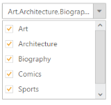

## Checkbox Support

Show Checkbox 

You can enable the checkbox in the Dropdownlist with this property. The data type of ShowCheckbox value is Boolean type. It maintains multiple selection and gets the checked items on its dropdown client side events.  

Check All 

You can check all the check box in the list by using this property. The data type of CheckAll needs to be in Boolean type. To achieve this, you need to set ShowCheckbox property as true

Uncheck All

You can uncheck all the check box in the list by using this property. The data type of UncheckAll is Boolean type. To achieve this, set ShowCheckbox property as true.

Defining the Checkbox support

The following steps explains you the configuration of checkbox options in Dropdownlist

1. Add the below code snippet to render the dropdown list with checkbox

[CSHTML]

// Add a DropDownList element using the helper class in CSHTML

@Html.EJ().DropDownList("dropdownlist").TargetID("list").ShowCheckbox(true).CheckAll(true).Width("200px")

    <ul>

        <li>Art</li>

        <li>Architecture</li>

        <li>Biography</li>

        <li>Comics</li>

        <li>Sports</li>

        <li>Science</li>

    </ul>

Output of the above steps

{{ '' | markdownify }}
{:.image }

_Figure 17: Dropdown with checkbox property_  

