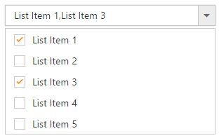
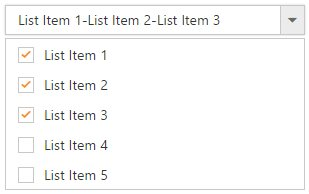

# Checkbox

DropDownList displays checkboxes to the left of each item when you set <b>ShowCheckbox</b> property to true. It allows you to select more than one item at a time from DropDownList. Popup list stays open until the user finishes selection. When you click on an item’s text or checkbox then the checkbox checked status get change.



	
        @model MVCApplication.Controllers.HomeController
        
        @Html.EJ().DropDownList("DropDownList1").Datasource((IEnumerable<Data>)ViewData["DropDownSource"]).DropDownListFields(Df => Df.Text("Text").Value("Value")).ShowCheckbox(true)
		
	
    
    
        public ActionResult Index()
        {
            List<Data> DropDownData = new List<Data>();
            DropDownData.Add(new Data { Value = "item1", Text = "ListItem 1" });
            DropDownData.Add(new Data { Value = "item2", Text = "ListItem 2" });
            DropDownData.Add(new Data { Value = "item3", Text = "ListItem 3" });
            DropDownData.Add(new Data { Value = "item4", Text = "ListItem 4" });
            DropDownData.Add(new Data { Value = "item5", Text = "ListItem 5" });
            ViewData["DropDownSource"] = DropDownData;
            return View();
        }
        public class Data
        {
            public string Value { get; set; }
            public string Text { get; set; }
        }
    
    


> if you want to showcase the DropDownList with default checked items on data binding, specify Selected field with Boolean values.



	
        @model MVCApplication.Controllers.HomeController
        
        @Html.EJ().DropDownList("DropDownList1").Datasource((IEnumerable<Data>)ViewData["DropDownSource"]).DropDownListFields(Df => Df.Text("Text").Value("Value").Selected("Selected")).ShowCheckbox(true).Width("300px")
		
	
    
    
        public ActionResult Index()
        {
            List<Data> DropDownData = new List<Data>();
            DropDownData.Add(new Data { Value = "item1", Text = "ListItem 1", Selected=true });
            DropDownData.Add(new Data { Value = "item2", Text = "ListItem 2", Selected=false });
            DropDownData.Add(new Data { Value = "item3", Text = "ListItem 3", Selected=true });
            DropDownData.Add(new Data { Value = "item4", Text = "ListItem 4", Selected=false });
            DropDownData.Add(new Data { Value = "item5", Text = "ListItem 5", Selected=false });
            ViewData["DropDownSource"] = DropDownData;
            return View();
        }
        public class Data
        {
            public string Value { get; set; }
            public string Text { get; set; }
            public bool Selected { get; set; }
        }
    
    


## Selection Modes

The MultiSelectMode property enables you to make multiple selections in the following two ways:

* Delimiter 
* Visual Mode

I> “MultiSelectMode” property accepts **Syncfusion.JavaScript.MultiSelectModeTypes** enum value.

### Delimiter

Each checked item’s text is appended to the textbox with delimiter “,” by default. This is enabled by assigning **Syncfusion.JavaScript.MultiSelectModeTypes.Delimiter** (enum) value to MultiSelectMode property. You can customize the delimiter option by using DelimiterChar property.



	
        @model MVCApplication.Controllers.HomeController
        
        @Html.EJ().DropDownList("DropDownList1").Datasource((IEnumerable<Data>)ViewData["DropDownSource"]).DropDownListFields(Df => Df.Text("Text").Value("Value")).ShowCheckbox(true).MultiSelectMode(MultiSelectModeTypes.Delimiter).DelimiterChar("-").Width("300px")
		
	
    
    
        public ActionResult Index()
        {
            List<Data> DropDownData = new List<Data>();
            DropDownData.Add(new Data { Value = "item1", Text = "ListItem 1" });
            DropDownData.Add(new Data { Value = "item2", Text = "ListItem 2" });
            DropDownData.Add(new Data { Value = "item3", Text = "ListItem 3" });
            DropDownData.Add(new Data { Value = "item4", Text = "ListItem 4" });
            DropDownData.Add(new Data { Value = "item5", Text = "ListItem 5" });
            ViewData["DropDownSource"] = DropDownData;
            return View();
        }
        public class Data
        {
            public string Value { get; set; }
            public string Text { get; set; }
        }
    
    


### Visual Mode

When you enable this option in DropDownList control, each checked item’s text is appended to the text box in a box model layout. This is enabled by assigning **Syncfusion.JavaScript.MultiSelectModeTypes.VisualMode** (enum) value to MultiSelectMode property.



	
        @model MVCApplication.Controllers.HomeController
        
        @Html.EJ().DropDownList("DropDownList1").Datasource((IEnumerable<Data>)ViewData["DropDownSource"]).DropDownListFields(Df => Df.Text("Text").Value("Value")).ShowCheckbox(true).Width("300px").MultiSelectMode(MultiSelectModeTypes.VisualMode)
		
	
    
    
        public ActionResult Index()
        {
            List<Data> DropDownData = new List<Data>();
            DropDownData.Add(new Data { Value = "item1", Text = "ListItem 1" });
            DropDownData.Add(new Data { Value = "item2", Text = "ListItem 2" });
            DropDownData.Add(new Data { Value = "item3", Text = "ListItem 3" });
            DropDownData.Add(new Data { Value = "item4", Text = "ListItem 4" });
            DropDownData.Add(new Data { Value = "item5", Text = "ListItem 5" });
            ViewData["DropDownSource"] = DropDownData;
            return View();
        }
        public class Data
        {
            public string Value { get; set; }
            public string Text { get; set; }
        }
    
    


