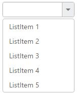

# Customization

## Adding watermark text

It provides the short description of the expected value in dropdown and will display the text until any item is selected. You can set this text using WatermarkText property.



    
    
        @model MVCApplication.Controllers.HomeController
        
        @Html.EJ().DropDownList("DropDownList1").Datasource((IEnumerable<Data>)ViewData["DropDownSource"]).DropDownListFields(Df => Df.Text("Text").Value("Value")).WatermarkText("Select an Item")
            
	
    
    
    
        public ActionResult Index()
        {
            List<Data> DropdownData = new List<Data>();
            DropdownData.Add(new Data { Value = "item1", Text = "ListItem 1" });
            DropdownData.Add(new Data { Value = "item2", Text = "ListItem 2" });
            DropdownData.Add(new Data { Value = "item3", Text = "ListItem 3" });
            DropdownData.Add(new Data { Value = "item4", Text = "ListItem 4" });
            DropdownData.Add(new Data { Value = "item5", Text = "ListItem 5" });
            ViewData["DropDownSource"] = DropdownData;
            return View();
        }
        public class Data
        {
            public string Value { get; set; }
            public string Text { get; set; }
        }
        
    
    


## Applying Rounded Corner

You can use ShowRoundedCorner property to add rounded borders to the input and popup elements. By default, rounded corner property is disabled in DropDownList.



    
    
        @model MVCApplication.Controllers.HomeController
        
        @Html.EJ().DropDownList("DropDownList1").Datasource((IEnumerable<Data>)ViewData["DropDownSource"]).DropDownListFields(Df => Df.Text("Text").Value("Value")).ShowRoundedCorner(true)
            
	
    
    
    
        public ActionResult Index()
        {
            List<Data> DropdownData = new List<Data>();
            DropdownData.Add(new Data { Value = "item1", Text = "ListItem 1" });
            DropdownData.Add(new Data { Value = "item2", Text = "ListItem 2" });
            DropdownData.Add(new Data { Value = "item3", Text = "ListItem 3" });
            DropdownData.Add(new Data { Value = "item4", Text = "ListItem 4" });
            DropdownData.Add(new Data { Value = "item5", Text = "ListItem 5" });
            ViewData["DropDownSource"] = DropdownData;
            return View();
        }
        public class Data
        {
            public string Value { get; set; }
            public string Text { get; set; }
        }
        
    
    


I> The browser support details for rounded corner is given [here](http://www.w3schools.com/cssref/css3_pr_border-radius.asp).

## Enable/Disable the control

The Enabled property is used to indicate whether the control can respond to the user interaction or not. You can disable it by assigning false to this property. When the control is disabled state, you cannot interact with the control.



    
    
        @model MVCApplication.Controllers.HomeController
        
        @Html.EJ().DropDownList("DropDownList1").Datasource((IEnumerable<Data>)ViewData["DropDownSource"]).DropDownListFields(Df => Df.Text("Text").Value("Value")).Enabled(false)
            
	
    
    
    
        public ActionResult Index()
        {
            List<Data> DropdownData = new List<Data>();
            DropdownData.Add(new Data { Value = "item1", Text = "ListItem 1" });
            DropdownData.Add(new Data { Value = "item2", Text = "ListItem 2" });
            DropdownData.Add(new Data { Value = "item3", Text = "ListItem 3" });
            DropdownData.Add(new Data { Value = "item4", Text = "ListItem 4" });
            DropdownData.Add(new Data { Value = "item5", Text = "ListItem 5" });
            ViewData["DropDownSource"] = DropdownData;
            return View();
        }
        public class Data
        {
            public string Value { get; set; }
            public string Text { get; set; }
        }
        
    
    


## Applying HTML Attributes

Additional HTML attributes can be applied to the control by using HtmlAttributes property. The attributes such as name, required, read-only and disabled are directly applied to the input element of DropDownList, and other attributes such as style, class will be applied to the outer wrapper element of DropDownList.



    
    
        @model MVCApplication.Controllers.HomeController
        
        @Html.EJ().DropDownList("DropDownList1").Datasource((IEnumerable<Data>)ViewData["DropDownSource"]).DropDownListFields(Df => Df.Text("Text").Value("Value")).HtmlAttributes((IDictionary<string,object>)ViewData["HtmlAttrData"])
            
	
    
    
    
        public ActionResult Index()
        {
            List<Data> DropdownData = new List<Data>();
            DropdownData.Add(new Data { Value = "item1", Text = "ListItem 1" });
            DropdownData.Add(new Data { Value = "item2", Text = "ListItem 2" });
            DropdownData.Add(new Data { Value = "item3", Text = "ListItem 3" });
            DropdownData.Add(new Data { Value = "item4", Text = "ListItem 4" });
            DropdownData.Add(new Data { Value = "item5", Text = "ListItem 5" });
            ViewData["DropDownSource"] = DropdownData;
            object StyleObj = new object();
            StyleObj = "border:1px solid red;";
            Dictionary<string, object> AttrVal = new Dictionary<string, object>
            { 
                {"style" , StyleObj}
            };
            ViewData["HtmlAttrData"] = AttrVal;
            return View();
        }
        public class Data
        {
            public string Value { get; set; }
            public string Text { get; set; }
        }
        
    
    


