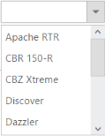
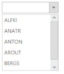

# Data-binding 

## Data fields and configuration 

The following sub-properties provides you a way to bind either the local or remote data to the Dropdown control.

_Table_ _1_: Properties ofndropdown list in MVC for data binding_

<table>
<tr>
<th>
Properties</th><th>
Description</th></tr>
<tr>
<td>
DataSource</td><td>
The data source contains the list of data for generating the DropDownList items.</td></tr>
<tr>
<td>
Query</td><td>
It specifies the query to retrieve the data from the online server.</td></tr>
<tr>
<td>
Fields</td><td>
It specifies the mapping fields for the data items of the DropDownList textbox.</td></tr>
<tr>
<td>
Id</td><td>
It specifies the ID of the tag.</td></tr>
<tr>
<td>
Text</td><td>
It specifies the text content of the tag.</td></tr>
<tr>
<td>
Value</td><td>
It specifies the value of the tag.</td></tr>
<tr>
<td>
Category</td><td>
It is used to categorize the items and is used when the grouping is enabled.</td></tr>
<tr>
<td>
ImageUrl</td><td>
It defines the ImageURL for the image location.</td></tr>
<tr>
<td>
ImageAttributes</td><td>
It defines the image attributes such as height, width, styles, etc.</td></tr>
<tr>
<td>
SpriteCssClass</td><td>
It defines the sprite CSS for the image tag.</td></tr>
<tr>
<td>
HtmlAttributes</td><td>
It defines the HTML attributes such as class and styles for an item.</td></tr>
<tr>
<td>
Selected</td><td>
This field defines the tag value to be selected initially. Corresponding field mapped has boolean values to select the list items on control creation. The data with value true in this field is selected automatically when the control is initialized.</td></tr>
<tr>
<td>
TableName</td><td>
It defines the table name for the tag value or displays text while rendering remote data.</td></tr>
</table>

## Local data

Dropdown provides data binding support for DropdownList. Thus you can bind the data from JSON Data. To achieve this, you need to map the corresponding file with their column names

And also you need to provide support to add and customize the images and list item by using appropriate data fields. 

The following steps explains you the details of data binding with DropdownList. 

1. Add the below code in your page with to render the dropdown list with local data


[CSHTML]// Add a DropDownList element using the helper class in CSHTML
        
Select a bike
        @Html.EJ().DropDownList("dropdownlist").Datasource((IEnumerable<Data>)ViewData["BikeList"] ).DropDownListFields(f => f.Text("Text")).DropDownListFields(f => f.Value("Id")).Width("150px")                        
</td></tr>



[CS]// Initialize Datasource in the controller        public ActionResult DropdownlistFeatures()        {                    List<Data> ListOrder = new List<Data>();            ListOrder.Add(new Data() { Id = "bk1", Text = "Aache RTR" });            ListOrder.Add(new Data() { Id = "bk2", Text = "CBR 150-R" });            ListOrder.Add(new Data() { Id = "bk3", Text = "CBZ Xtreme" });            ListOrder.Add(new Data() { Id = "bk4", Text = "Discover" });            ListOrder.Add(new Data() { Id = "bk5", Text = "Dazzler" });            ListOrder.Add(new Data() { Id = "bk6", Text = "Flame" });            ListOrder.Add(new Data() { Id = "bk7", Text = "Fazzer" });            ListOrder.Add(new Data() { Id = "bk8", Text = "FZ-S" });            ListOrder.Add(new Data() { Id = "bk9", Text = "Pulsar" });            ListOrder.Add(new Data() { Id = "bk10", Text = "Shine" });            ListOrder.Add(new Data() { Id = "bk11", Text = "R15" });            ListOrder.Add(new Data() { Id = "bk12", Text = "Unicorn" });            ViewData["BikeList"] = ListOrder;            return View();       }       public class Data       {            public string Id { get; set; }            public string Text { get; set; }       }</td></tr>


Output of the above steps

_Figure_ _10_: Dropdown with Data binding -local_ 

## Remote data 

You can bind the data’s for the DropdownList from remote, that can fetch the data from any other server that is located as remote web service. By using Query options, you can pass the query string to filter the data that helps to avoid the extensive properties look up. 

The following steps explains you the details of data binding from remote. 

1. Add the below code in your page with to render the dropdown list with remote data



// Add a DropDownList element using the helper class in CSHTML

Select a customer

   @Html.EJ().DropDownList("dropdownlist").Datasource(ds=>ds.URL("http://mvc.syncfusion.com/Services/Northwnd.svc/")).Query("ej.Query().from('Customers').take(6)").DropDownListFields(f => f.Text("CustomerID")).Width("150px")                      



Output of the above steps

_Figure 11: Dropdown with Data binding -Remote_ 

