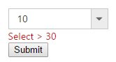

# Functionalities

## Selection

By default only one item can be selected from the popup list. For multiple selection, you have to enable [checkboxes](Checkbox). The selected item consist of active class (“e-active”) to differentiate it from other items.

### Using value or text

To select an item initially you can pass the item’s value via Value property or SelectItemByValue API. To achieve this DropDownList control must be initiated with the associate value. 



	
        @model MVCApplication.Controllers.HomeController
        
        @Html.EJ().DropDownList("DropDownList1").Datasource((IEnumerable<Data>)ViewData["DropDownSource"]).DropDownListFields(Df => Df.Text("Text").Value("Value")).Value("item3")
		
	
    
    
        public ActionResult Index()
        {
            List<Data> DropdownData = new List<Data>();
            DropdownData.Add(new Data { Value = "item1", Text = "ListItem 1" });
            DropdownData.Add(new Data { Value = "item2", Text = "ListItem 2" });
            DropdownData.Add(new Data { Value = "item3", Text = "ListItem 3" });
            DropdownData.Add(new Data { Value = "item4", Text = "ListItem 4" });
            DropdownData.Add(new Data { Value = "item5", Text = "ListItem 5" });
            ViewData["DropDownSource"] = DropdownData;
            return View();
        }
        public class Data
        {
            public string Value { get; set; }
            public string Text { get; set; }
        }
    
    


N> To retrieve the selected item’s value in controller page, you can use DropDownList control name in the controller post action.


	
    
        
        @model MVCApplication.Controllers.HomeController
        
        @using (Html.BeginForm("DropdownlistFeatures", "Dropdownlist", FormMethod.Post, null))
        {
            @Html.EJ().DropDownList("DropDownList1").Datasource((IEnumerable<Data>)ViewData["DropDownSource"]).DropDownListFields(Df => Df.Text("Text").Value("Value")).Height("50px").Width("500px").PopupHeight("200px").PopupWidth("300px")
            
            <input type="submit" value="Get Value" />
            
        }
        

	
    
    
        public ActionResult Index()
        {
            List<Data> DropdownData = new List<Data>();
            DropdownData.Add(new Data { Value = "item1", Text = "ListItem 1" });
            DropdownData.Add(new Data { Value = "item2", Text = "ListItem 2" });
            DropdownData.Add(new Data { Value = "item3", Text = "ListItem 3" });
            DropdownData.Add(new Data { Value = "item4", Text = "ListItem 4" });
            DropdownData.Add(new Data { Value = "item5", Text = "ListItem 5" });
            ViewData["DropDownSource"] = DropdownData;
            return View();
        }
        [HttpPost]
        public ActionResult DropdownlistFeatures(string DropDownList1)
        {
            //DropDownList1 is ID of DropDownList used in this example. You can get the selected items value in controller using the ID
            string DropDownValue = DropDownList1;
            return View();
        }
        public class Data
        {
            public string Value { get; set; }
            public string Text { get; set; }
        }
    



### Using indices

You can select a single or more than one item by passing index values to the properties SelectedIndex or SelectedIndices respectively. Index starts from 0 here.



	
        @model MVCApplication.Controllers.HomeController
        
        @Html.EJ().DropDownList("DropDownList").Datasource((IEnumerable<Data>)ViewData["DropDownSource"]).DropDownListFields(Df => Df.Text("Text").Value("Value")).SelectedIndex(1)
		
	
    
    
        public ActionResult Index()
        {
            List<Data> DropdownData = new List<Data>();
            DropdownData.Add(new Data { Value = "item1", Text = "ListItem 1" });
            DropdownData.Add(new Data { Value = "item2", Text = "ListItem 2" });
            DropdownData.Add(new Data { Value = "item3", Text = "ListItem 3" });
            DropdownData.Add(new Data { Value = "item4", Text = "ListItem 4" });
            DropdownData.Add(new Data { Value = "item5", Text = "ListItem 5" });
            ViewData["DropDownSource"] = DropdownData;
            return View();
        }
        public class Data
        {
            public string Value { get; set; }
            public string Text { get; set; }
        }
    
    


I> To use "SelectedIndices" property, you should enable either ShowCheckbox or MultiSelectMode property First.



	
        @model MVCApplication.Controllers.HomeController
        
        @Html.EJ().DropDownList("DropDownList").Datasource((IEnumerable<Data>)ViewData["DropDownSource"]).DropDownListFields(Df => Df.Text("Text").Value("Value")).ShowCheckbox(true).SelectedIndices(new List<int> { 1,2 })
		
	
    
    
        public ActionResult Index()
        {
            List<Data> DropdownData = new List<Data>();
            DropdownData.Add(new Data { Value = "item1", Text = "ListItem 1" });
            DropdownData.Add(new Data { Value = "item2", Text = "ListItem 2" });
            DropdownData.Add(new Data { Value = "item3", Text = "ListItem 3" });
            DropdownData.Add(new Data { Value = "item4", Text = "ListItem 4" });
            DropdownData.Add(new Data { Value = "item5", Text = "ListItem 5" });
            ViewData["DropDownSource"] = DropdownData;
            return View();
        }
        public class Data
        {
            public string Value { get; set; }
            public string Text { get; set; }
        }
    
    


### Unselect items

Similarly, you can unselect a single or multiple items by using [unselectItemByValue](http://help.syncfusion.com/js/api/ejdropdownlist#methods:unselectitembyvalue) or [unselectItemByIndices](http://help.syncfusion.com/js/api/ejdropdownlist#methods:unselectitembyindices) or [unselectItemByText](http://help.syncfusion.com/js/api/ejdropdownlist#methods:unselectitembytext) methods. This will remove the selection state of the corresponding data item from the popup list and textbox. 



	
        @model MVCApplication.Controllers.HomeController
        
        @Html.EJ().DropDownList("DropDownList").Datasource((IEnumerable<Data>)ViewData["DropDownSource"]).DropDownListFields(Df => Df.Text("Text").Value("Value")).ShowCheckbox(true).SelectedIndices(new List<int> { 1, 2, 3 })
		
        <input type="button" value="Unselect" onclick="unselect()" />
        
	
    
    

        var obj;

        $(function() {       
            obj = $('#dropdown1').data("ejDropDownList");
            console.log("Selected Item's Text - " + obj.option("text"));
            console.log("selected Item's Value - " + obj.option("value"));
        });

        function unselect() {
            obj.unselectItemByValue("item2");
            obj.unselectItemByIndices(2);
            obj.unselectItemByText("ListItem 4");
        }			

    
    
    
        public ActionResult Index()
        {
            List<Data> DropdownData = new List<Data>();
            DropdownData.Add(new Data { Value = "item1", Text = "ListItem 1" });
            DropdownData.Add(new Data { Value = "item2", Text = "ListItem 2" });
            DropdownData.Add(new Data { Value = "item3", Text = "ListItem 3" });
            DropdownData.Add(new Data { Value = "item4", Text = "ListItem 4" });
            DropdownData.Add(new Data { Value = "item5", Text = "ListItem 5" });
            ViewData["DropDownSource"] = DropdownData;
            return View();
        }
        public class Data
        {
            public string Value { get; set; }
            public string Text { get; set; }
        }
    
    


## Grouping

The DropDownList items can be categorized by using a specific field in the popup list. This is enabled by using Category field on data source binding. By default grouping is disabled in DropDownList.
The below given example explains the behavior of grouping with List data binding.



	
        @model MVCApplication.Controllers.HomeController
        
        @Html.EJ().DropDownList("DropDownList").Datasource((IEnumerable<VegetableList>)ViewData["VegData"]).DropDownListFields(Df => Df.Text("Name").Category("Category")).Width("150px").PopupHeight("300px").WatermarkText("Select a vegetable")
        
	
    
    
        public ActionResult Index()
        {
            List<VegetableList> VegeList = new List<VegetableList>();
            VegeList.Add(new VegetableList { Name = "Cabbage", Category = "Leafy and Salad" }); 
            VegeList.Add(new VegetableList { Name = "Pea", Category = "Leafy and Salad" }); 
            VegeList.Add(new VegetableList { Name = "Spinach", Category = "Leafy and Salad" }); 
            VegeList.Add(new VegetableList { Name = "Wheatgrass", Category = "Leafy and Salad" }); 
            VegeList.Add(new VegetableList { Name = "Yarrow", Category = "Leafy and Salad" }); 
            VegeList.Add(new VegetableList { Name = "Chickpea", Category = "Beans" }); 
            VegeList.Add(new VegetableList { Name = "Green bean", Category = "Beans" }); 
            VegeList.Add(new VegetableList { Name = "Horse gram", Category = "Beans" }); 
            VegeList.Add(new VegetableList { Name = "Peanut", Category = "Beans" });
            VegeList.Add(new VegetableList { Name = "Pigeon pea", Category = "Beans" }); 
            VegeList.Add(new VegetableList { Name = "Garlic", Category = "Bulb and Stem" }); 
            VegeList.Add(new VegetableList { Name = "Garlic Chives", Category = "Bulb and Stem" }); 
            VegeList.Add(new VegetableList { Name = "Lotus root", Category = "Bulb and Stem" }); 
            VegeList.Add(new VegetableList { Name = "Nopal", Category = "Bulb and Stem" });
            VegeList.Add(new VegetableList { Name = "Onion", Category = "Bulb and Stem" }); 
            VegeList.Add(new VegetableList { Name = "Shallot", Category = "Bulb and Stem" }); 
            VegeList.Add(new VegetableList { Name = "Beetroot", Category = "Root and Tuberous" }); 
            VegeList.Add(new VegetableList { Name = "Carrot", Category = "Root and Tuberous" }); 
            VegeList.Add(new VegetableList { Name = "Ginger", Category = "Root and Tuberous" }); 
            VegeList.Add(new VegetableList { Name = "Potato", Category = "Root and Tuberous" }); 
            VegeList.Add(new VegetableList { Name = "Radish", Category = "Root and Tuberous"}); 
            VegeList.Add(new VegetableList { Name = "Turmeric", Category = "Root and Tuberous" });
            ViewData["VegData"] = VegeList;
            return View();
        }
        public class VegetableList
        {
            public string Name { get; set; }
            public string Category { get; set; }
        }
    
    


N> Grouping has restrictions in the following scenarios,
N> 1.  It is not supported on using HTML "select" element with predefined set of options
N> 2.  When using UL-LI elements you need to use “e-category” class in li element to specify it as the grouping header. The following code will explain this behavior,



     @Html.EJ().DropDownList("DropDownList").TargetID("groupinglist").Width("150px").PopupHeight("300px").WatermarkText("Select a vegetable")

        

            <ul>
                Header 1
                <li>Item 1</li>
                <li>Item 2</li>
                Header 2
                <li>Item 3</li>
                <li>Item 4</li>
                <li>Item 5</li>
            </ul>
        

    


I> Virtual scrolling is not supported with Grouping.

## Sorting

Sorting is enabled in order to display the items alphabetically in either ascending or descending order. By default the items is displayed in the initialized order, use EnableSorting property to automatically sort strings based on text field value. You can assign either SortOrder.Ascending or SortOrder.Descending enum values to the SortOrder property to sort out the list items. By default ascending order is followed when SortOrder property is not specified. 



	
        @model MVCApplication.Controllers.HomeController
        
        @Html.EJ().DropDownList("DropDownList").Datasource((IEnumerable<Data>)ViewData["DropDownSource"]).DropDownListFields(Df => Df.Text("Text").Value("Value")).EnableSorting(true).SortOrder(SortOrder.Descending)
		
	
    
    
        public ActionResult Index()
        {
            List<Data> DropDownData = new List<Data>();
            DropDownData.Add(new Data { Value = "item1", Text = "List Item 1" });
            DropDownData.Add(new Data { Value = "item5", Text = "List Item 5" });
            DropDownData.Add(new Data { Value = "item4", Text = "List Item 4" });
            DropDownData.Add(new Data { Value = "item2", Text = "List Item 2" });
            DropDownData.Add(new Data { Value = "item3", Text = "List Item 3" });
            ViewData["DropDownSource"] = DropDownData;
            return View();
        }
        public class Data
        {
            public string Value { get; set; }
            public string Text { get; set; }
        }
    
    


I> Virtual scrolling is not supported with Sorting.

## Cascading

This works for series of DropDownList in which items are filtered based on the previous DropDownList‘s selection. Cascading is performed based on the value field and this field should be bounded with a foreign key. To perform cascading, specify the child DropDownList’s id in CascadeTo property and use delimiter (“,”) to specify more than one child DropDownList.

Configuring the data items for cascading to the series of DropDownList is demonstrated below



	
        @model MVCApplication.Controllers.HomeController
        
        

           

               Select Group
               @Html.EJ().DropDownList("GroupDropDown").Datasource((IEnumerable<Groups>)ViewData["Groups"]).DropDownListFields(Df => Df.Text("Text").ID("ParentId").Value("ParentId")).CascadeTo("CountryDropDown")
           

           

               Select Country
               @Html.EJ().DropDownList("CountryDropDown").Datasource((IEnumerable<Country>)ViewData["CountriesData"]).Enabled(false).DropDownListFields(df=>df.Text("Text"))
           

       

       
	

    
        public ActionResult Index()
        {
            List<Groups> GroupList = new List<Groups>();
            GroupList.Add(new Groups{ ParentId = "a", Text = "Group A" }); 
            GroupList.Add(new Groups{ ParentId = "b", Text = "Group B" }); 
            GroupList.Add(new Groups{ ParentId = "c", Text = "Group C" }); 
            GroupList.Add(new Groups{ ParentId = "d", Text = "Group D" }); 
            GroupList.Add(new Groups { ParentId = "e", Text = "Group E" });
            List<Country> CountryList = new List<Country>();
            CountryList.Add(new Country{ ParentId = "a", Text = "Algeria" }); 
            CountryList.Add(new Country{ ParentId = "a", Text = "Armenia" }); 
            CountryList.Add(new Country{ ParentId = "a", Text = "Bangladesh" }); 
            CountryList.Add(new Country{ ParentId = "a", Text = "Cuba" }); 
            CountryList.Add(new Country{ ParentId = "b", Text = "Denmark" }); 
            CountryList.Add(new Country{ ParentId = "b", Text = "Egypt" }); 
            CountryList.Add(new Country{ ParentId = "c", Text = "Finland" }); 
            CountryList.Add(new Country{ ParentId = "c", Text = "India" }); 
            CountryList.Add(new Country{ ParentId = "c", Text = "Malaysia" }); 
            CountryList.Add(new Country{ ParentId = "d", Text = "New Zealand" }); 
            CountryList.Add(new Country{ ParentId = "d", Text = "Norway" }); 
            CountryList.Add(new Country{ ParentId = "d", Text = "Poland" }); 
            CountryList.Add(new Country{ ParentId = "e", Text = "Romania" }); 
            CountryList.Add(new Country{ ParentId = "e", Text = "Singapore" }); 
            CountryList.Add(new Country{ ParentId = "e", Text = "Thailand" }); 
            CountryList.Add(new Country{ ParentId = "e", Text = "Ukraine" });
            ViewData["Groups"] = GroupList;
            ViewData["CountriesData"] = CountryList;
            return View();
        }
        public class Groups
        {
            public string ParentId { get; set; }
            public string Text { get; set; }
        }
        public class Country
        {
            public string ParentId { get; set; }
            public string Text { get; set; }
        }
    
    


You can also bind the data source to the cascading DropDownList dynamically using ClientSideEvent Cascade as demonstrated below,



	
        @model MVCApplication.Controllers.HomeController
        
        

           

               Select Group
               @Html.EJ().DropDownList("GroupDropDown").Datasource((IEnumerable<Groups>)ViewData["Groups"]).DropDownListFields(Df => Df.Text("Text").ID("ParentId").Value("ParentId")).CascadeTo("CountryDropDown, PlayersDropDown")
           

           

               Select Country
               @Html.EJ().DropDownList("CountryDropDown").Datasource((IEnumerable<Country>)ViewData["CountriesData"]).Enabled(false).DropDownListFields(df => df.Text("Text"))
           

           

               Select Players
               @Html.EJ().DropDownList("PlayersDropDown").Datasource((IEnumerable<Players>)ViewData["PlayersData"]).Enabled(false).DropDownListFields(df => df.Text("Text"))
           

       

       
	

    
        public ActionResult Index()
        {
            List<Groups> GroupList = new List<Groups>();
            GroupList.Add(new Groups{ ParentId = "a", Text = "Group A" }); 
            GroupList.Add(new Groups{ ParentId = "b", Text = "Group B" });
            List<Country> CountryList = new List<Country>();
            CountryList.Add(new Country{ ParentId = "a", Text = "Algeria" }); 
            CountryList.Add(new Country{ ParentId = "a", Text = "Armenia" }); 
            CountryList.Add(new Country{ ParentId = "b", Text = "Denmark" }); 
            CountryList.Add(new Country{ ParentId = "b", Text = "Egypt" }); 
            List<Players> PlayerList = new List<Players>();
            PlayerList.Add(new Players { ParentId = "a", Text = "Adams" });
            PlayerList.Add(new Players { ParentId = "a", Text = "Clarke" });
            PlayerList.Add(new Players { ParentId = "b", Text = "Brett" });
            PlayerList.Add(new Players { ParentId = "b", Text = "James" });
            ViewData["Groups"] = GroupList;
            ViewData["CountriesData"] = CountryList;
            ViewData["PlayersData"] = PlayerList;
            return View();
        }
        public class Groups
        {
            public string ParentId { get; set; }
            public string Text { get; set; }
        }
        public class Country
        {
            public string ParentId { get; set; }
            public string Text { get; set; }
        }
        public class Players
        {
            public string ParentId { get; set; }
            public string Text { get; set; }
        }
    
    


## Search

Items are searched based on the keyed in values to the textbox. There are two types of searches,

* Incremental Search
* Filter Search

### Incremental Search

Selects the item in the popup list based on the keyed in value. If the time taken to type exceeds 1000 milliseconds then filtered items will be reset based on the current input value. By default this mode of search is enabled. Incremental search can be case sensitive or case insensitive. To make case sensitive, you can use CaseSensitiveSearch property.



	
        @model MVCApplication.Controllers.HomeController
        
        @Html.EJ().DropDownList("DropDownList").Datasource((IEnumerable<Data>)ViewData["DropDownSource"]).DropDownListFields(Df => Df.Text("Text").Value("Value")).EnableIncrementalSearch(true).CaseSensitiveSearch(true)
		
	
    
    
        public ActionResult Index()
        {
            List<Data> DropDownData = new List<Data>();
            DropDownData.Add(new Data { Value = "emp1", Text = "Adams", Selected = true });
            DropDownData.Add(new Data { Value = "emp2", Text = "James", Selected = false });
            DropDownData.Add(new Data { Value = "emp3", Text = "Maria", Selected = true });
            DropDownData.Add(new Data { Value = "emp4", Text = "Jessica", Selected = false });
            DropDownData.Add(new Data { Value = "emp5", Text = "Jenneth", Selected = false });
            ViewData["DropDownSource"] = DropDownData;
            return View();
        }
        public class Data
        {
            public string Value { get; set; }
            public string Text { get; set; }
        }
    
    


### Filter search

You can quickly locate specific item within a large data source by filtering matches with a search box. A text box appears in the popup list for searching when EnableFilterSearch property is enabled. By default, filtering returns the matched items list based on text in search textbox. 
You can configure the search filter by using FilterType property that takes SearchFilterType enum values. There is two types of filter options,

* Starts With 
* Contains

N> Items are filtered based on “SearchFilterType.Contains” filter type by default.



	
        @model MVCApplication.Controllers.HomeController
        
        @Html.EJ().DropDownList("DropDownList").Datasource((IEnumerable<Data>)ViewData["DropDownSource"]).DropDownListFields(Df => Df.Text("Text").Value("Value")).EnableFilterSearch(true).FilterType(SearchFilterType.StartsWith)
		
	
    
    
        public ActionResult Index()
        {
            List<Data> DropDownData = new List<Data>();
            DropDownData.Add(new Data { Value = "emp1", Text = "Adams", Selected = true });
            DropDownData.Add(new Data { Value = "emp2", Text = "James", Selected = false });
            DropDownData.Add(new Data { Value = "emp3", Text = "Maria", Selected = true });
            DropDownData.Add(new Data { Value = "emp4", Text = "Jessica", Selected = false });
            DropDownData.Add(new Data { Value = "emp5", Text = "Jenneth", Selected = false });
            ViewData["DropDownSource"] = DropDownData;
            return View();
        }
        public class Data
        {
            public string Value { get; set; }
            public string Text { get; set; }
        }
    
    


I> When VirtualScrolling enabled with searching, then filter will be applied only on the DropDownList items available at the moment.

##Validations

DropDownList value can be validated in following ways,
1. Using jQuery Validators
2. Client side Validation
3. Server side validation

### Using jQuery Validators
You can validate the DropDownList value on form submission using jQuery Validations, by applying “ValidationRules” and “ValidationMessage” to the DropDownList. 

N> [jquery.validate.min](http://cdn.syncfusion.com/js/assets/external/jquery.validate.min.js) script file should be referred for validation, for more details, refer [here](http://jqueryvalidation.org/documentation).

#### Validation Rules

The validation rules help you to verify the selected text by adding validation attributes to the input element. This can be set by using ValidationRules property.

#### Validation Messages 

You can set your own custom error message by using ValidationMessage property. To display the error message, specify the corresponding annotation attribute followed by the message to display.

N> jQuery predefined error messages to that annotation attribute will be shown when this property is not defined. The below given example explain this behavior of ‘required’ attribute,

When the DropDownList control is rendered, it creates an input hidden element which is used to store the selected items value. Hence, the validation is performed based on the value stored in this hidden element.

Required field and min value validation is demonstrated in the below given example.





     @model MVCApplication.Controllers.HomeController
    <form id="form1">   

        @Html.EJ().DropDownList("DropDownList1").Datasource((IEnumerable<Data>)ViewData["DropDownSource"]).DropDownListFields(Df => Df.Text("Text").Value("Value")).ValidationMessage(vm => vm.AddMessage("required", "* Required").AddMessage("min","Select > 30")).ValidationRules(vr => vr.AddRule("required", true).AddRule("min",30))

         <input type="submit" value="Submit" />

    </form>
                




        $.validator.setDefaults({
            ignore: [],
            errorClass: 'e-validation-error', // to get the error message on jquery validation
            errorPlacement: function (error, element) {
                $(error).insertAfter(element.closest(".e-widget"));
            }
            // any other default options and/or rules
        });
        //If necessary, we can create custom rules as below. here method defined for min
        $.validator.addMethod("min",
            function (value, element, params) {
                if (!/Invalid|NaN/.test(value)) {
                    return parseInt(value) > params;
                }
            }, 'Must be greater than 30.');
				



	
    public ActionResult Index()
        {
            List<Data> DropdownData = new List<Data>();
            DropdownData.Add(new Data { Value = "10", Text = "10" });
            DropdownData.Add(new Data { Value = "20", Text = "20" });
            DropdownData.Add(new Data { Value = "30", Text = "30" });
            DropdownData.Add(new Data { Value = "40", Text = "40" });
            DropdownData.Add(new Data { Value = "50", Text = "50" });
            ViewData["DropDownSource"] = DropdownData;
            return View();
        }
        public class Data
        {
            public string Value { get; set; }
            public string Text { get; set; }
        }
	




### Client Side Validation

When you are developing the MVC application in Visual Studio then the client-side becomes enabled by default, but you can easily enable or disable the writing of the following app setting code snippet in the web.config file.





    <appSettings>
    
        <add key="ClientValidationEnabled" value="true" />
        <add key="UnobtrusiveJavaScriptEnabled" value="true" />
    </appSettings>





After setting the value as **true,** refer to the jQuery validation script file in the **_Layout page** as shown in the following code example.





    





The jQuery validation plug-in takes advantage of the Data Annotation attributes defined in the model. Let's create a Sample model that has a single property with Data annotation attributes.





    using System.ComponentModel.DataAnnotations;
    public class DropDownListModel
    {
        [Required(ErrorMessage = "DropDownList value is Required")]
        public List<DropDownValue> DropData { get; set; }
    }

    public class DropDownValue
    {
        public string Text { get; set; }
        public string Value { get; set; }

    }





After that you need to create the controller's action methods. These render views on the UI and bind a model with the view. So let's create a controller as follows.
The view is created as in the following code snippet:




    
    @model MvcApplication.Models.DropDownListModel

    @using (Html.BeginForm())
    {
        @Html.ValidationSummary(true)

        @Html.EJ().DropDownListFor(Model => Model. DropData,(Syncfusion.JavaScript.Models.DropDownListProperties)ViewData["properties"])
         
        @Html.EJ().Button("btn").Size(ButtonSize.Small).Text("Post").Type(ButtonType.Submit)
    }




    
    using MvcApplication.Models;
    using Syncfusion.JavaScript.Models;
        public ActionResult DropdownlistFeatures()
        {
            BindingData();
            return View();
         }
        public void BindingData()
        {
            List<DropDownValue> data = new List<DropDownValue>() { };
            data.Add(new DropDownValue() { Value = "item1", Text = "List Item 1" });
            data.Add(new DropDownValue() { Value = "item2", Text = "List Item 2" });
            data.Add(new DropDownValue() { Value = "item3", Text = "List Item 3" });
            data.Add(new DropDownValue() { Value = "item4", Text = "List Item 4" });
            data.Add(new DropDownValue() { Value = "item5", Text = "List Item 5" });
            DropDownListProperties ddl = new DropDownListProperties();
            ddl.DataSource = data;
            DropDownListFields ddf = new DropDownListFields();
            ddf.Text = "Text";
            ddf.Value = "Value";
            ddl.DropDownListFields = ddf;
            ViewData["properties"] = ddl;
        }        
        [HttpPost]
        public ActionResult DropdownlistFeatures(DropDownListModel model)
        {
            BindingData();
            return View(model);
        }





### Server side Validation

The ASP.NET MVC Framework validates any data passed to the controller action that is executing.
For DropDownList, we have to create a sample using Data Annotation API to validate the model data for it.
1. Create a model named DropDownListModel (DropDownListModel*.cs*) under the *Models* folder and applies Data Annotation attributes on the properties of the DropDownListModel class that is the Text property of the DropDownList.
2. Now, create an action method in the controller that returns a view with a model after the post request.

    

    
        
        using System.ComponentModel.DataAnnotations;
        public class DropDownListModel
        {
            public List<DropDownValue> DropData { get; set; }

            [Required(ErrorMessage = "DropDownList value is Required")]
            public string SelectedTextValue { get; set; }
        }

        public class DropDownValue
        {
            public string Text { get; set; }
            public string Value { get; set; }

        }

    

    
        
        using MvcApplication.Models;
        using Syncfusion.JavaScript.Models;
            public ActionResult DropdownlistFeatures()
            {
                BindingData();
                return View();
            }
            public void BindingData()
            {
                List<DropDownValue> data = new List<DropDownValue>() { };
                data.Add(new DropDownValue() { Value = "item1", Text = "List Item 1" });
                data.Add(new DropDownValue() { Value = "item2", Text = "List Item 2" });
                data.Add(new DropDownValue() { Value = "item3", Text = "List Item 3" });
                data.Add(new DropDownValue() { Value = "item4", Text = "List Item 4" });
                data.Add(new DropDownValue() { Value = "item5", Text = "List Item 5" });
                DropDownListProperties ddl = new DropDownListProperties();
                ddl.DataSource = data;
                DropDownListFields ddf = new DropDownListFields();
                ddf.Text = "Text";
                ddf.Value = "Value";
                ddl.DropDownListFields = ddf;
                ViewData["properties"] = ddl;
            }   
            [HttpPost]
            public ActionResult DropdownlistFeatures(DropDownListModel model)
            {
                if(ModelState.IsValid)
                    BindingData();
                return View(model);
            }

    

    

3. After that, created a view to get value and show an error message if the value of the DropDownList is not given.
    
    

    

        @using (Html.BeginForm())
        {
            @Html.ValidationSummary(true)

            @Html.EJ().DropDownListFor(Model => Model.SelectedTextValue,(Syncfusion.JavaScript.Models.DropDownListProperties)ViewData["properties"])

                @Html.ValidationMessageFor(model => model.SelectedTextValue)
             
            @Html.EJ().Button("btn").Size(ButtonSize.Small).Text("Post").Type(ButtonType.Submit)
        }

    

    

