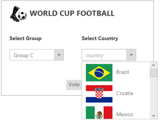
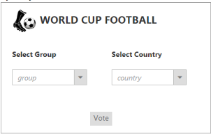
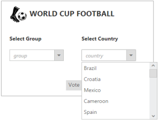
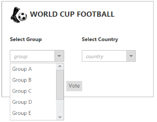
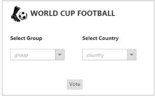
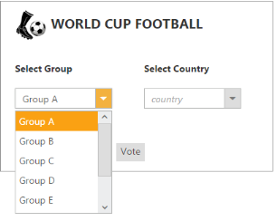
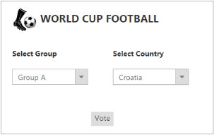
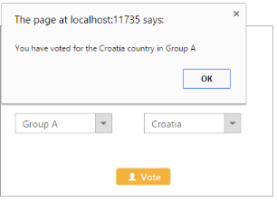

# Getting Started 

This section explains briefly on how to create a DropDownList control in your application using ASP.NET MVC.

## Create your first DropDownList in MVC

The DropDownList control provides a list of options and allows you to choose an item from the list. It includes several HTML elements such as images, textboxes, check box, and radio buttons. It also supports data binding, template options and multi-select options. In this section, you can learn how to customize DropDownList in a real time Voting Selection Scenario of World Cup Football. This allows you to display the groups and its countries in the DropDownList Selection Item. 

The following screen shot illustrates the functionality of DropDownList control with a Cascading Feature.

DropDownList Appearance
{:.caption}

In the above screenshot, you can select a group from the first DropDownList widget. After you select the group, the corresponding countries for that group are listed in the second DropDownList widget.Now, you can select a country and click the Vote option.  

To create a DropDownList, the steps are as follows:

* Create DropDownList Widgets 
* Configure Data Source
* Configure DropDownList with Sprite Icons 
* Set the Cascading Option
* Set the Vote process in the DropDownList Widget

## Create DropDownList Widgets 

ASP.NET MVCDropDownList widget basically renders with built-in features.

1. You can create an MVC Project and add necessary DLL with the help of the given [MVC-Getting Started](http://docs.syncfusion.com/aspnetmvc/dropdownlist/getting-started) Documentation.

2. Please add the below code in layout._cshtml file head section to add the necessary script and CSS files to render the DropDownList.

   ~~~ cshtml

	<head>

	<link href="http://cdn.syncfusion.com/13.1.0.21/js/web/flat-azure/ej.web.all.min.css" rel="stylesheet" />

		<!--Scripts-->

		

		

		

		

	</head>

   ~~~
   

   Create a CSHTML file in View page and add the following code sample to it. 

3. Add the below code to render the DropDownList widgets.

   ~~~ cshtml

	

		

			

			
WORLD CUP FOOTBALL

			 

			<table>

				<tr>

					<td class="tdcls">

						<label>Select Group</label></td>

					<td class="tdcls">

						<label>Select Country</label></td>

				</tr>

				<tr>

					<td class="tdcls">

					@Html.EJ().DropDownList("GroupsList").WatermarkText("group")

					<td class="tdcls">

					@Html.EJ().DropDownList("CountryList").WatermarkText("country")

				</tr>

			</table>

			

				@Html.EJ().Button("voter").Text("Vote").CssClass("e-btn")

			

		

	

   ~~~
   

4. Add the following style section for the DropDownList widgets alignment. Add the following location in the URL path for the background image. [http://js.syncfusion.com/UG/Web/Content/football.png](http://js.syncfusion.com/UG/Web/Content/football.png)

   ~~~ css

	

   ~~~
   

5. Execute the above code example to render the following output.

   
   
   DropDown Appearance without DropDown content
   {:.caption}
   
## Configure Data Source 

Configure the DropDownList widgets using online services. Here, two different online data services, group data service for the group selection DropDownList and countries data service for the country selection DropDownList are created for the two DropDownList Widgets. Both the data services are referred from the following service location.

[http://mvc.syncfusion.com/UGOdataServices/Northwnd.svc/](http://mvc.syncfusion.com/UGOdataServices/Northwnd.svc/)

In the above scenario, the given data source is mentioned in the DataSource property. In the first and second DropDownList widgets, mention the group widgets and countries Data Source in the DataSource property respectively. If the DataSource has different field names you can map the fields with the field’s property.

The following code example explains you on how to configure the Data Source.



<tr>

                <td class="tdcls">

<!—Declaration for DropDownList with Datasource-->

                @Html.EJ().DropDownList("GroupsList").Datasource(ds =>ds.URL("http://mvc.syncfusion.com/UGOdataServices/Northwnd.svc/")).Query("ej.Query().from('TeamGroups')").DropDownListFields(f=>f.Text("GroupName").Value("GroupId")).WatermarkText("group")

                <td class="tdcls">

                @Html.EJ().DropDownList("CountryList").Datasource(ds =>ds.URL("http://mvc.syncfusion.com/UGOdataServices/Northwnd.svc/")).Query("ej.Query().from('TeamCountries')").PopupWidth("200px").DropDownListFields(f=>f.Text("CountryName").Value("CountryId").SpriteCssClass ("CountryFlag")).WatermarkText("country")

            </tr>



Execute the above code example to render the following output.     

DropDown Appearance with Datasource content
{:.caption}

### Configure DropDownList with Sprite Icons

To style the DropDownList popup with the country flag, you can create the SpriteCSS styles using the flag icons from the following image source location.  You can add the following location in the URL path for the background image

[http://js.syncfusion.com/UG/Web/Content/countryFootbal.png](http://js.syncfusion.com/UG/Web/Content/countryFootbal.png)

To load the Sprite image icons for the countries in a DropDownList, add the following code sample in styles section. 



#CountryList_popup_wrapper .e-align

{

display: inline-block;

float: none;

margin-left: 5px;

margin-right: 10px;

vertical-align: middle;

}

/*Sprite CSS for the Flags used in DDL widget */

.flag

{

display: block;

background-image: url(http://js.syncfusion.com/UG/Web/Content/countryFootbal.png); 

height: 46px;

width: 70px;

background-position: center center;

background-repeat: no-repeat;

}

.flag.algeria

{

	background-position: 0 0;

}

.flag.argentina

{

	background-position: 0 -96px;

}

.flag.australia

{

	background-position: 0 -192px;

}

.flag.belgium

{

	background-position: 0 -288px;

}

.flag.bosnia

{

	background-position: 0 -384px;

}

.flag.brazil

{

	background-position: 0 -480px;

}

.flag.cameroon

{

	background-position: 0 -576px;

}

.flag.chile

{

	background-position: 0 -672px;

}

.flag.colombia

{

	background-position: 0 -768px;

}

.flag.costarica

{

	background-position: 0 -864px;

}

.flag.croatia

{

	background-position: 0 -960px;

}

.flag.ecuador

{

	background-position: 0 -1056px;

}

.flag.england

{

	background-position: 0 -1152px;

}

.flag.france

{

	background-position: 0 -1248px;

}

.flag.germany

{

	background-position: 0 -1344px;

}

.flag.ghana

{

	background-position: 0 -1440px;

}

.flag.greece

{

	background-position: 0 -1536px;

}

.flag.honduras

{

	background-position: 0 -1632px;

}

.flag.iran

{

	background-position: 0 -1728px;

}

.flag.italy

{

	background-position: 0 -1824px;

}

.flag.ivoriecote

{

	background-position: 0 -1920px;

}

.flag.japan

{

	background-position: -120px 0;

}

.flag.korea

{

	background-position: -120px -96px;

}

.flag.mexico

{

	background-position: -120px -192px;

}

.flag.netherlands

{

	background-position: -120px -288px;

}

.flag.nigeria

{

	background-position: -120px -384px;

}

.flag.portugal

{

	background-position: -120px -480px;

}

.flag.russia

{

	background-position: -120px -576px;

}

.flag.spain

{

	background-position: -120px -672px;

}

.flag.swiss

{

	background-position: -120px -768px;

}

.flag.uruguay

{

	background-position: -120px -864px;

}

.flag.usa

{

	background-position: -120px -960px;

}



Execute the above code sample to render the following DropDownList with DataSource.

DropDown Appearance with Datasource content for group
{:.caption}

DropDown Appearance for Datasource contents with country flag
{:.caption}

## Set the Cascading Option 

In this application, select the group in the first DropDownList to list the corresponding countries in the country DropDownList for the group selected. To render this, you can set the “CascadeTo” property that points the DropDownList, where the data is loaded dynamically and you can disable the second DropDownList till the data is loaded dynamically.

The following code example explains you on how to set the Cascading Option.

1. Add the below code in your view page to render the dropdown list



<!--use the following codes with above Html -->

<tr>

    <td class="tdcls">

      <!—Declaration for DropDownList with Datasource-->

       @Html.EJ().DropDownList("GroupsList").Datasource(ds => ds.URL("http://mvc.syncfusion.com/UGOdataServices/Northwnd.svc/")).Query("ej.Query().from('TeamGroups')").DropDownListFields(f => f.Text("GroupName").Value("GroupId")).CascadeTo("CountryList").WatermarkText("group")<!--Set DropDownList id to load the dynamic data  -->

     <td class="tdcls">

       @Html.EJ().DropDownList("CountryList").Datasource(ds => ds.URL("http://mvc.syncfusion.com/UGOdataServices/Northwnd.svc/")).Query("ej.Query().from('TeamCountries')").PopupWidth("200px").DropDownListFields(f => f.Text("CountryName").Value("CountryId").SpriteCssClass("CountryFlag")).WatermarkText("country")

     </td>           

 </tr>



Execute the above code example to render the DropDownList with Cascading Option.  

DropDown Appearance for cascading
{:.caption}

Initially, you can select the group from the popup of the first DropDownList. After you select the option,   selected value is loaded.

Cascading DropDown Apperance for Select group
{:.caption}

Based on the group selection in the first DropDownList, the DataSource in the second DropDownList is loaded, and the corresponding countries are shown when clicking the drop-down button as illustrated in the following screen shot.

Cascading DropDown Apperance for Select country

From the DropDownList called Country, you can select the desired country.

DropDown Appearance for cascading after selection of group and country
{:.caption}
## Set the Vote process in the DropDownList Widget

The voting process starts when you click the Vote button. The button is customized to support the voting process. For more information about the button refer the following link: <http://docs.syncfusion.com/js/>

The following code sample explains how to set the Vote process in the DropDownList widget.



<!--use the following codes with Html -->

            @Html.EJ().Button("voter").Text("Vote").CssClass("e-btn").Width("80px").Height("25px").ShowRoundedCorner(true).PrefixIcon("e-uiLight e-userlogin").ContentType(ContentType.TextAndImage).ClientSideEvents(e => e.Click("selectVoted"))

        



Include the following script 





Execute the above code sample to display the DropDownList widgets. Select the values and click on Vote button. The button click event is processed and the values are displayed as illustrated in the following screenshot.     

DropDown Apperance for Vote process_
{:.caption}
