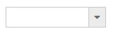

# Getting Started

## Creating your first DropDownList in MVC application
1. Create an MVC Project and add necessary DLLs, scripts and CSS files given in [MVC-Getting Started](http://help.syncfusion.com/aspnetmvc/getting-started#manual-integration-of-syncfusion-mvc-components-into-newexisting-mvc-applications) Documentation.

2. Add DropDownList control using the helper from EJ namespace. 

    

        @Html.EJ().DropDownList("DropDownList1")
            
    

3. Execute the code and get a empty DropDownList control as below

## Populating data

The DropDownList can be bounded to any local list data and remote data services. You can use [DataManager](http://help.syncfusion.com/js/datamanager/overview) component to serve data from the data services based on the query provided. To bind data to DropDownList control, the Datasource property's URL and Query are used. To render the DropDownList items, map the DropDownListFields with corresponding Fields  
 
	


    @Html.EJ().DropDownList("dropdownlist").Datasource(ds => ds.URL("http://mvc.syncfusion.com/Services/Northwnd.svc/")).Query("ej.Query().from('Customers').take(6)").DropDownListFields(f => f.Text("CustomerID"))	



Execute the code and to get a DropDownList control with data bound from remote service

## Setting Dimensions

DropDownList dimensions can be set using Width and Height Properties.
	


    @Html.EJ().DropDownList("dropdownlist").Datasource(ds => ds.URL("http://mvc.syncfusion.com/Services/Northwnd.svc/")).Query("ej.Query().from('Customers').take(6)").DropDownListFields(f => f.Text("CustomerID")).Width("300px").Height("50px")



**Setting dimensions to Popup list**

PopupWidth and PopupHeight can be used to create a fixed size popup list.



	
        @model MVCApplication.Controllers.HomeController
        
        @Html.EJ().DropDownList("DropDownList1").Datasource((IEnumerable<Data>)ViewData["DropDownSource"]).DropDownListFields(Df => Df.Text("Text").Value("Value")).Height("50px").Width("500px").PopupHeight("200px").PopupWidth("300px")
		
	
    
    
        public ActionResult Index()
        {
            List<Data> DropdownData = new List<Data>();
            DropdownData.Add(new Data { Value = "item1", Text = "List Item 1" });
            DropdownData.Add(new Data { Value = "item2", Text = "List Item 2" });
            DropdownData.Add(new Data { Value = "item3", Text = "List Item 3" });
            DropdownData.Add(new Data { Value = "item4", Text = "List Item 4" });
            DropdownData.Add(new Data { Value = "item5", Text = "List Item 5" });
            ViewData["DropDownSource"] = DropdownData;
            return View();
        }
        public class Data
        {
            public string Value { get; set; }
            public string Text { get; set; }
        }
    
    
 
	
## Setting and Getting Value

You can select single or multiple values from DropDownList control. To assign a value initially to the DropDownList, you can use <b>Value</b> property.


	
    
        
        @model MVCApplication.Controllers.HomeController
        
        @using (Html.BeginForm("DropdownlistFeatures", "Dropdownlist", FormMethod.Post, null))
        {
            @Html.EJ().DropDownList("DropDownList1").Datasource((IEnumerable<Data>)ViewData["DropDownSource"]).DropDownListFields(Df => Df.Text("Text").Value("Value")).Height("50px").Width("500px").PopupHeight("200px").PopupWidth("300px").Value("item3")
            
            <input type="submit" value="Get Value" />
            
        }
        

	
    
    
        public ActionResult Index()
        {
            List<Data> DropdownData = new List<Data>();
            DropdownData.Add(new Data { Value = "item1", Text = "List Item 1" });
            DropdownData.Add(new Data { Value = "item2", Text = "List Item 2" });
            DropdownData.Add(new Data { Value = "item3", Text = "List Item 3" });
            DropdownData.Add(new Data { Value = "item4", Text = "List Item 4" });
            DropdownData.Add(new Data { Value = "item5", Text = "List Item 5" });
            ViewData["DropDownSource"] = DropdownData;
            return View();
        }
        [HttpPost]
        public ActionResult DropdownlistFeatures(string DropDownList1)
        {
            //DropDownList1 is ID of DropDownList used in this example. You can get the selected items value in controller using the ID
            string DropDownValue = DropDownList1;
            return View();
        }
        public class Data
        {
            public string Value { get; set; }
            public string Text { get; set; }
        }
    



