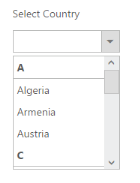
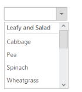

## Grouping Support

Grouping Support using DataSource

GroupingDropDownList items can be done by using Category field. Set the Category field and define it in the DataSource. Then map the fields for the data items of the DropDownList and set AllowGrouping property value to true.

The following steps explain you how to group data items in the DropDownList control by using DataSource.

1. Add the below code in your page to render the dropdown list

<table>
<tr>
<td>
[CSHTML]// Add the following code example in CSHTML page.@H@Html.EJ().DropDownList("selectCar").Datasource((IEnumerable<Check.Models.Books>)ViewBag.datasource).DropDownListFields(df => df.ID("id").Text("text").Category("category")).Width("200px").AllowGrouping(true)</td></tr>
<tr>
<td>
[CS]// Define the DataSource in the controller page as follows.List<Books> book = new List<Books>();        public ActionResult Index()        {            book.Add(new Books { id = 1,  text= "Austria", category= "A"});            book.Add(new Books { id = 2, text= "Australia", category= "A" });            book.Add(new Books { id = 3, text =  "Bangladesh", category= "B"  });            book.Add(new Books { id = 4, text = "Belgium", category= "B"  });            book.Add(new Books { id = 5, text = "Canada", category= "C" });            book.Add(new Books { id = 6, text = "Denmark", category= "D" });            book.Add(new Books { id = 7, text = "Egypt", category= "E"});            book.Add(new Books { id = 8, text = "England", category= "E" });            book.Add(new Books { id = 9, text = "India", category= "I"  });            book.Add(new Books { id = 10, text = "Italy", category= "I"  });            book.Add(new Books { id = 11, text = "Haiti", category= "H" });            book.Add(new Books { id = 12, text = "Jordan", category= "J" });            book.Add(new Books { id = 13, text = "Jamaica", category= "J" });            ViewBag.datasource = book;            return View();        }        public class Books        {            public int id { get; set; }            public string text { get; set; }            public string category { get; set; }        }</td></tr>
</table>

2. The above code example illustrates the following output.

{  | markdownify }
{:.image }

Grouping Support using UL and LI structure

Another way to group DropDownList is by using UL and LI structure. Here, you have to specify the group category in the &lt;span&gt; tag. The ID of the &lt;div&gt; tag should be given as the TargetId for the DropDownList control. The following code example illustrates how to achieve Grouping in DropDownList control by using UL and LI structure.

1. Add the input element and the UL and LI structures to group the DropDownList control.

[HTML]

@Html.EJ().DropDownList("dropdownlist").TargetID(“vegetablelist"). AllowGrouping(true)

                        &lt;div id="vegetablelist"&gt;

                            &lt;ul&gt;

                                Leafy and Salad

                                <li>Cabbage</li>

                                <li>Pea</li>

                                <li>Spinach</li>

                                <li>Wheatgrass</li>

                                <li>Yarrow &lt;/li&gt;

                                Beans

                                <li>Chickpea</li>

                                <li>Green bean</li> 

                                 Bulb and Stem

                                <li>Garlic</li>

                                <li>Garlic Chives</li>

                                 Root and Tuberous

                                <li>Beetroot</li>

                                <li>Carrot</li>

                            &lt;/ul&gt;

                        &lt;/div&gt;

{  | markdownify }
{:.image }

