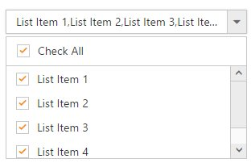

# How To

## Add check all option in popup list?

You can use HeaderTemplate property to add any HTML element. Code snippet to add check all option is given below,



     @model MVCApplication.Controllers.HomeController
    
     @Html.EJ().DropDownList("DropDownList1").Datasource((IEnumerable<Data>)ViewData["DropDownSource"]).DropDownListFields(Df => Df.Text("Text").Value("Value")).HeaderTemplate("
<input id='check' type='checkbox' />   
").ShowCheckbox(true).Width("300").ClientSideEvents(ce=>ce.Create("create"))
	 




        .temp {
            height: 30px;
            display: block;
            padding-left: 13px;
            padding-top: 5px;
            border-bottom: 1px solid #c8c8c8;
        }
        .e-chkbox-wrap .e-text {
            font-size: 14px;
            padding-left: 10px;
        }

     




    function create(args) {
        $("#check").ejCheckBox({ text: "Check All", change: "onallChange" });
    }
    function onallChange(args) {
        window.flag = true;
        var obj = $("#DropDownList1").ejDropDownList("instance");
        if (args.isChecked) obj.checkAll();
        else obj.uncheckAll();
        window.flag = false;
    }
    



        
        public ActionResult Index()
        {
            List<Data> DropdownData = new List<Data>();
            DropdownData.Add(new Data { Value = "item1", Text = "List Item 1" });
            DropdownData.Add(new Data { Value = "item2", Text = "List Item 2" });
            DropdownData.Add(new Data { Value = "item3", Text = "List Item 3" });
            DropdownData.Add(new Data { Value = "item4", Text = "List Item 4" });
            DropdownData.Add(new Data { Value = "item5", Text = "List Item 5" });
            ViewData["DropDownSource"] = DropdownData;
            return View();
        }
        
        public class Data
        {
            public string Value { get; set; }
            public string Text { get; set; }
        }



The following screenshot exhibits the output of the above code,

