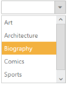

# Keyboard Interaction

You can use Keyboard shortcut keys as an alternative to the mouse on using Dropdown widget. Dropdown Widget allows you to perform all kind of actions using keyboard shortcuts.

_Table3: Keyboard Shortcut Keys_

<table>
<tr>
<th>
Shortcut Key</th><th>
Description</th></tr>
<tr>
<td>
{{ '[Access key](http://en.wikipedia.org/wiki/Access_key)' | markdownify }} + j	</td><td>
Focuses into the Dropdown text box</td></tr>
<tr>
<td>
Up</td><td>
Moves to previous item in pop up</td></tr>
<tr>
<td>
Down</td><td>
Moves to next item in pop up</td></tr>
<tr>
<td>
Enter</td><td>
Selects the focused item</td></tr>
<tr>
<td>
Esc</td><td>
Closes the popup window</td></tr>
<tr>
<td>
Left </td><td>
Moves to previous item in pop up</td></tr>
<tr>
<td>
Right </td><td>
Moves to next item in pop up</td></tr>
<tr>
<td>
Home</td><td>
Navigates to the starting item </td></tr>
<tr>
<td>
End</td><td>
Navigates to the end item </td></tr>
<tr>
<td>
Alt + Up</td><td>
Close the popup window</td></tr>
<tr>
<td>
Alt +down </td><td>
Opens the popup window </td></tr>
</table>

## Configure Keyboard Interaction

The following steps explains you to enable keyboard interaction for a dropdown textbox.

1. In an HTML page, add a &lt;input&gt; element to configure Dropdownlist widget and enable keyboard interaction by setting the accesskey property

2. Add the below code to render the dropdown list.



// Add a DropDownList element using the helper class in CSHTML@Html.
EJ().DropDownList("dropdownlist").TargetID("list")
           

		   <ul>
		   <li>Art</li>
		   <li>Architecture</li>
		   <li>Biography</li>
		   <li>Comics</li>
		   <li>Sports</li>
		   <li>Science</li>
		   </ul>
</td></tr>



// Render Dropdown list control
      </td></tr>


Run the sample, press Alt + J to focus in the Dropdownlist widget that enables it and you can navigate using arrow keys and Esc key to close the popup.

_Figure 31: Dropdown list focused and moved with Keyboard shortcut_

