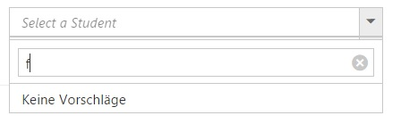

# Localization

The DropDownList provides option to localize its strings, it is used to adapting the DropDownList to a particular local language. By default, the DropDownList will use the US English (en-US) as its language.

N> The culture name has to be specified in a standard format such as [Language Code]-[County/Region Code].

To localize the dropdownlist’s strings with your own localization, copy the default language informations and localize the strings in the values column. For example, to localize the DropDownList in German language (“de-DE”).



    ej.DropDownList.Locale["de-DE"] = {
        emptyResultText: "Keine Vorschläge" //replace with your text  
    };
    


Set the locale property of the DropDownList to the new language.



    @Html.EJ().DropDownList("selectCar").Datasource((IEnumerable<Product>)ViewBag.data).DropDownListFields(df => df.Text("name").Value("name")).WatermarkText("Select a Student").Width("100%").Locale("de-DE").EnableFilterSearch(true).EnableIncrementalSearch(true)



